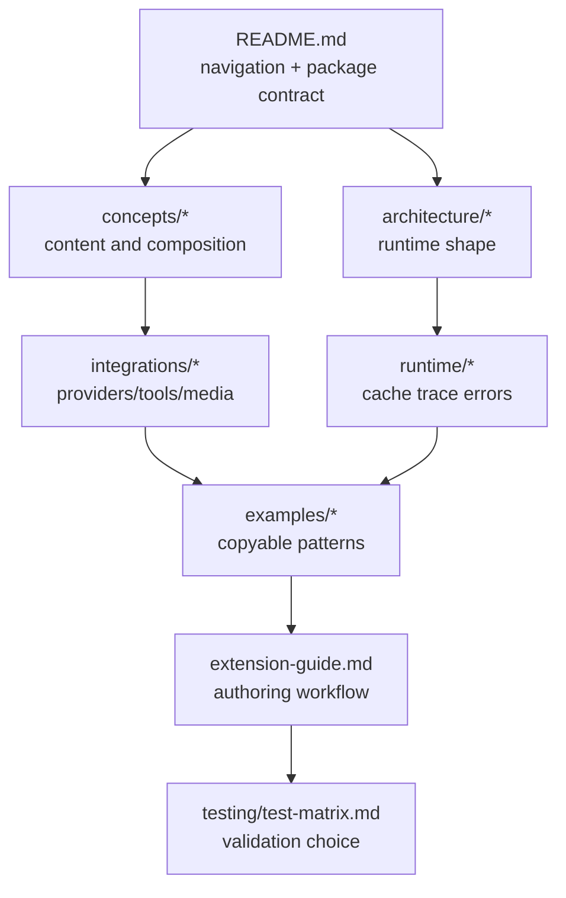

# GenAI Processors LLM Reference

This folder is a compact map for LLM agents changing `genai-processors`.
Always start from the repository sources named below; these notes summarize
current contracts, not a replacement API.

## Reading Order

1. `llms.txt` - mandatory coding-agent guidance. It calls out current API
   usage, content coercion, streaming, `.text` safety, and preferred execution
   style.
2. `README.md` and `README.pypi.md` - public product contract: modular async
   processors, unified content model, streaming-first usage, examples, and
   installation.
3. [Architecture Overview](architecture/overview.md), then
   [Repository Map](architecture/repository-map.md) and
   [Runtime Flow](architecture/runtime-flow.md).
4. [Content Model](concepts/content-model.md),
   [Processors And Composition](concepts/processors-and-composition.md), and
   [Substreams And Routing](concepts/substreams-and-routing.md).
5. Integration references for model providers, function calling/MCP, media IO,
   caching, tracing, and errors.
6. [Examples Reference](examples/README.md) before copying any runnable example
   pattern.
7. [Extension And Change Guide](extension-guide.md) and
   [Test Matrix](testing/test-matrix.md) before implementing changes.

## Area Index

- Architecture:
  - [Architecture Overview](architecture/overview.md)
  - [Repository Map](architecture/repository-map.md)
  - [Runtime Flow](architecture/runtime-flow.md)
  - [Async Context And TaskGroups](architecture/async-context-and-taskgroups.md)
- Core concepts:
  - [Content Model](concepts/content-model.md)
  - [Processors And Composition](concepts/processors-and-composition.md)
  - [Substreams And Routing](concepts/substreams-and-routing.md)
- Runtime and integrations:
  - [Model Providers](integrations/model-providers.md)
  - [Function Calling And MCP](integrations/function-calling-and-mcp.md)
  - [Media IO And Documents](integrations/media-io-and-documents.md)
  - [Caching](runtime/caching.md)
  - [Tracing](runtime/tracing.md)
  - [Errors And Status Parts](runtime/errors-and-status-parts.md)
- Extensions and examples:
  - [Built-In Processors](extensions/built-in-processors.md)
  - [Contrib Processors](extensions/contrib-processors.md)
  - [Examples Reference](examples/README.md)
- Project operations:
  - [Python Package And Docs Reference](packaging/python-package-and-docs.md)
  - [Test Matrix](testing/test-matrix.md)
  - [Extension And Change Guide](extension-guide.md)
  - [Glossary](glossary.md)

## Documentation Methodology

Each reference page should answer four questions:

1. What source files define the contract?
2. What data shape enters and exits the component?
3. What state, timing, routing, or concurrency rules change behavior?
4. What should an LLM agent preserve when replicating the pattern elsewhere?

Use this semantic ladder:

```text
source code -> observed contract -> data/state diagram -> invariants -> gotchas
```

Do not document only names. Explain the transformation:

```text
ProcessorPart envelope + async stream context + processor graph
  -> model/tool/media side effect
  -> normalized ProcessorPart output
```

## Reference Graph



When adding a new page, link it from the closest index and include a
`Source References` section before behavioral prose. Source references are the
anchor that keeps the LLM-facing summary from drifting into folklore.

## Package Contract

The package name is `genai_processors`; the PyPI install name is
`genai-processors`. The library requires Python `>=3.11` in
`pyproject.toml`, while `README.md` currently says Python 3.10+. Treat that as
version drift to resolve before release-facing edits.

The public API re-exported from `genai_processors/__init__.py` includes
`ProcessorPart`, `ProcessorContent`, `ProcessorPartTypes`,
`ProcessorContentTypes`, `Processor`, `PartProcessor`, `ProcessorFn`,
`PartProcessorWithMatchFn`, `apply_sync`, `apply_async`, `chain`, `parallel`,
`parallel_concat`, `create_filter`, `part_processor_function`,
`stream_content`, and `gather_stream`.

Processor authors implement `Processor.call(content: ProcessorStream)` and
yield `ProcessorPartTypes`. Callers invoke processors with wide
`ProcessorContentTypes` directly and usually run
`await processor(input_content).gather()`.

## Global Invariants

- Processor invocation is lazy; work starts when the returned stream is
  consumed.
- `ProcessorPart` is the unit of data and control. Metadata and substreams can
  carry state transitions without changing content bytes/text.
- Default substream usually means model-visible prompt/content. Named
  substreams are routing lanes and may be local-only.
- Function calls/responses are normal parts with a protocol envelope, not
  out-of-band callbacks.
- Reserved substreams such as status/debug should bypass ordinary model
  transformations unless a processor explicitly reintroduces them.
- Examples are executable patterns. Prefer copying their graph shape and
  invariants over copying literal prompts.

## Source References

- API surface and version: `genai_processors/__init__.py:16-50`
- Content contract: `genai_processors/content_api.py:39-1226`
- Processor contract: `genai_processors/processor.py:149-1649`
- Stream utilities: `genai_processors/streams.py:27-265`
- LLM usage rules: `llms.txt:1-35`
- Packaging: `pyproject.toml:1-96`
- CI: `.github/workflows/python-tests.yml:16-42`
- Docs: `documentation/mkdocs.yml:1-90`,
  `.github/workflows/deploy_docs.yml:1-32`
