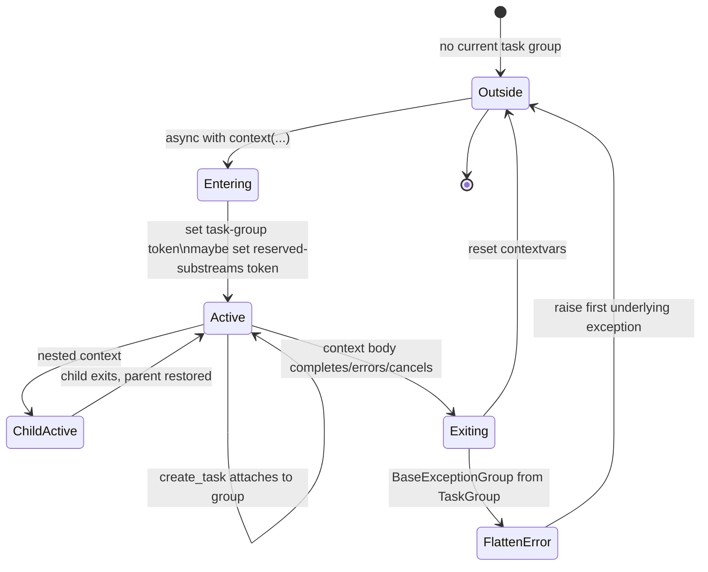
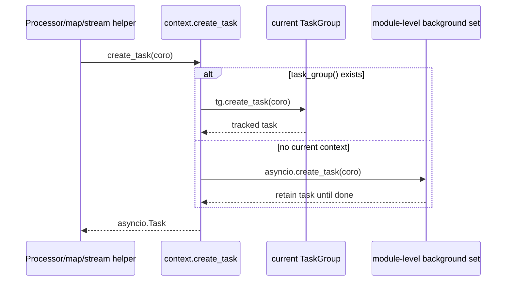
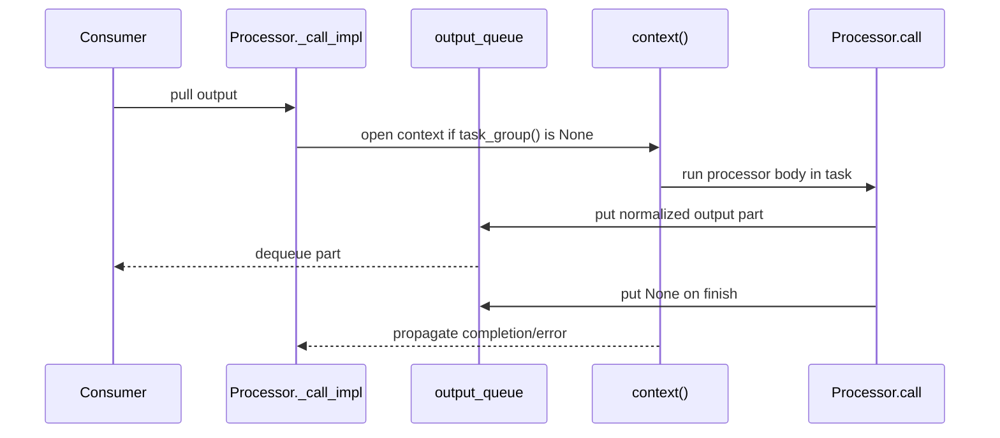
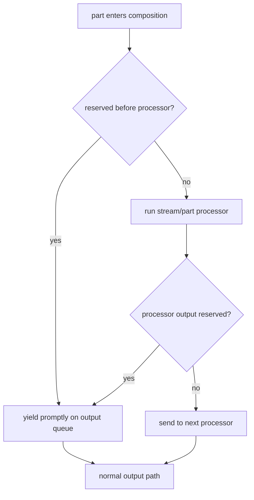
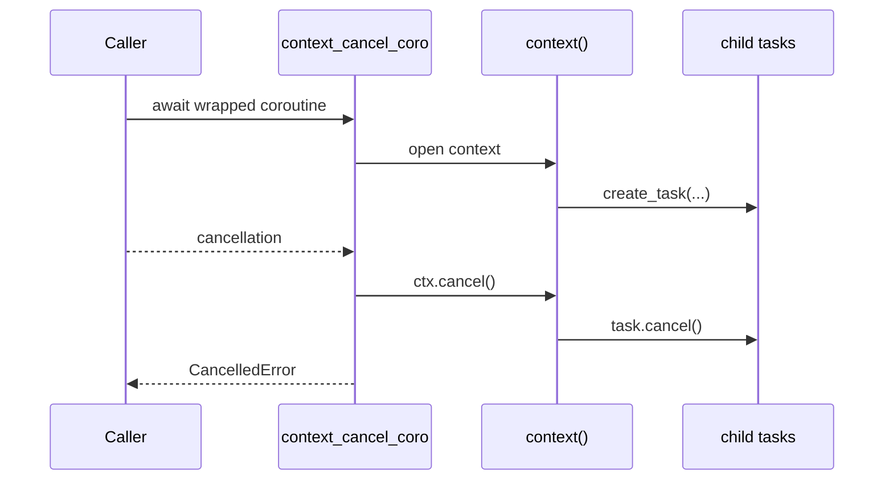

# Async Context And TaskGroups

`genai_processors.context` owns two runtime contracts: spawned tasks should join the current processor task group, and reserved substreams should be visible to composition code through context variables.

## Source References

- `genai_processors/context.py:25-53` declares context variables for the current task group and reserved substreams.
- `genai_processors/context.py:66-128` defines `CancellableContextTaskGroup`, task tracking, contextvar setup/reset, exception flattening, and cancellation.
- `genai_processors/context.py:130-147` exposes `context()`, `task_group()`, `get_reserved_substreams()`, and `is_reserved_substream()`.
- `genai_processors/context.py:150-174` implements `create_task`; it uses the current task group when present and keeps references to background tasks when absent.
- `genai_processors/context.py:180-189` cancels context tasks when a wrapper coroutine is cancelled.
- `genai_processors/processor.py:199-251` explains why processor invocation uses a queue inside a task group when no context exists.
- `genai_processors/map_processor.py:207-243`, `genai_processors/map_processor.py:259-317`, and `genai_processors/map_processor.py:340-383` eagerly schedule part-function work through `context.create_task`.
- `genai_processors/streams.py:27-78` notes `split()` should be used with processor context for error propagation.
- `genai_processors/streams.py:81-111` schedules concat branch readers through `context.create_task`.
- `genai_processors/processor.py:973-1118` captures reserved parts around chains and part-processor calls.
- `genai_processors/processor.py:1258-1315` applies reserved capture inside part-level parallel composition.
- `genai_processors/tests/context_test.py:10-78` verifies task group lookup, nesting, inheritance, and cancellation.
- `genai_processors/tests/processor_test.py:1228-1296` verifies reserved status/debug/custom substreams are yielded promptly or bypass processors.

## Contract

Use `processor.context()` or `context.context()` around manual async orchestration. Inside that context, `processor.create_task()` and `context.create_task()` attach work to the active `CancellableContextTaskGroup`; outside it, tasks are created with `asyncio.create_task` and retained in a module-level set until done.

The same context carries the reserved-substream set. By default, `debug`, `status`, and `ui` are reserved. Passing `reserved_substreams=[...]` replaces the reserved set for that context.

## Context Variables

| ContextVar | Public Accessor | Meaning |
| --- | --- | --- |
| `_PROCESSOR_TASK_GROUP` | `task_group()` | Current `CancellableContextTaskGroup`, or `None` outside a processor context. |
| `_PROCESSOR_RESERVED_SUBSTREAMS` | `get_reserved_substreams()` | Current reserved-prefix set. Defaults to `{"debug", "status", "ui"}`. |

The task group and reserved-prefix set are scoped together because composition
helpers need both: task ownership for concurrent work and bypass knowledge for
out-of-band parts.

## Lifecycle



Nested contexts replace the current task group while active, then restore the
parent. Tests assert parent/child task groups are distinct and parent lookup is
restored after the child exits.

## Task Ownership



Inside processors, use the context-aware helper so failures and cancellation are
owned by the same lifecycle as the stream. Outside a context, the fallback keeps
a reference to the task so it is not lost immediately.

## Missing-Context Wrapper

`Processor._call_impl` creates a context when a processor is consumed outside
one. It uses a queue because async generators can otherwise yield outside the
`async with TaskGroup` block at exactly the point where cancellation/error
propagation matters.



The queue is not an implementation detail to ignore: it is how yielded output
stays connected to task-group cancellation.

## Reserved Substream Predicate

Reserved membership is prefix-based:

```text
reserved(substream_name, prefixes) =
  any(substream_name.startswith(prefix) for prefix in prefixes)
```

Default:

```text
prefixes = {"debug", "status", "ui"}
reserved("status") = True
reserved("status.progress") = True
reserved("debug.trace") = True
reserved("") = False
reserved("realtime") = False
```

Custom context replaces the set:

```text
async with context(reserved_substreams=["custom_debug"]):
  prefixes = {"custom_debug"}
```

This means `debug` is no longer reserved inside that context unless it is
included explicitly.

## Reserved Capture Flow



This behavior lets processors emit `status`, `debug`, or `ui` parts without
having those parts interpreted by downstream model processors. Tests cover both
chain and parallel composition.

## Cancellation Semantics



`context_cancel_coro` is for top-level coroutines that should cancel all tasks
created inside the context when the wrapper itself is cancelled.

## Invariants

- Use `context.create_task` or the alias `processor.create_task` for framework tasks so failures and cancellation propagate through the active task group.
- Do not use a raw `asyncio.create_task` inside processors unless escaping processor cancellation is intentional.
- Do not keep async generators open across unrelated contexts; context reset can see `GeneratorExit` from a different context.
- Reserved-substream membership is prefix-based: `part.substream_name.startswith(prefix)`.
- A custom `reserved_substreams` argument replaces the current reserved set for that context, it does not append to the default set.
- Composition helpers rely on the context task group; missing context is patched at processor invocation boundaries, but explicit context is clearer for manual stream utilities.
- Child tasks inherit the current contextvars, so code they run can look up the
  same task group.
- Exceptions from task groups are flattened to the first underlying exception
  before re-raising.
- `streams.split()` and `streams.concat()` spawn helper tasks; use them inside a
  processor context when failure propagation matters.

## Replication Pattern

To document context/task ownership in another repo:

1. List every context variable and the public accessor for it.
2. Draw the enter/exit/nesting lifecycle as a state machine.
3. Show the task creation decision: attach to current group or create a retained
   background task.
4. Write predicates for any scoped routing/bypass rule, such as reserved
   substream matching.
5. Explain cancellation from both directions: child task failure and caller
   cancellation.
6. Cite tests for nesting, inheritance, cancellation, and bypass behavior.

## Read Next

- `.llms/reference/architecture/runtime-flow.md`
- `.llms/reference/concepts/substreams-and-routing.md`
- `.llms/reference/concepts/processors-and-composition.md`
