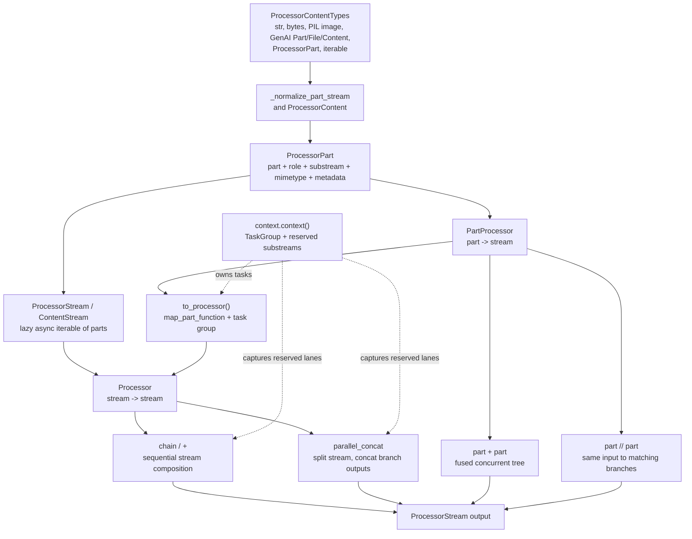
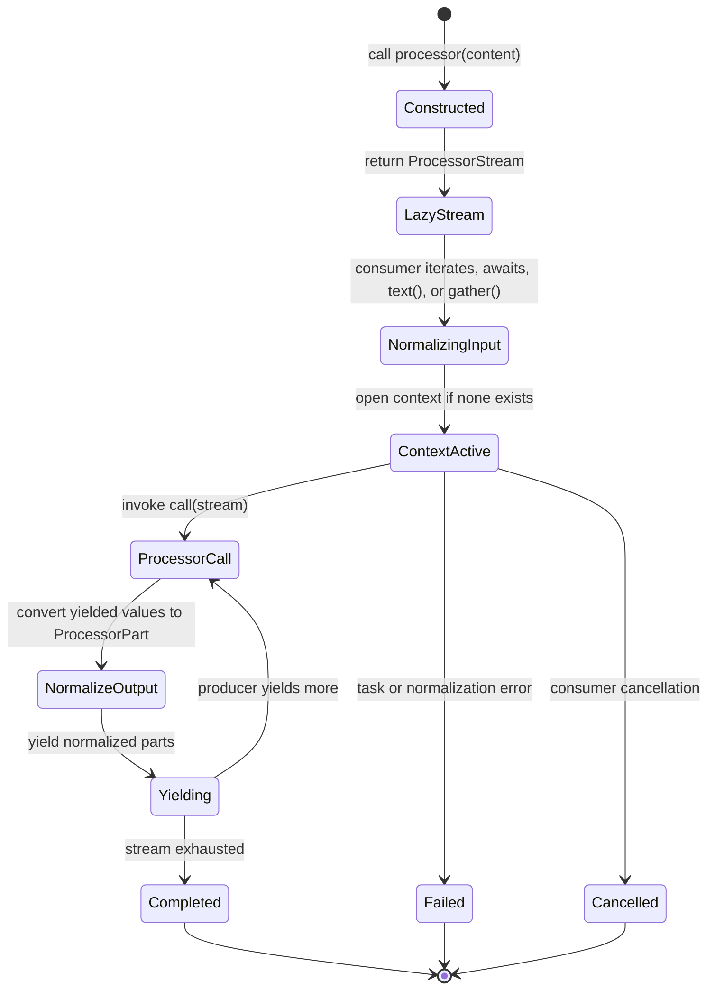
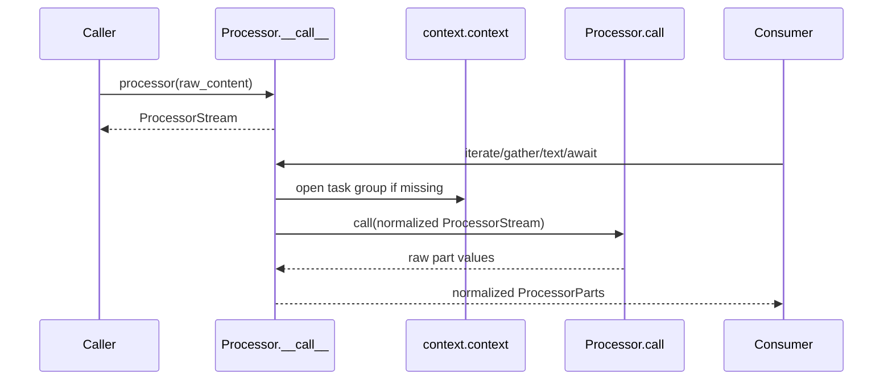

# Architecture Overview

GenAI Processors is an async streaming composition library. The smallest runtime value is a `ProcessorPart`; parts move through `ProcessorStream`s; `Processor`s transform whole streams; `PartProcessor`s transform one part into zero or more parts and can be lifted to stream processors for concurrent execution.

## Source References

- `genai_processors/__init__.py:27-50` exports the public surface: `ProcessorPart`, `ProcessorContent`, `Processor`, `PartProcessor`, composition helpers, and stream helpers.
- `genai_processors/content_api.py:39-68` defines `ProcessorPart` as content plus role, substream, MIME type, and metadata.
- `genai_processors/content_api.py:695-820` defines `ContentStream`, the async adapter around parts with `.text()` and `.gather()` reducers.
- `genai_processors/content_api.py:841-980` defines `ProcessorContent`, the static multi-part container and coercion point.
- `genai_processors/processor.py:149-283` defines `Processor`: stream-in, stream-out, implement `call`, invoke through `__call__`.
- `genai_processors/processor.py:372-430` defines `PartProcessor`: part-in, stream-out, implement `call`, invoke through `__call__`.
- `genai_processors/context.py:25-53` stores the current processor task group and reserved substreams in context variables.
- `genai_processors/streams.py:27-111` defines split/concat ordering primitives; `genai_processors/streams.py:136-230` defines merge and queue adapters.
- `genai_processors/map_processor.py:15-54` explains the eager tree execution model for part-function chains.
- `genai_processors/map_processor.py:98-194` exposes map, chain, and parallel part-function constructors.
- `genai_processors/switch.py:34-142` routes streams by first matching case; `genai_processors/switch.py:145-227` routes single parts with `PartSwitch`.
- `genai_processors/tests/processor_test.py:114-135` asserts reserved substreams bypass chained processors.
- `genai_processors/tests/map_processor_test.py:17-32` asserts ordered output even when per-part execution completes out of order.

## Model

Use this stack when reading or changing code:

1. Content enters as broad `ProcessorContentTypes` or `ProcessorPartTypes`.
2. Boundaries normalize content to `ProcessorPart`.
3. A `Processor` consumes an async stream of parts and yields an async stream of parts.
4. A `PartProcessor` consumes one normalized part and yields zero or more parts.
5. Composition helpers lift part processors into stream processors and schedule concurrent work.
6. `context.context()` provides task-group ownership and the reserved-substream table.
7. Reserved substreams are out-of-band lanes: they bypass downstream processors and are yielded promptly.

## Architecture Shape



The library's central abstraction is not "a model call"; it is a typed,
metadata-preserving stream transducer. Model providers, IO devices, tools,
routers, caches, and examples are all expressed as processors or lifted part
processors.

## Semantic Layers

| Layer | Runtime Type | Semantic Contract | Typical Source |
| --- | --- | --- | --- |
| Envelope | `ProcessorPart` | One piece of data or control with role, MIME type, substream, and metadata. | `content_api.py` |
| Static content | `ProcessorContent` | Re-iterable ordered container of normalized parts. | `content_api.py` |
| Live stream | `ProcessorStream` / `ContentStream` | Lazy async stream with reducers such as `.gather()` and `.text()`. | `content_api.py`, `processor.py` |
| Stream transform | `Processor` | Consumes one stream and yields one stream. | `processor.py` |
| Part transform | `PartProcessor` | Consumes one part and yields zero or more parts; liftable to stream scope. | `processor.py`, `map_processor.py` |
| Orchestration | `context.context()` | Owns cancellation/error propagation and reserved-substream capture. | `context.py` |
| Routing | `Switch`, `PartSwitch`, substreams | Selects processors or bypass lanes from part metadata/predicates. | `switch.py`, `processor.py` |

## Composition Algebra

Let:

```text
Part = (genai_part, role, substream_name, mimetype, metadata)
Stream[Part] = ordered async sequence of Part
Processor P: Stream[Part] -> Stream[Part]
PartProcessor f: Part -> Stream[Part]
lift(f): Stream[Part] -> Stream[Part]
```

Sequential composition:

```text
(P + Q)(S) = Q(P(S))
chain([P0, P1, ..., Pn])(S) = Pn(...P1(P0(S))...)
```

Part-processor lifting preserves input order at the output boundary while work
may run ahead internally:

```text
lift(f)([p0, p1, ..., pn]) =
  flatten_in_input_order([f(p0), f(p1), ..., f(pn)])
```

Part-processor chain is one-to-many at every step:

```text
(f + g)(p) = flatten(g(x) for x in f(p))
```

Part-level parallel sends the same input to every matching branch and emits
branch results in branch-list order:

```text
(f // g)(p) = concat(f(p), g(p))
```

Stream-level parallel clones the input stream, runs stream processors, then
concatenates branch streams:

```text
parallel_concat([P, Q])(S) = concat(P(S0), Q(S1))
where (S0, S1) = split(S, n=2)
```

Reserved substreams are a side condition on these equations:

```text
reserved(part) = any(part.substream_name.startswith(prefix)
                     for prefix in current_reserved_substreams)

if reserved(part):
  yield part to the chain output promptly
  do not pass it into the next processor branch
```

## Runtime Lifecycle



The important lifecycle edge is `Constructed -> LazyStream`: calling a processor
builds a stream object, but the processor body does not execute until something
consumes that stream.

## Directionality



Processors should be implemented as if they are stream transducers. They should
not assume a list, a text-only payload, or eager execution.

## Failure Modes And Gotchas

- A `ProcessorPart` can be media data, model protocol, application state, or a
  control signal. The envelope determines meaning.
- `ProcessorContent` is static and re-iterable; `ContentStream` backed by
  `parts_generator` is single-use.
- Part processors run concurrently after lifting. Use metadata copies when
  mutating parts that may be seen by multiple branches.
- `Switch` and `parallel_concat` can reorder output across cases or branches;
  use a single part processor or explicit sequencing when global output order is
  part of the contract.
- Context is not optional for correctness when using task-spawning helpers. The
  invocation wrapper creates one at the boundary, but manual stream utilities
  should usually be wrapped explicitly.

## Invariants

- Do not call `Processor.call()` or `PartProcessor.call()` directly. Use `p(content)` or `part_processor(part)` so normalization, tracing, context handling, and match behavior run.
- Do not assume processor output is text. Preserve `ProcessorPart` until a boundary truly needs `.text()`, `.as_text()`, or `.gather()`.
- Do not treat substreams as separate Python iterables. A substream is metadata on each `ProcessorPart`.
- A stream processor may reorder output across concurrent branches, but each branch preserves its own local order.
- Reserved substreams are control/data lanes, not model-input lanes; chain and parallel composition capture them before handing parts to the next processor.
- A `PartProcessor.match(part) == False` is pass-through for normal chains and
  apply/lift behavior, but part-level parallel uses explicit passthrough
  sentinels to preserve unmatched input.
- `key_prefix` is semantic identity for caches/traces. Constructor arguments
  that change output should change the key prefix.

## Replication Pattern

Use this page as the top-level architecture template for another repo:

1. Name the smallest runtime value and the stream/container types around it.
2. Draw the normalization boundary before any business-specific processors.
3. State composition equations for sequential, parallel, routing, and bypass
   behavior.
4. Add a lifecycle state diagram that distinguishes "constructed" from
   "executing".
5. Tie every semantic claim to local source references and at least one test
   anchor when ordering, concurrency, or error behavior matters.
6. Preserve a short invariants section that tells future agents what not to
   assume.

## Read Next

- `.llms/reference/concepts/content-model.md`
- `.llms/reference/concepts/processors-and-composition.md`
- `.llms/reference/concepts/substreams-and-routing.md`
- `.llms/reference/architecture/async-context-and-taskgroups.md`
