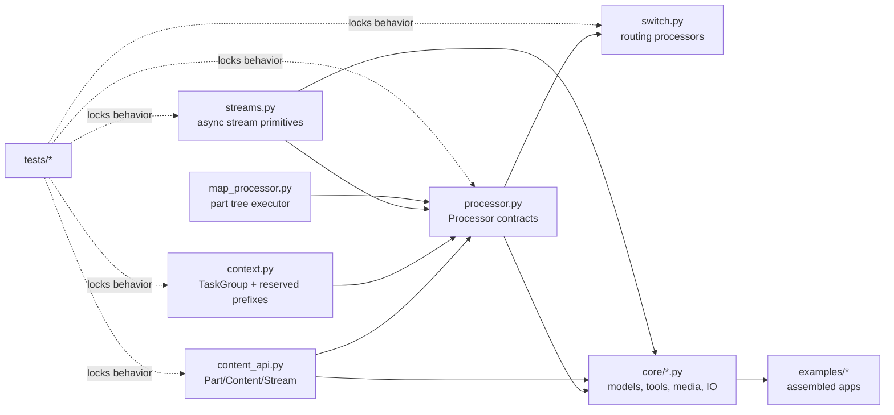

# Repository Map

This map is for LLM navigation. Prefer the files below before widening a search.

## Core Runtime

- `genai_processors/content_api.py`: content wrappers, coercion, MIME helpers, text/image reducers, GenAI conversion.
- `genai_processors/processor.py`: processor interfaces, decorators, composition operators, chain/parallel internals, cache wrappers, sources.
- `genai_processors/map_processor.py`: concurrent execution engine for part functions over streams and trees.
- `genai_processors/streams.py`: async stream utilities: split, concat, merge, enqueue/dequeue, gather.
- `genai_processors/context.py`: contextvars, cancellable task group, `create_task`, reserved-substream table.
- `genai_processors/switch.py`: stream and part routing by cases.

```mermaid
flowchart TD
    Root["genai-processors repo"] --> Runtime["genai_processors/"]
    Root --> Tests["genai_processors/tests/"]
    Root --> Examples["examples/"]
    Root --> HumanDocs["documentation/docs/"]
    Root --> LLMDocs[".llms/reference/"]
    Root --> Notebooks["notebooks/"]

    Runtime --> Content["content_api.py\npart/content/stream model"]
    Runtime --> Processor["processor.py\ninterfaces + composition"]
    Runtime --> Context["context.py\nTaskGroup + reserved substreams"]
    Runtime --> Streams["streams.py\nsplit/concat/merge/queues"]
    Runtime --> Map["map_processor.py\nconcurrent part-function engine"]
    Runtime --> Switch["switch.py\nrouting by case"]
    Runtime --> Core["core/\nbuilt-in processors"]
    Runtime --> Contrib["contrib/\noptional integrations"]
    Runtime --> Dev["dev/\ntracing and dev server"]

    Tests --> ContractTests["contract evidence\nordering, matching, routing,\nserialization, cancellation"]
    Examples --> AppPatterns["application assembly\nCLI, live, realtime, research,\nwidgets, MCP"]
    HumanDocs --> Guides["human guides and tutorials"]
    LLMDocs --> AgentRefs["agent-facing semantic maps"]
```



## Public Entry Points

- `genai_processors/__init__.py:27-50` re-exports the common API.
- `llms.txt:1-32` gives high-level guidance for coding agents.
- `documentation/docs/` contains human-facing guides; use source files for contract-level details.
- `examples/` shows application assembly and core usage.

## Built-In Processors

- `genai_processors/core/genai_model.py`: GenAI model stream processor.
- `genai_processors/core/live_model.py`, `core/realtime.py`: realtime/live streaming contracts.
- `genai_processors/core/function_calling.py`: tool/function-call processors.
- `genai_processors/core/text.py`: terminal IO, text extraction, regex/window-style processors.
- `genai_processors/core/audio.py`, `core/audio_io.py`, `core/video.py`: multimodal processors.
- `genai_processors/core/pdf.py`, `core/filesystem.py`, `core/web.py`, `core/github.py`, `core/drive.py`: IO and document ingestion.
- `genai_processors/contrib/`: optional integrations such as LangChain and OpenRouter.

## Test Anchors

- `genai_processors/tests/content_api_test.py`: coercion, serialization, reducers.
- `genai_processors/tests/processor_test.py`: chain, parallel, match, reserved-substream, cache behavior.
- `genai_processors/tests/map_processor_test.py`: concurrent tree execution behavior.
- `genai_processors/tests/streams_test.py`: stream utilities.
- `genai_processors/tests/switch_test.py`: routing and ordering behavior.
- `genai_processors/tests/context_test.py`: task group and cancellation behavior.

## Source References

- `genai_processors/content_api.py:39-177` defines the part envelope and MIME inference.
- `genai_processors/content_api.py:695-980` defines stream/static content adapters.
- `genai_processors/processor.py:42-57` aliases context constants and stream helpers into the processor module.
- `genai_processors/processor.py:149-324` defines stream processors and `+`.
- `genai_processors/processor.py:372-508` defines part processors, match, `+`, `//`, and lifting.
- `genai_processors/processor.py:560-667` provides decorators and top-level composition constructors.
- `genai_processors/processor.py:898-970` fuses processor chains and lifts part processors.
- `genai_processors/map_processor.py:98-194` exposes map/chain/parallel part-function constructors.
- `genai_processors/streams.py:27-111` provides split/concat behavior; `genai_processors/streams.py:136-230` provides merge and queues.
- `genai_processors/switch.py:34-227` is the routing module.
- `genai_processors/core/README.md:1-25` lists built-in processor groups.
- `genai_processors/contrib/README.md:1-5` marks optional contrib integrations.
- `genai_processors/tests/processor_test.py:49-70` shows reserved debug parts bypass a slow downstream processor in a chain.
- `genai_processors/tests/switch_test.py:39-82` shows stream routing keeps order per case but not across cases.

## Navigation Strategy

Start narrow. Most framework questions are answered by six files:

```text
content_api.py -> processor.py -> context.py -> streams.py -> map_processor.py -> switch.py
```

Use built-in processors only after the framework contract is clear. For example,
`core/live_model.py` is a model-adapter implementation; it relies on the
substream and processor contracts defined in the core runtime files above.

Use tests as behavior witnesses when source comments and implementation details
leave room for interpretation:

| Question | First Source | Test Anchor |
| --- | --- | --- |
| What can be a `ProcessorPart`? | `content_api.py:39-177` | `genai_processors/tests/content_api_test.py:40-183` |
| Is content re-iterable? | `content_api.py:695-820` | `genai_processors/tests/content_api_test.py:673-759` |
| How does chain composition work? | `processor.py:898-1118` | `genai_processors/tests/processor_test.py:797-836` |
| How does `//` fallback work? | `processor.py:1189-1343` | `genai_processors/tests/processor_test.py:1152-1227` |
| Do reserved substreams bypass processors? | `processor.py:973-1118` | `genai_processors/tests/processor_test.py:878-907` |
| Can stream routing reorder results? | `switch.py:34-142` | `genai_processors/tests/switch_test.py:39-82` |
| How do merge/split order? | `streams.py:27-196` | `genai_processors/tests/streams_test.py:23-130` |
| How are task groups scoped? | `context.py:66-189` | `genai_processors/tests/context_test.py:10-78` |

## Change Locality Matrix

| Desired Change | Primary Files | Avoid Starting In |
| --- | --- | --- |
| Add a new content representation or reducer | `content_api.py`, `mime_types.py`, content tests | Example files |
| Add a composition operator or change ordering | `processor.py`, `map_processor.py`, processor/map tests | Built-in processor modules |
| Add a routing primitive | `switch.py`, switch tests | Model adapters |
| Add a new model or IO integration | `genai_processors/core/` or `contrib/` plus targeted tests | `processor.py` unless the framework contract truly changes |
| Change task/cancellation behavior | `context.py`, `processor.py`, stream/map tests | Individual processors |
| Change reserved-substream semantics | `context.py`, `processor.py`, processor tests | `switch.py` only |
| Add an example application | `examples/`, `.llms/reference/examples/`, human docs if public | Core runtime |

## Semantic Module Map



Directionality matters. `core/*` should consume the runtime abstractions; it
should not redefine what a processor, stream, or substream means.

## Documentation Surfaces

- `README.md` and `README.pypi.md`: external product-level introduction.
- `documentation/docs/`: human-facing guides, examples, development topics, and
  MkDocs pages.
- `.llms/reference/`: agent-facing semantic references with source-backed
  claims, invariants, diagrams, and gotchas.
- `llms.txt`: short operational guidance for coding agents before touching the
  library.

When facts conflict, prefer source and tests over prose docs. When documenting,
cite both source and tests if a behavior is subtle or concurrency-sensitive.

## Invariants

- Start with `content_api.py`, `processor.py`, `context.py`, `streams.py`, `map_processor.py`, and `switch.py` for framework behavior.
- Use tests as contract evidence when behavior involves concurrency, order, or reserved streams.
- Avoid changing core composition semantics from a built-in processor file; composition contracts live in `processor.py` and `map_processor.py`.
- Public import availability is controlled by `__init__.py`; internal helpers may be intentionally omitted.
- The `.llms/reference` docs are semantic maps, not API exhaustiveness lists.
  They should point to the right source before they duplicate source.
- Example docs should explain assembled behavior; concept and architecture docs
  should explain reusable runtime contracts.

## Replication Pattern

To create this kind of repository map for another repo:

1. Identify the smallest set of files that define framework semantics.
2. Separate runtime, adapters, examples, tests, docs, and packaging.
3. Add a Mermaid repository graph that shows dependency direction, not just
   folders.
4. Build a "question -> source -> test" table for behaviors future agents may
   misread.
5. Include a change-locality matrix so agents know where to start and where not
   to start.
6. Keep the map stable by naming modules and contracts, not every function.

## Read Next

- `.llms/reference/architecture/runtime-flow.md`
- `.llms/reference/concepts/processors-and-composition.md`
- `.llms/reference/concepts/substreams-and-routing.md`
