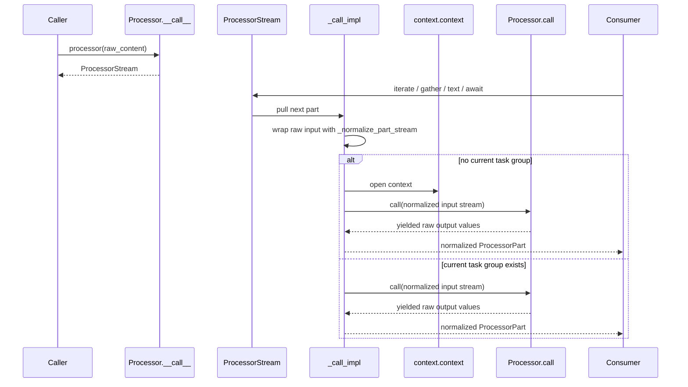
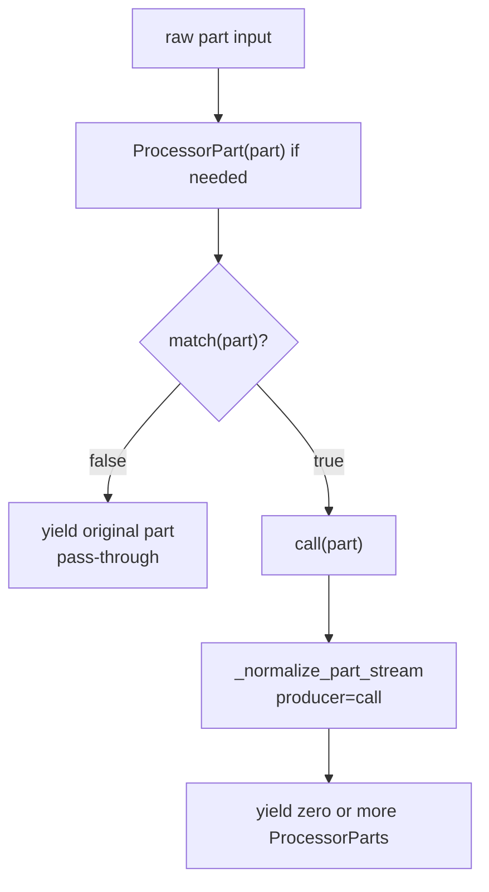
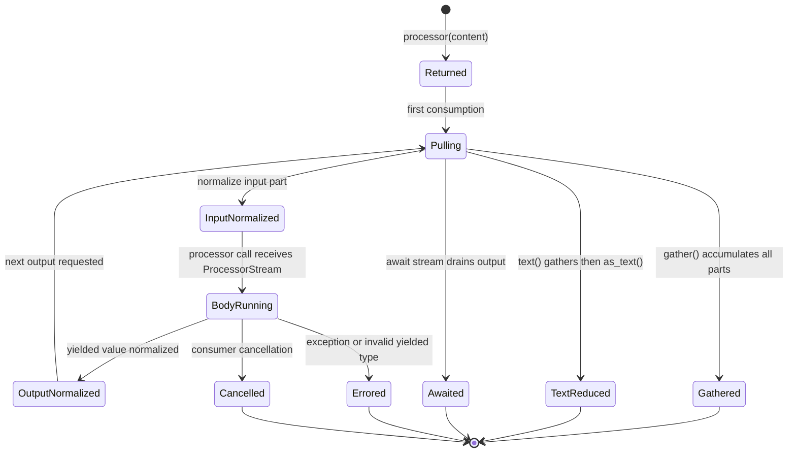
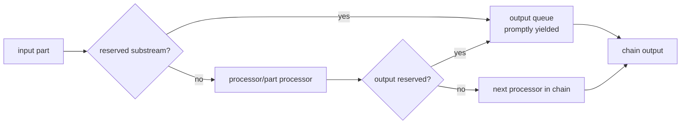
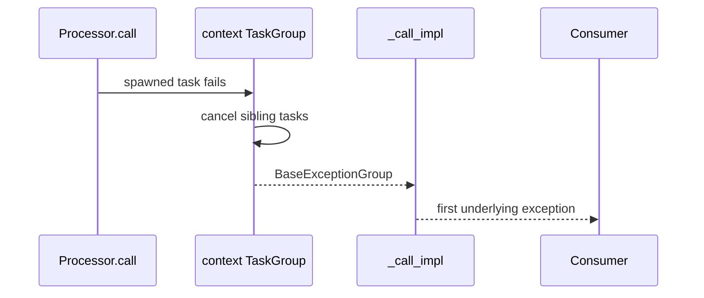

# Runtime Flow

Processor calls are lazy async streams. Calling a processor returns a `ProcessorStream`; work happens as the stream is consumed, gathered, or awaited.

## Source References

- `genai_processors/processor.py:87-108` normalizes sync or async content into `ProcessorPart` objects.
- `genai_processors/processor.py:149-178` wraps a `Processor` call in a `ProcessorStream` and creates trace context.
- `genai_processors/processor.py:187-258` implements processor invocation, including input normalization, trace IO, and context creation when missing.
- `genai_processors/processor.py:372-405` normalizes a `PartProcessor` input and applies `match()` before `call()`.
- `genai_processors/content_api.py:815-836` executes a stream via `.gather()` or `await stream`.
- `genai_processors/processor.py:520-557` implements `apply_async` and `apply_sync` by lifting to a processor and gathering.
- `genai_processors/processor.py:973-1034` captures reserved substreams between processors in a chain.
- `genai_processors/processor.py:1037-1118` captures reserved substreams before and after part-processor calls.
- `genai_processors/processor.py:1124-1167` runs stream-level parallel processors over split input streams.
- `genai_processors/streams.py:266-268` gathers any async iterable into a list.
- `genai_processors/tests/processor_test.py:86-163` verifies task-group errors are flattened to the original exception.
- `genai_processors/tests/content_api_test.py:673-742` verifies stream reducers and `await ContentStream`.

## Flow

1. Caller invokes `processor(content)`.
2. `Processor.__call__` returns `ProcessorStream(self._call_impl(...))`.
3. When consumed, `_call_impl` wraps non-stream inputs with `_normalize_part_stream`.
4. If no processor context exists, `_call_impl` opens `context()` and uses a queue so generator yields and task-group cancellation stay connected.
5. `Processor.call(content_stream)` yields raw `ProcessorPartTypes`.
6. `_normalize_part_stream` converts yielded raw values into `ProcessorPart`.
7. The returned `ProcessorStream` can be iterated, gathered into `ProcessorContent`, reduced to text, or awaited for side effects.

For a `PartProcessor`, the flow is narrower:

1. Caller invokes `part_processor(part)`.
2. `PartProcessor.__call__` coerces raw input to `ProcessorPart`.
3. `_call_impl` returns the input unchanged if `match(part)` is false.
4. Otherwise `call(part)` yields zero or more parts, normalized through `_normalize_part_stream`.

## Processor Invocation Diagram



The wrapper controls execution. Subclasses implement `call()`; callers consume
the stream returned by `__call__()`.

## PartProcessor Invocation Diagram



For ordinary invocation, a failed match is not a drop. Drops come from filters,
processors that yield nothing, or part-level parallel without passthrough
sentinels.

## Stream State Model



`ProcessorStream` inherits reducer behavior from `ContentStream`, so `.text()`
and `.gather()` are not special execution paths. They are consumers of the same
lazy async stream.

## Execution Equations

For processor invocation:

```text
processor(raw_input)
  returns ProcessorStream(parts=_call_impl(raw_input))

consume(processor(raw_input))
  = normalize_output(processor.call(normalize_input(raw_input)))
```

For part processor invocation:

```text
part_processor(x) =
  if match(ProcessorPart(x)):
    normalize_output(call(ProcessorPart(x)))
  else:
    [ProcessorPart(x)]
```

For reducers:

```text
await stream.gather() = ProcessorContent([p async for p in stream])
await stream.text(strict=False, substream_name=s)
  = as_text(await stream.gather(), strict=False, substream_name=s)
await stream = drain(stream) and discard yielded parts
```

For invalid producer values:

```text
normalize_output(y, producer=f)
  raises ValueError("<conversion error> produced by <f>")
```

That producer tag is part of the debugging contract; it points failures at the
processor body that yielded an unsupported value.

## Reserved-Substream Flow



Reserved capture is checked before handing a part to a downstream processor and
again after a part processor yields output. This is why status/debug/UI parts
can escape slow or model-facing processors.

## Consumption Modes

| Mode | Code Shape | Semantics | Use When |
| --- | --- | --- | --- |
| Streaming | `async for part in p(input): ...` | Pulls parts as they arrive. | Arrival order, realtime UI, audio, incremental state. |
| Gather | `await p(input).gather()` | Drains stream into `ProcessorContent`. | Tests, batch transforms, model output needed as content. |
| Text | `await p(input).text()` | Gathers, filters/reduces text parts. | Text-only boundaries. |
| Await | `await p(input)` | Drains stream and discards parts. | Side effects only, such as terminal output. |
| Apply | `processor.apply_sync/async(p, input)` | Opens context, lifts part processors, gathers list. | Simple tests and synchronous examples. |

Prefer `.gather()` for complete output. Prefer `async for` only when the order
and timing of individual parts matters.

## Error And Cancellation Semantics



`context.raise_flattened_exception_group` unwraps nested exception groups to the
first underlying exception. Tests assert that callers see the specific
`ValueError` message rather than only "unhandled errors in a TaskGroup".

## Invariants

- Invocation is separate from execution. A returned `ProcessorStream` may do no work until consumed.
- `Processor.call()` receives a `ProcessorStream`, not a list.
- `PartProcessor.call()` receives exactly one `ProcessorPart`.
- `PartProcessor.match(part) == False` means pass-through in normal chains/apply; parallel composition has extra fallback/drop semantics.
- Use `await processor(input).gather()` when all output is needed; use streaming iteration only when arrival order matters.
- Non-`ProcessorPart` outputs are allowed only if they are valid `ProcessorPartTypes`; otherwise normalization raises a producer-tagged `ValueError`.
- `ContentStream(parts_generator=...)` is single-use; static content streams are
  re-iterable.
- A processor body should not block the event loop inside `call()`. Long or
  blocking work should be awaited or moved to an async-friendly boundary.
- A `ProcessorStream` carries trace context, but nested `ProcessorStream`
  wrappers are unrolled to avoid duplicate traces for the same stream.

## Replication Pattern

To document runtime flow in another repo:

1. Separate "call returns handle" from "consumer drives execution".
2. Draw one sequence diagram for the public wrapper and one flowchart for the
   smallest unit processor.
3. Write equations for normalization, reducers, and error tagging.
4. Add a state diagram for stream lifecycle from constructed to completed,
   errored, or cancelled.
5. Include a consumption-mode table so future agents choose the right execution
   style.
6. Cite tests for lazy execution, error propagation, ordering, and single-use
   stream behavior.

## Read Next

- `.llms/reference/concepts/content-model.md`
- `.llms/reference/concepts/processors-and-composition.md`
- `.llms/reference/architecture/async-context-and-taskgroups.md`
