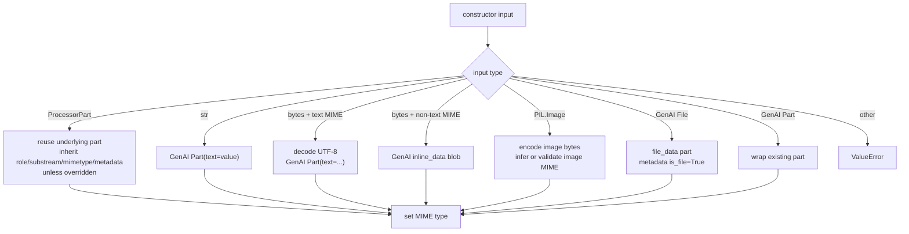
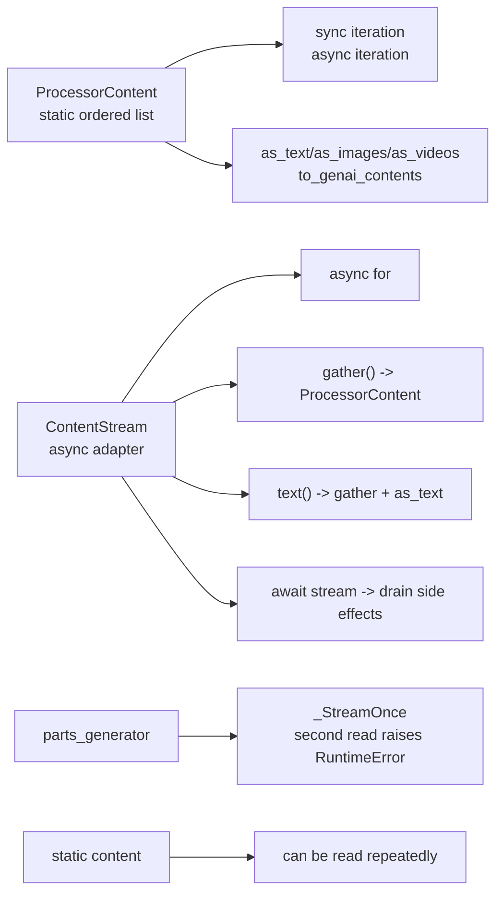
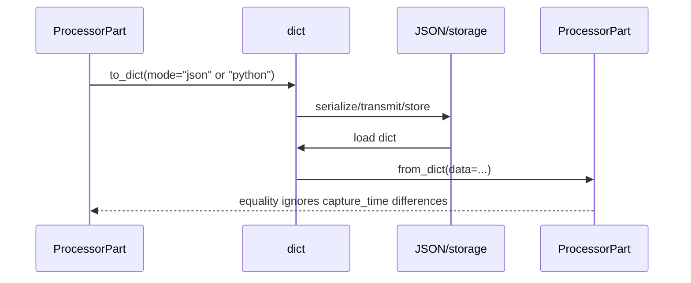
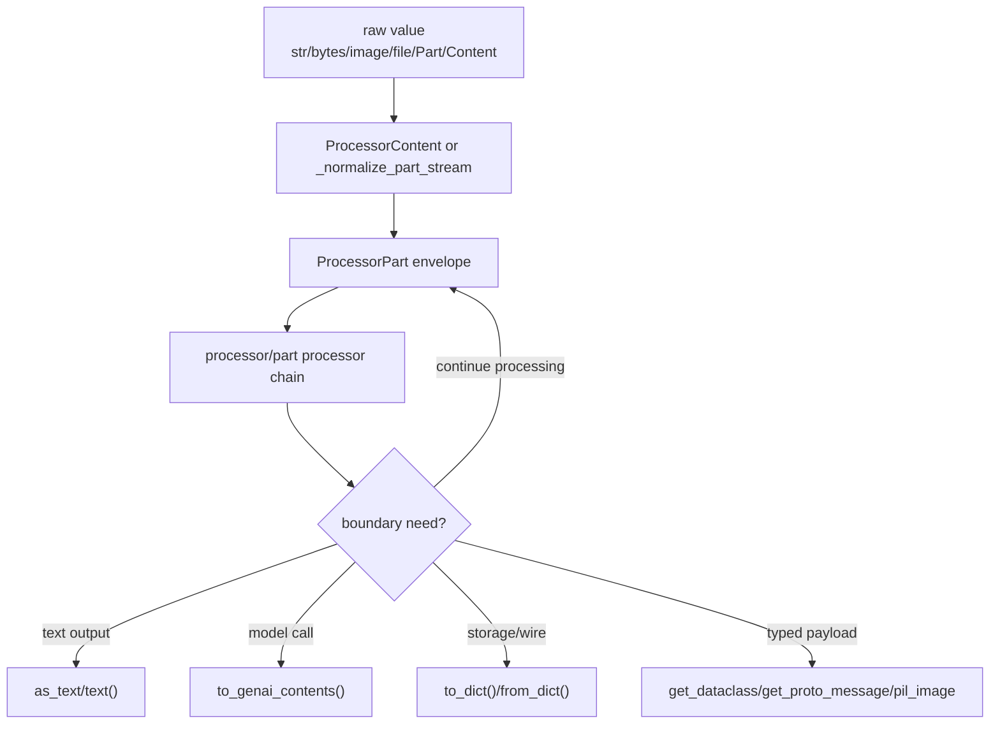

# Content Model

The content model separates the single unit (`ProcessorPart`) from collections/streams (`ProcessorContent`, `ContentStream`). Preserve parts as long as possible; reduce to text, images, GenAI content, or dataclasses only at boundaries.

## Source References

- `genai_processors/content_api.py:39-68` defines `ProcessorPart` constructor fields.
- `genai_processors/content_api.py:91-153` shows supported construction inputs and metadata inheritance.
- `genai_processors/content_api.py:155-177` derives MIME type from explicit args, inline data, function calls/responses, or text.
- `genai_processors/content_api.py:228-310` exposes role, bytes, substream, MIME, text, and metadata accessors.
- `genai_processors/content_api.py:392-572` provides constructors for URI, function call/response, code execution, bytes, proto, tool cancellation, dataclass, and end-of-turn.
- `genai_processors/content_api.py:575-672` serializes, deserializes, and copies `ProcessorPart`.
- `genai_processors/content_api.py:695-820` defines `ContentStream` as an async adapter with reducers.
- `genai_processors/content_api.py:841-980` defines `ProcessorContent` as a static multi-part container.
- `genai_processors/content_api.py:994-1012` defines accepted `ProcessorPartTypes` and `ProcessorContentTypes`.
- `genai_processors/content_api.py:1065-1252` reduces or converts content to text/images/videos/GenAI values.
- `genai_processors/mime_types.py:127-178` defines MIME-type predicates used by content accessors.
- `genai_processors/tests/content_api_test.py:40-183` verifies bytes, tool cancellation, text access, and equality behavior.
- `genai_processors/tests/content_api_test.py:237-250` verifies exact substream filtering for `as_text`.
- `genai_processors/tests/content_api_test.py:481-573` verifies serialization round trips and JSON/python bytes modes.
- `genai_processors/tests/content_api_test.py:590-662` verifies GenAI content grouping by role and files.
- `genai_processors/tests/content_api_test.py:673-759` verifies `ContentStream` construction, single-use generators, reducers, and await behavior.

## Contracts

`ProcessorPart` wraps a GenAI SDK `Part` plus metadata:

- `role`: producer or conversation role; usually empty, `user`, or `model`.
- `substream_name`: logical lane; empty string means default stream.
- `mimetype`: semantic type used for dispatch and access safety.
- `metadata`: arbitrary auxiliary data; copied by `copy()` and serialized by `to_dict()`.

`ProcessorContent` is a static container. It can be built from parts, strings, bytes with MIME type, images, GenAI files, GenAI content, and iterables. Iterating yields `ProcessorPart`.

`ContentStream` is an async adapter. A stream backed by a generator may be single-use; static content streams can be iterated multiple times.

## Semantic Envelope

```text
ProcessorPart =
  (part, role, substream_name, mimetype, metadata)

part = google.genai.types.Part
role = "" | "user" | "model" | application-specific string
substream_name = "" | application-specific lane name
mimetype = media/protocol/dataclass/exception type string
metadata = dict[str, Any]
```

The underlying GenAI `Part` holds the payload. The wrapper holds the routing and
processing envelope. Most processors should preserve the envelope unless they
are intentionally changing role, MIME type, substream, or metadata.

## Construction And MIME Inference



MIME inference order:

| Condition | Inferred `mimetype` |
| --- | --- |
| Explicit constructor `mimetype` | Explicit value wins. |
| Underlying part has `inline_data.mime_type` | Inline MIME value. |
| Underlying part has `function_call` | Function-call protobuf MIME string. |
| Underlying part has `function_response` | Function-response protobuf MIME string. |
| Underlying part has non-empty text | `text/plain`. |
| Otherwise | Empty internal MIME, exposed as `text/plain` by the property. |

Bytes always require a MIME type. For text MIME types, bytes are decoded into
`part.text`; for non-text MIME types, bytes are stored as inline data.

## Content Containers



`ProcessorContent` is useful at boundaries that need all parts. `ContentStream`
is useful inside processors because it preserves laziness and supports stream
consumption.

## Reducer Algebra

Given ordered parts:

```text
C = [p0, p1, ..., pn]
```

Text reduction:

```text
as_text(C, strict=False, substream_name=s) =
  concat(p.text for p in C
         if is_text(p.mimetype)
         and (s is None or p.substream_name == s))
```

Strict text reduction:

```text
if strict=True and any(non_text selected part):
  raise ValueError("Unsupported content type ...")
```

Image/video reductions:

```text
as_images(C, ignore_unsupported_types=False) =
  [p for p in C if is_image(p.mimetype)]
  or raise on unsupported non-image parts
```

GenAI conversion groups consecutive values by `(role, file-ness)`:

```text
to_genai_contents([user text A, user text B, model text C])
  = [Content(role=user, parts=[A, B]),
     Content(role=model, parts=[C])]
```

Files are emitted as `genai_types.File` entries rather than packed into a
`Content` object.

## Serialization Lifecycle



`mode="json"` base64-encodes bytes through the GenAI model dump. `mode="python"`
may preserve Python bytes objects. Tests cover both modes.

## Tool And Protocol Parts

| Constructor / Property | Semantic Use |
| --- | --- |
| `from_function_call(name, args)` | Model requests tool/function execution. |
| `from_function_response(...)` | Tool/client returns a result, error, continuation, or scheduling policy. |
| `from_tool_cancellation(function_call_id=...)` | Model cancels an outstanding tool call; role is forced to `model`. |
| `from_proto_message(...)` / `get_proto_message(...)` | Store and recover typed protobuf payloads. |
| `from_dataclass(...)` / `get_dataclass(...)` | Store and recover JSON dataclass payloads. |
| `end_of_turn(...)` | Empty user text part with `metadata["turn_complete"] = True`. |

These are still `ProcessorPart`s. They are routed by MIME type, function fields,
metadata, role, or substream like any other part.

## Mutation And Aliasing

`ProcessorPart.copy()` deep-copies metadata but does not deep-copy the underlying
GenAI `Part`. `ProcessorContent` may hold the same `ProcessorPart` objects that
other containers hold. If a branch changes metadata, role, substream, or text in
place, copy first when aliases might exist.

```text
safe_part = part.copy()
safe_part.metadata["source"] = "my_processor"
```

This matters most after `streams.split(..., with_copy=False)` and in
`parallel_concat`, where multiple branches may see the same part objects.

## Data Lifecycle



The recommended lifecycle is envelope-preserving until a concrete boundary
requires a narrower representation.

## Failure Modes And Gotchas

- `part.text` checks MIME type, not just whether the underlying GenAI part has
  text. A text payload with custom non-text MIME can raise.
- `as_text(..., substream_name=...)` uses exact substream equality, not reserved
  prefix matching.
- `ProcessorPart(another_part, metadata=...)` updates inherited metadata; use
  `copy()` if callers should not observe metadata mutation.
- The equality operator ignores `capture_time` metadata differences, which is
  convenient for streaming tests but should not be used as a complete audit
  comparison.
- Empty internal MIME is exposed as `text/plain` by `mimetype`; do not use empty
  MIME as a reliable signal for "unknown".

## Invariants

- Bytes require a MIME type when constructing a `ProcessorPart`.
- `part.text` raises for non-text MIME types; check MIME or let the error signal misuse.
- Empty substream name is the default content stream, not missing data.
- Copy before mutating metadata or part fields if aliases might share the same `ProcessorPart`.
- `ProcessorPart.from_dict(part.to_dict())` is the JSON-compatible round trip.
- `as_text(..., substream_name=...)` filters by exact substream name, not prefix.
- `to_genai_contents()` groups consecutive parts by role and file-ness.
- `ContentStream(parts_generator=...)` can be consumed only once.
- Function calls, function responses, dataclasses, proto messages, and tool
  cancellations are ordinary parts with protocol-specific fields/MIME types.
- Preserve multimodal parts until a real boundary needs a text/image/proto/GenAI
  conversion.

## Replication Pattern

To document a content model in another repo:

1. Define the smallest content envelope as a tuple of payload plus metadata.
2. Draw construction and MIME/type inference before documenting processors.
3. State reducer equations and filtering rules, especially exact versus prefix
   matching.
4. Document serialization as a lifecycle, including equality caveats.
5. Include a mutation/aliasing section if containers or stream splits share
   object instances.
6. Cite tests for constructor inputs, reducer filters, wire round trips, and
   single-use stream behavior.

## Read Next

- `.llms/reference/concepts/processors-and-composition.md`
- `.llms/reference/concepts/substreams-and-routing.md`
- `.llms/reference/architecture/runtime-flow.md`
