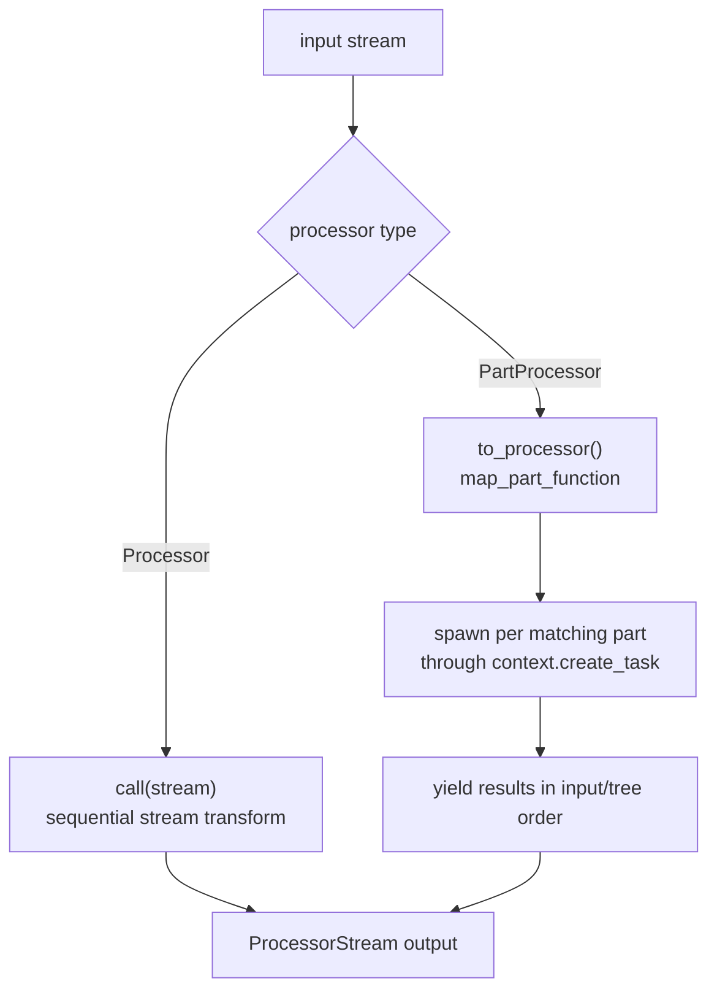
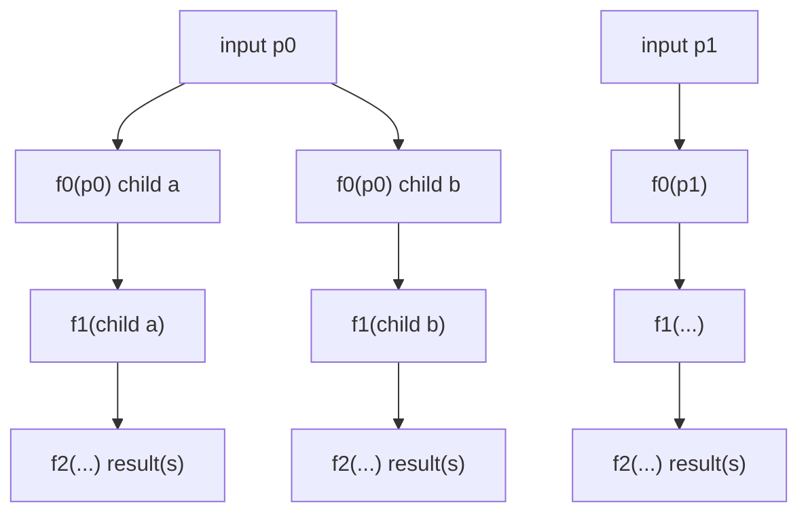
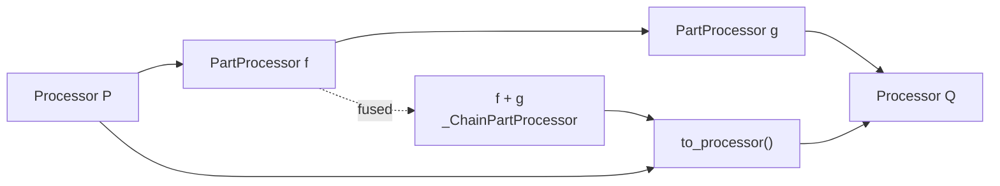
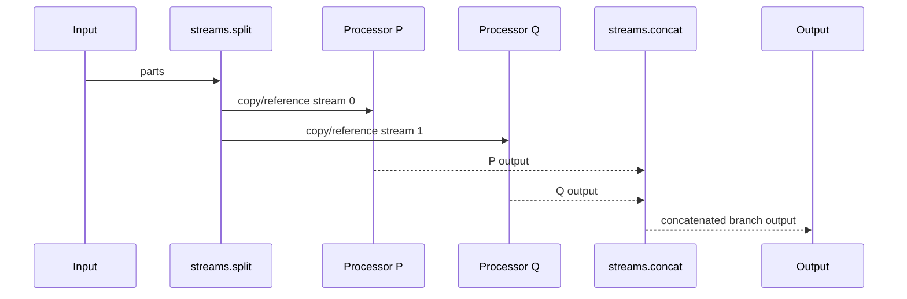

# Processors And Composition

There are two processing contracts. `Processor` transforms a stream. `PartProcessor` transforms one part and can be lifted to a stream processor for concurrent execution across the input stream.

## Source References

- `genai_processors/processor.py:135-147` defines the `ProcessorFn` protocol: `ProcessorStream -> AsyncIterable[ProcessorPartTypes]`.
- `genai_processors/processor.py:149-324` defines `Processor`, its invocation wrapper, `call`, `key_prefix`, `trace_name`, `to_processor`, and `+`.
- `genai_processors/processor.py:327-369` defines part-processor protocols and `match`.
- `genai_processors/processor.py:372-508` defines `PartProcessor`, pass-through on failed match, `+`, `//`, and lifting through `to_processor`.
- `genai_processors/processor.py:560-608` provides `@processor_function` and `@part_processor_function`.
- `genai_processors/processor.py:611-667` defines `chain`, `parallel`, and `parallel_concat`.
- `genai_processors/processor.py:780-846` implements fused part-processor chains.
- `genai_processors/processor.py:898-970` fuses adjacent `PartProcessor`s inside processor chains.
- `genai_processors/processor.py:1124-1187` implements stream-level parallel concatenation.
- `genai_processors/processor.py:1189-1343` implements part-level parallel composition and passthrough sentinels.
- `genai_processors/map_processor.py:98-194` exposes map/chain/parallel part-function combinators.
- `genai_processors/map_processor.py:259-383` implements eager concurrent chain and parallel execution.
- `genai_processors/tests/processor_test.py:797-836` verifies chain composition across processor and part-processor forms.
- `genai_processors/tests/processor_test.py:909-936` verifies failed matches skip task creation in part-processor chains.
- `genai_processors/tests/processor_test.py:1096-1227` verifies `//`, fallback, and always-passthrough behavior.
- `genai_processors/tests/map_processor_test.py:17-32` verifies output order is preserved while execution can complete out of order.
- `genai_processors/tests/map_processor_test.py:85-126` verifies part-function chains run ahead while preserving ordered output.
- `genai_processors/tests/map_processor_test.py:323-342` verifies parallel match functions drop unmatched parts unless fallback is enabled.

## Operators

- `p + q`: sequential composition.
- `part_p + part_q`: fused part chain; each matching part can fan out through the chain.
- `part_p + stream_p`: mixed chain; part processor is lifted to stream processor.
- `part_p // part_q`: part-level parallel composition; both processors see the same input part when their match functions pass.
- `parallel_concat([p, q])`: stream-level parallel fan-out; outputs are concatenated/merged by processor branch.
- `PASSTHROUGH_FALLBACK`: in `//`, yield the input only when no branch outputs anything.
- `PASSTHROUGH_ALWAYS`: in `//`, always include the input part as an output.

## Match Contract

`match(part)` is a scheduling and pass-through hint. A `PartProcessor` whose match returns false must behave as pass-through. The wrapper enforces pass-through before `call()` for normal invocation; wrappers and map functions also use `match` to skip task creation.

In parallel composition, no matching processor usually means drop. Add `PASSTHROUGH_FALLBACK` to preserve unmatched inputs, or `PASSTHROUGH_ALWAYS` to preserve every input.

## Type Contracts

```text
ProcessorFn:      ProcessorStream -> AsyncIterable[ProcessorPartTypes]
Processor:        ProcessorStream -> ProcessorStream
PartProcessorFn:  ProcessorPart -> AsyncIterable[ProcessorPartTypes]
PartProcessor:    ProcessorPart -> ProcessorStream
```

`Processor` is the right abstraction when transformation depends on multiple
parts, stream end, history, external session state, or model state. `PartProcessor`
is the right abstraction when each input part can be transformed independently
or fanned out.

## Composition Algebra

Let `S = [p0, p1, ..., pn]`, `P` and `Q` be processors, and `f`, `g` be part
processors.

Sequential stream composition:

```text
(P + Q)(S) = Q(P(S))
chain([P0, P1, ..., Pk])(S) = Pk(...P1(P0(S))...)
```

Lifted part processor:

```text
f.to_processor()(S) =
  ordered_flatten([f(p0), f(p1), ..., f(pn)])
```

Part chain:

```text
(f + g)(p) = flatten(g(x) for x in f(p))
```

Part parallel:

```text
(f // g)(p) = concat(f(p), g(p))
```

Parallel sentinels:

```text
(f // PASSTHROUGH_FALLBACK)(p) =
  f(p) if f(p) yields anything else [p]

(f // PASSTHROUGH_ALWAYS)(p) =
  concat(f(p), [p])
```

These equations ignore reserved-substream capture. In real chains, reserved
parts are diverted to the output queue before reaching downstream processors.

## Execution Model



Part processors trade local independence for concurrency. They can run far ahead
of the consumer, but the result iterator buffers enough to preserve the
documented order.

## Part-Function Chain Tree

For part functions `f0`, `f1`, and `f2`, each function can yield zero or more
children. The executor builds a tree and yields completed leaves in left-to-right
order:



`p1` work may finish before `p0`, but `p0` results are yielded first if `p0` is
the earlier input. Tests explicitly show execution order and output order can
differ.

## Chain Fusion



`_ChainProcessor` fuses adjacent `PartProcessor`s before lifting. This preserves
the public `+` semantics while allowing part-level concurrency across the fused
segment.

## Match And Output Matrix

| Composition | `match(part) == False` | Branch Called? | Output If No Branch Produces Data |
| --- | --- | --- | --- |
| Direct `part_processor(part)` | Pass original part through. | No. | Original part. |
| `part_processor.to_processor()` / apply | Pass original part through. | No. | Original part. |
| Part chain `f + g` | Skip that processor; continue chain with current part. | No for skipped processor. | Current part may still flow to later processors. |
| Part parallel `f // g` | Non-matching branch skipped. | No for skipped branch. | Drop unless a passthrough sentinel is present. |
| `// PASSTHROUGH_FALLBACK` | Same branch matching rules. | Sentinel is not called as normal branch. | Original part only if all real branches yield nothing. |
| `// PASSTHROUGH_ALWAYS` | Same branch matching rules. | Sentinel is not called as normal branch. | Original part always included after real branch outputs. |

The difference between "skip" and "drop" is the main semantic trap in this
module.

## Ordering Guarantees

| Primitive | Preserved Order | May Reorder |
| --- | --- | --- |
| `Processor.call` implementation | Whatever the implementation yields. | Implementation-defined. |
| `f.to_processor()` | Input-part order and per-part yielded order. | Actual task completion order is hidden. |
| `f + g` | Tree left-to-right order. | Internal execution may run ahead. |
| `f // g` | Branch-list order for one input part. | Branch execution completion order. |
| `parallel_concat([P, Q])` | Each branch's local output order. | Cross-branch timing and concat scheduling details. |
| `Switch` | Each case processor's local output order. | Cross-case output order. |

When a user-facing stream must preserve global input order, prefer a
`PartProcessor` chain or add sequence metadata and reorder explicitly at the
boundary.

## Stream-Level Parallel



`streams.split(..., with_copy=False)` shares objects by default. Use
`with_copy=True` or copy parts inside branches if a branch mutates parts in
place.

## Sources

`@processor.source(stop_on_first=True)` turns an async generator into both a
`Source` stream and a `Processor`. As a processor, it merges incoming content
with generated parts:

```text
Source.call(content) = streams.merge(content, source_stream,
                                     stop_on_first=stop_on_first)
```

For realtime device streams, `stop_on_first=True` lets the upstream input stream
control chain lifetime. For finite folder/file sources, `stop_on_first=False`
can let generated content continue after the incoming stream ends.

## Caching And Trace Identity

`key_prefix` identifies processor semantics for cache keys and trace labels.
The default is the class name or wrapped function name. Override it when
constructor arguments change output:

```text
same key_prefix + same input + cache enabled => same cache namespace
```

Do not hide output-affecting parameters from `key_prefix`; doing so can collide
cache entries and traces across semantically different processors.

## Invariants

- Decorated processor functions must be async generator functions.
- `Processor` implementations consume streams; `PartProcessor` implementations consume one `ProcessorPart`.
- Adjacent `PartProcessor`s are fused to maximize concurrency.
- Part-function chains preserve left-to-right output order within the tree while eagerly scheduling deeper work.
- Part-level parallel output is emitted in processor-list order, not completion order.
- Stream-level switch/parallel branches may reorder output across branches.
- `key_prefix` should change when constructor arguments change output; otherwise cache keys and traces can collide.
- `//` has higher precedence than `+` in Python expression parsing; parenthesize
  mixed expressions when the grouping matters.
- `processor.chain([])`, `processor.parallel([])`, and
  `processor.parallel_concat([])` raise `ValueError`.
- Direct `PartProcessor.__call__` pass-through on failed match is not the same
  as parallel composition fallback.

## Replication Pattern

To document composition in another repo:

1. Write type signatures before operator prose.
2. Give equations for every operator and explicitly call out side conditions
   such as reserved lanes or passthrough sentinels.
3. Add one diagram for execution topology and one table for ordering guarantees.
4. Build a match/drop/pass-through matrix; this prevents many incorrect fixes.
5. Include precedence or grouping gotchas if the API overloads operators.
6. Cite tests that prove ordering, matching, fallback, and error behavior.

## Read Next

- `.llms/reference/architecture/runtime-flow.md`
- `.llms/reference/architecture/async-context-and-taskgroups.md`
- `.llms/reference/concepts/substreams-and-routing.md`
