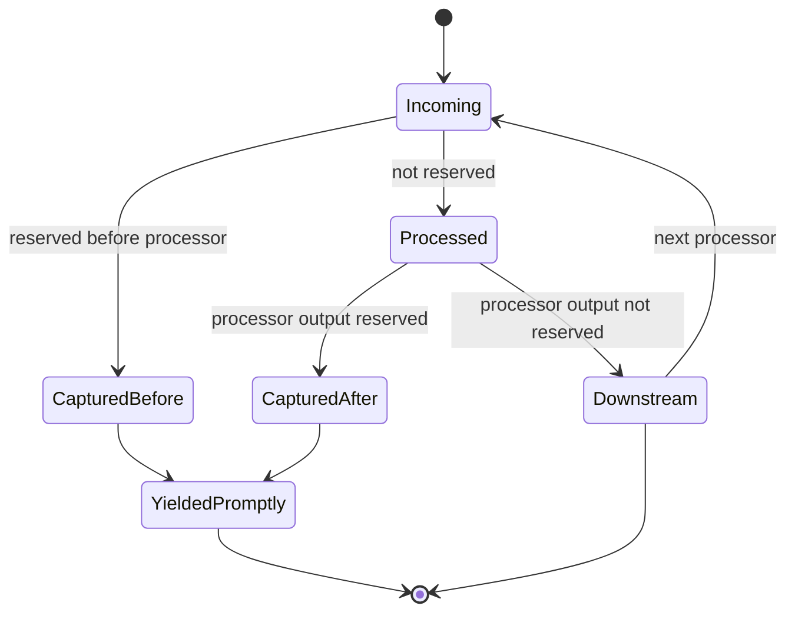
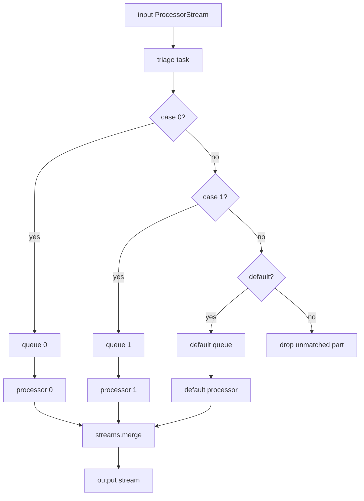
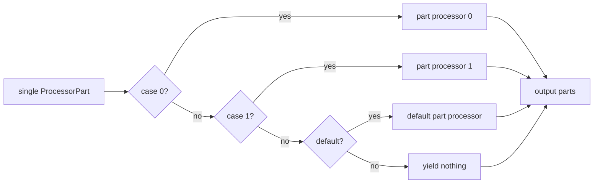

# Substreams And Routing

Substreams are metadata on `ProcessorPart`, not separate stream objects. They let one physical stream carry default content plus out-of-band lanes such as status, debug, UI, realtime audio, or named routing channels.

## Source References

- `genai_processors/content_api.py:76-81` documents substream construction and inheritance.
- `genai_processors/content_api.py:259-268` exposes `substream_name`.
- `genai_processors/content_api.py:1037-1041` provides `get_substream_name` for routing.
- `genai_processors/context.py:29-53` defines `prompt`, `debug`, `status`, `ui`, and the default reserved-substream set.
- `genai_processors/context.py:130-147` exposes reserved-substream lookup and prefix matching.
- `genai_processors/processor.py:510-517` builds `debug()` and `status()` parts.
- `genai_processors/processor.py:973-984` captures reserved stream parts from processor chains.
- `genai_processors/processor.py:996-1034` captures reserved parts between stream processors and yields them through the output queue.
- `genai_processors/processor.py:1037-1070` captures reserved parts before and after part-processor calls.
- `genai_processors/processor.py:1073-1118` applies reserved capture inside part-processor chains.
- `genai_processors/processor.py:1258-1315` applies reserved capture inside part-level parallel composition.
- `genai_processors/switch.py:34-142` routes streams by first matching case; `genai_processors/switch.py:145-227` routes individual parts by first matching case.
- `genai_processors/tests/processor_test.py:878-907` and `genai_processors/tests/processor_test.py:1267-1296` assert custom reserved substreams bypass chain/parallel processors.
- `genai_processors/tests/processor_test.py:1228-1265` asserts reserved `status`/`debug` outputs are yielded promptly.
- `genai_processors/tests/switch_test.py:39-82` asserts stream switch routing and cross-case ordering behavior.
- `genai_processors/tests/switch_test.py:107-165` asserts `PartSwitch` first-match and default behavior.

## Reserved Substreams

Default reserved prefixes are:

- `debug`
- `status`
- `ui`

Reserved parts are captured and yielded immediately instead of being passed to the next processor in a chain or branch. Matching is prefix-based, so `status.progress` is reserved when `status` is reserved.

Custom context can replace the reserved set:

```python
async with processor.context(reserved_substreams=["custom_debug"]):
  async for part in chain(content):
    ...
```

## Switch Routing

`Switch(match_fn).case(value_or_predicate, processor).default(processor)` routes each input part to the first matching stream processor. Each case owns an input queue, cases run concurrently, and outputs are merged. Ordering is guaranteed only within one case processor, not across cases.

`PartSwitch` does the same first-match routing for one part at a time and is preferred when all cases are `PartProcessor`s.

Common routing keys:

- `content_api.get_substream_name`
- `lambda part: part.mimetype`
- `content_api.as_text` only when all routed parts are text-compatible
- custom predicates over `ProcessorPart`

## Substream Semantics

```text
substream_name = "" | "debug" | "status" | "ui" | "realtime" | "event_detection" | ...
```

The empty string is the default content lane. Every non-empty substream is just
a name on the same physical stream until a processor or context assigns special
meaning to it.

Reserved substreams are the only framework-level special case. Other names such
as `realtime`, `input_transcription`, `output_transcription`, or
`event_detection` are conventions used by specific processors and examples.

## Reserved Predicate

```text
reserved(part) =
  any(part.substream_name.startswith(prefix)
      for prefix in context.get_reserved_substreams())
```

Examples with default prefixes:

| Substream | Reserved? | Reason |
| --- | --- | --- |
| `""` | No | Default content is ordinary input. |
| `debug` | Yes | Exact default reserved prefix. |
| `debug.trace` | Yes | Prefix match. |
| `status.progress` | Yes | Prefix match. |
| `ui.widget` | Yes | Prefix match. |
| `realtime` | No | Processor-specific convention, not reserved by default. |

Custom context replaces, rather than appends to, the default set:

```python
async with processor.context(reserved_substreams=["audit"]):
  # "audit" and "audit.detail" are reserved.
  # "debug", "status", and "ui" are not reserved unless included above.
  ...
```

## Reserved Capture Lifecycle



Captured parts are put on an output queue and bypass the downstream processor
that would otherwise receive them. That makes status/debug/UI lanes safe to
emit from inside chains that include model processors.

## Routing Algebra

For cases ordered as:

```text
cases = [(predicate0, processor0), ..., (predicateN, processorN)]
```

A `Switch` triages each input part to the first matching case:

```text
case_index(part) = min(i for i in 0..N if predicate_i(part))

if no case matches:
  drop part
else:
  enqueue part into input_queue[case_index(part)]
```

Output:

```text
Switch(cases)(S) =
  merge(processor_i(dequeue(input_queue_i)) for i in cases)
```

`PartSwitch` uses the same first-match rule but calls only one part processor
for a single part:

```text
PartSwitch(cases)(p) =
  processor_case_index(p)(p)
  or [] when no case matches
```

Adding `.default(processor.passthrough())` appends a final predicate that always
matches. The default must be last.

## Switch Data Flow



Each case owns an input queue and processor. Case processors run concurrently,
so output order across cases is timing-dependent.

## PartSwitch Data Flow



Use `PartSwitch` when all routes are part processors and first-match behavior is
sufficient. It avoids the per-case stream queues used by `Switch`.

## Route Selection Matrix

| Route Need | Prefer | Reason |
| --- | --- | --- |
| Route by substream to stream processors | `Switch(content_api.get_substream_name)` | Each route may need stream state. |
| Route by MIME type to part processors | `PartSwitch(lambda p: p.mimetype)` | First-match, per-part, efficient. |
| Send status/debug/UI around downstream model | Reserved substream context | Bypasses processing rather than routing through a case. |
| Preserve unmatched inputs | `.default(processor.passthrough())` or passthrough sentinel in `//` | Switches drop unmatched parts without default. |
| Split one part into several independent transforms | `part_p // part_q` | Same input part goes to every matching branch. |
| Send one physical stream to multiple stream processors | `parallel_concat([...])` | Uses `streams.split`. |

Do not use reserved substreams as a general router. Reserved means "bypass the
next processors"; routing means "choose a processor to handle this part."

## Example Substream Taxonomy

| Name | Framework Status | Typical Meaning |
| --- | --- | --- |
| `""` | Default lane | Ordinary model/user/tool content. |
| `debug` | Reserved by default | Diagnostic text or trace-like details. |
| `status` | Reserved by default | Progress and recoverable exception parts. |
| `ui` | Reserved by default | UI-bound parts that should not enter the model. |
| `prompt` | Named constant, not in default reserved set | Prompt-lane convention available to processors. |
| `realtime` | Processor convention | Live/realtime audio, image, or text input. |
| `event_detection` | Example convention | Local control lane in live commentator. |

This table describes current library conventions, not a closed enum. New
processors may define additional substreams, but they should document whether
the lane is model input, local control, UI output, or reserved bypass.

## Failure Modes And Gotchas

- Prefix matching means reserving `status` also reserves `status_anything` if it
  starts with the same characters. Choose custom prefixes deliberately.
- `as_text(..., substream_name="status")` is exact filtering, not reserved
  prefix filtering. It will not include `status.progress`.
- `Switch` without a default drops unmatched parts. This is often surprising in
  multimodal streams where only one MIME type was considered.
- `Switch(content_api.as_text)` can raise on non-text parts before a default can
  catch them. Route by MIME or substream when the stream may be multimodal.
- Reserved capture happens in composition helpers. A standalone processor body
  that manually iterates a stream can still see reserved parts unless it is
  inside the chain/parallel capture path.

## Invariants

- Empty substream name is ordinary default content and is not reserved.
- Reserved substreams bypass downstream processors in chain and parallel composition.
- Custom reserved-substream context replaces defaults; include defaults explicitly if they should remain reserved.
- Do not route by `.text` unless non-text parts are impossible or intended to raise.
- `Switch` without a default drops unmatched parts.
- `PartSwitch` without a default yields nothing for unmatched parts.
- A default case must be added last; adding another case after default raises.
- `Switch` output order is guaranteed within one case processor, not across
  different cases.
- `PartSwitch` uses first-match only. Later matching cases are ignored.
- Reserved-substream context is scoped by contextvars and can be nested.

## Replication Pattern

To document routing/substream behavior in another repo:

1. Define whether lanes are metadata, separate iterables, topics, queues, or
   external channels.
2. Write the exact reserved/bypass predicate as code or algebra.
3. Draw separate diagrams for bypass capture and case routing.
4. Include a route-selection table so agents choose bypass, switch, parallel, or
   split intentionally.
5. Document the drop/default behavior for unmatched input.
6. Cite tests for first-match, unmatched, cross-branch ordering, and custom
   reserved-lane behavior.

## Read Next

- `.llms/reference/architecture/async-context-and-taskgroups.md`
- `.llms/reference/concepts/processors-and-composition.md`
- `.llms/reference/architecture/runtime-flow.md`
