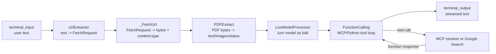

# Chat CLI

## Source References

- `examples/chat.py`
- `examples/models.py`
- `examples/mcp_server.py`
- `genai_processors/core/realtime.py`
- `genai_processors/core/function_calling.py`
- `genai_processors/core/pdf.py`
- `genai_processors/core/text.py`
- `genai_processors/dev/trace_file.py`

## Entrypoint

- Run with `python3 examples/chat.py`.
- Uses absl flags from this file plus model flags from `examples/models.py`.
- Optional flags: `--mcp_server`, `--api_key_env`, `--api_key_header`,
  `--trace_dir`, `--model_type`, `--model_name`.

## Pipeline / Data Flow

- `text.terminal_input()` emits user turns.
- `text.UrlExtractor()` converts URLs in user text into `FetchRequest` parts.
- Local `_FetchUrl` matches `FetchRequest`, downloads the URL with `httpx`, and
  yields a `ProcessorPart` with response bytes and response content type.
- `pdf.PDFExtract()` expands PDF parts before the model.
- `models.turn_based_model(...)` selects a turn model, wraps it in
  `realtime.LiveModelProcessor`, then `function_calling.FunctionCalling`.
- `text.terminal_output(...)` streams model text back to the terminal.

## Dependencies / Env

- Requires `GOOGLE_API_KEY` through `examples/models.py`.
- Remote MCP uses the env var named by `--api_key_env` when set; default
  `API_KEY`, sent in the header named by `--api_key_header`.
- `--mcp_server=demo` uses in-memory demo tools; `https://...` uses streamable
  HTTP; `local:<command>` launches stdio MCP.
- `--trace_dir` writes sync file traces through `trace_file.SyncFileTrace`.

## Demonstrated Processor Contracts

- Custom `processor.PartProcessor.match()` using dataclass mimetype checks.
- `@processor.yield_exceptions_as_parts` converts fetch failures into stream
  parts instead of terminating the pipeline.
- `FunctionCalling(..., is_bidi_model=True)` handles tool calls around a
  bidirectional realtime wrapper.
- `tools` are supplied to the model; `fns` are supplied to the local function
  caller when MCP is active.

## Semantic Flow



The CLI intentionally separates model-visible content from side effects:

- URLs become typed `FetchRequest` dataclass parts before network IO.
- Fetch exceptions are converted into status/exception parts, so one bad URL
  does not crash the chat loop.
- PDF extraction happens before function calling, so PDF text/images are part
  of the user turn rather than a tool call result.
- MCP sessions are passed twice: as model-visible tool declarations and as local
  function implementations.

## Tool Routing Matrix

| Flag Shape | Model Tools | Local `fns` | Transport |
| --- | --- | --- | --- |
| no `--mcp_server` | Google Search tool | none | server-side Gemini tool |
| `--mcp_server=demo` | MCP session | MCP session | in-memory FastMCP |
| `--mcp_server=https://...` | MCP session | MCP session | streamable HTTP with optional API header |
| `--mcp_server=local:<cmd>` | MCP session | MCP session | stdio subprocess |

When MCP is active, automatic function calling is disabled in the model config
and `FunctionCalling` owns the tool loop. This avoids double execution.

## Stateful Runtime Contract

`realtime.LiveModelProcessor` provides the conversational context boundary.
Semantically the loop is:

```text
history_0 = []
for each terminal turn u_i:
  enriched_i = fetch_and_extract_urls(u_i)
  response_i = FunctionCalling(LiveModelProcessor(turn_model))(history_i + enriched_i)
  history_{i+1} = history_i + enriched_i + response_i
```

The code does not materialize that formula directly; the realtime wrapper owns
the accumulated state. Reimplementations should preserve the boundary: terminal
input is streaming, but turn-model calls must see enough prior context to answer
conversationally.

## Gotchas

- `_FetchUrl` is explicitly example-grade and not production web fetching.
- Without `--mcp_server`, Google Search is the default tool.
- With MCP, automatic function calling is disabled and local function handling
  is expected.
- The CLI keeps conversational context in the realtime wrapper; it is not a
  stateless one-shot prompt loop.
