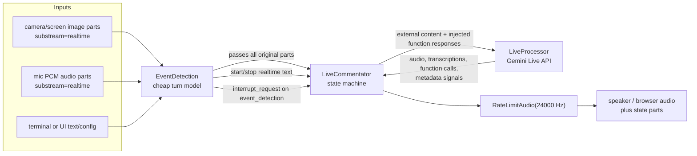
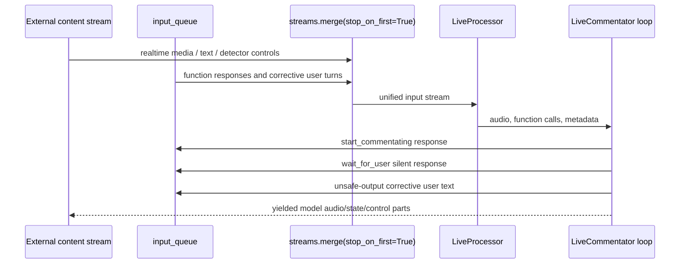
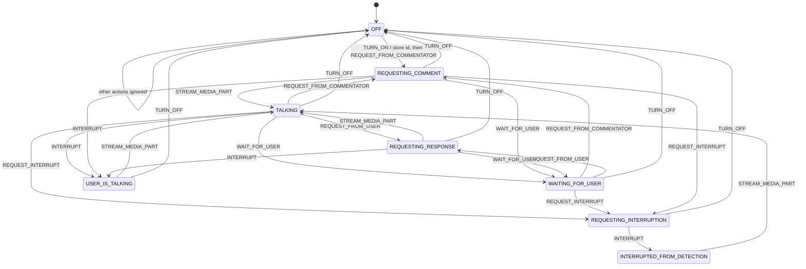
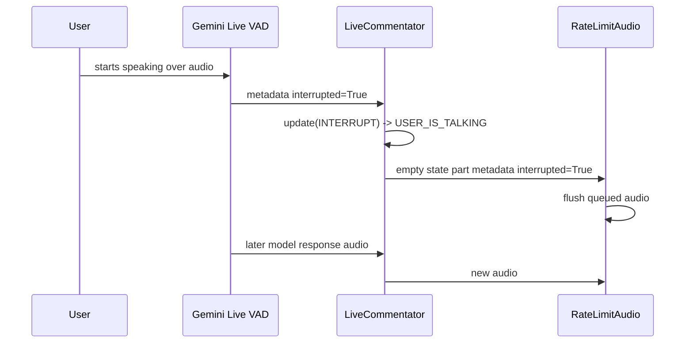
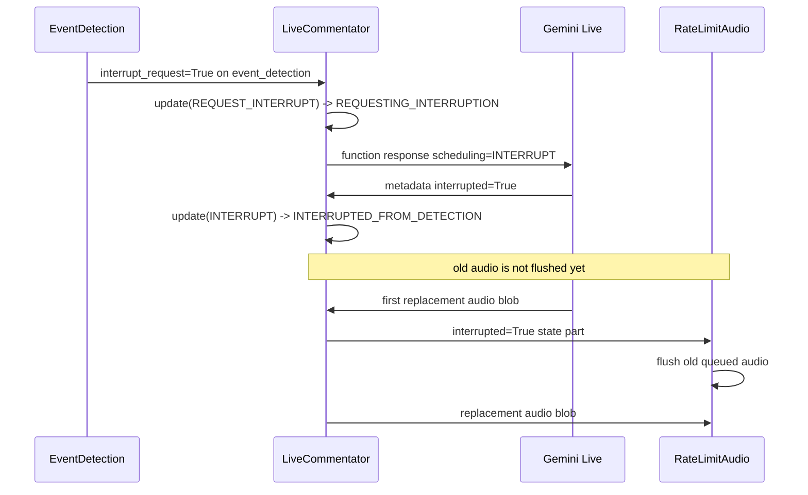
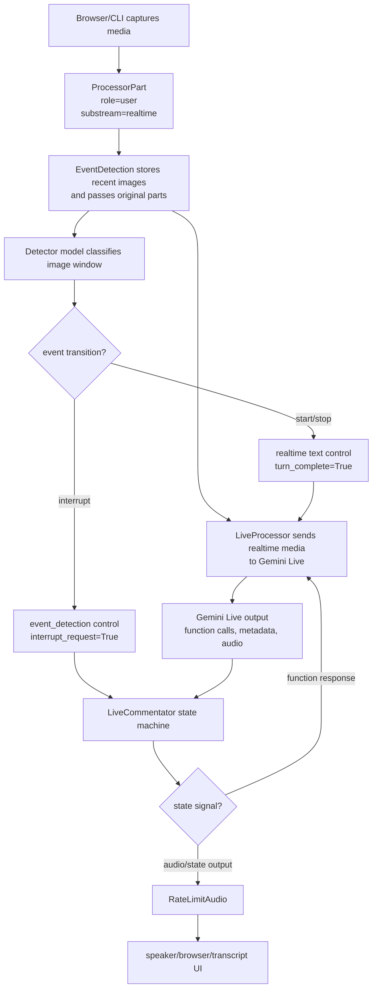

# Live Commentator

`examples/live_commentator` is the most stateful example in the repo. It is not
just a Live API wrapper: it is an event-driven commentator that keeps speaking,
lets the user interrupt it, interrupts itself when video changes, asks the model
when to wait, and schedules the next comment so generated audio lands close to
real playback time.

## Source References

- Design docstring, constants, tools, prompts:
  `examples/live_commentator/commentator.py:16-88`,
  `examples/live_commentator/commentator.py:113-277`
- Event enum, timing formulas, state machine:
  `examples/live_commentator/commentator.py:280-558`
- Runtime loop and function-response injection:
  `examples/live_commentator/commentator.py:561-890`
- Factory pipeline:
  `examples/live_commentator/commentator.py:893-994`
- CLI entrypoint: `examples/live_commentator/commentator_cli.py:68-96`
- AI Studio server: `examples/live_commentator/commentator_ais.py:44-83`
- ADK adapter: `examples/live_commentator/commentator_adk/agent.py:50-53`
- AI Studio client streams:
  `examples/live_commentator/ais_app/index.tsx:77-105`,
  `examples/live_commentator/ais_app/index.tsx:153-181`,
  `examples/live_commentator/ais_app/index.tsx:194-304`
- Event detection engine: `genai_processors/core/event_detection.py:137-296`
- Live API adapter: `genai_processors/core/live_model.py:61-129`,
  `genai_processors/core/live_model.py:181-279`
- Audio pacing: `genai_processors/core/rate_limit_audio.py:37-178`
- Stream merge/dequeue: `genai_processors/streams.py:136-230`
- Function response constructor:
  `genai_processors/content_api.py:402-455`

## Entrypoints

- CLI: from `examples/live_commentator`, run `python3 commentator_cli.py`.
- WebSocket server: `python3 commentator_ais.py`, default port `8765`.
- ADK: from `examples/live_commentator`, run `adk web` and select
  `commentator_adk`.
- Factory: `commentator.create_live_commentator(api_key, chattiness=...,
  unsafe_string_list=...)`.

The CLI builds local device IO:

```text
VideoIn(camera|screen) + PyAudioIn(use_pcm_mimetype=True)
  -> create_live_commentator(...)
  -> PyAudioOut
```

The AI Studio app sends mic, camera, screen, reset, and chattiness messages over
WebSocket. The server creates the same processor pipeline and streams audio or
state parts back to the browser.

## Semantic Model

The commentator treats the world as four simultaneous streams:

- `realtime`: audio/video/text that should enter Gemini Live through realtime
  input methods. Device media must use this substream.
- default substream: regular client content sent as turn content to Gemini Live.
- `event_detection`: internal control events from the detector to the
  `LiveCommentator`; these are intentionally not sent to Live API.
- model output/control: audio inline-data, transcription substreams, function
  calls, function cancellations, `generation_complete`, `interrupted`, and
  `go_away` metadata emitted by `LiveProcessor`.

The example composes three semantic processors:

1. `EventDetection` observes image parts and injects start/stop/interrupt
   control parts.
2. `LiveCommentator` owns the conversation state machine and injects async
   function responses into the Live model.
3. `RateLimitAudio` converts fast model audio into realtime playback pacing and
   flushes buffered audio when an interrupt state part arrives.

## Pipeline Diagram



Important directionality: `LiveCommentator` is both a consumer of `LiveProcessor`
output and a producer of extra input to it. It creates `input_queue`, merges the
external input stream with `streams.dequeue(input_queue)`, and passes that
merged stream into `LiveProcessor`.



`stop_on_first=True` means the merged input terminates when one of the merged
streams ends. In normal operation the internal queue does not end, so external
content controls session lifetime.

## Event Detection Semantics

The detector keeps a deque of recent image parts with timestamps. For each model
call it sends alternating image and relative timestamp text parts:

```text
image_0, "00:00", image_1, "00:01", ..., image_n, "00:dt"
```

The classifier returns one enum value:

- `yes`: something worth commentating is present.
- `no`: no relevant presence/action.
- `interruption`: a new notable event should interrupt the current comment.

Transition validity is not "latest label wins". The engine computes:

```text
event_name = response_text.strip().lower()
current_transition = (last_transition.to_state, event_name)
```

Then it checks:

```text
valid_transition =
  (current_transition in output_dict or current_transition.from_state == START)
  and current_transition.to_state != current_transition.from_state

sensitivity_reached =
  current_transition not in sensitivity
  or transition_counter[current_transition] > sensitivity[current_transition]
```

The strict `>` matters. With `NO_DETECTION_SENSITIVITY = 3`, the stop transition
fires only after the fourth repeated `(yes, no)` classification. Treat that as
the implementation contract, even though the constant comment reads like "three
times".

Configured transitions:

| Transition | Emitted Part | Meaning |
| --- | --- | --- |
| `(*, yes)` | realtime user text `"start commentating"`, `turn_complete=True` | Ask Live model to start or resume commentator behavior. |
| `(yes, no)` | realtime user text `"stop commentating"`, `turn_complete=True` | Ask model to cancel/stop active commentating after sustained absence. |
| `(yes, interruption)` | empty user part on `event_detection`, `interrupt_request=True` | Internal signal to request an interrupting comment. |
| `(interruption, yes)` | `None` | Accept the transition but emit no extra part. |

Because `EventDetection` passes all input through before injecting control
parts, downstream processors continue receiving normal media even while
detection is running.

## Live API Input Semantics

`LiveProcessor` routes each input part by semantic envelope:

| Input Part | Live API Method | Effect |
| --- | --- | --- |
| `function_response` | `session.send_tool_response(...)` | Returns async tool output to the model. |
| `substream_name == "realtime"` and `audio_stream_end` | `send_realtime_input(audio_stream_end=True)` | Ends realtime audio stream. |
| `substream_name == "realtime"` and inline media | `send_realtime_input(media=...)` | Sends mic/camera/screen media. |
| `substream_name == "realtime"` and text | `send_realtime_input(text=...)` | Sends realtime text control such as start/stop. |
| default substream | `send_client_content(..., turn_complete=...)` | Sends turn-style content. |
| any other substream | passed through | Lets internal control parts reach `LiveCommentator`. |

`to_parts()` converts Live server messages back into `ProcessorPart`s:

- audio model parts become inline-data `ProcessorPart`s with role from
  `model_turn`.
- `input_transcription` and `output_transcription` become text parts on their
  named substreams.
- metadata such as `generation_complete`, `interrupted`, `usage_metadata`, and
  `go_away` becomes empty model parts with metadata.
- function calls become `ProcessorPart.from_function_call(...)` with metadata
  `id`.
- tool cancellations become tool-cancellation parts.

## State Machine

The state machine stores:

- `state`: current `State` enum.
- `id`: active `start_commentating` async function-call id.
- `generation_request_info`: timing data for the current model request.
- `ttfts`: history of observed time-to-first-audio values.



### State Meanings

| State | Semantic Meaning | Active Request Data |
| --- | --- | --- |
| `OFF` | Commentator is inactive. User can still speak to the Live model, but autonomous commentary is off. | Cleared on `TURN_OFF`. |
| `TALKING` | Steady state: model audio is being played, or the agent is otherwise active and ready to schedule. | May have request timing from the last generation. |
| `USER_IS_TALKING` | VAD/model interruption indicates user started speaking. The agent yields an `interrupted` state part to stop old audio. | `GenerationType.USER_REQUEST`; start time is artificially delayed by 2 seconds to approximate user utterance duration. |
| `REQUESTING_INTERRUPTION` | Detector found a notable event. The system has asked the model for an interrupting comment but keeps old audio until replacement audio arrives. | `GenerationType.EVENT_INTERRUPTION`. |
| `REQUESTING_COMMENT` | Scheduler has requested the next autonomous comment. | `GenerationType.COMMENT`. |
| `REQUESTING_RESPONSE` | User-originated input should produce a response. | `GenerationType.USER_REQUEST`. |
| `INTERRUPTED_FROM_DETECTION` | Model confirmed interruption from detector. The next audio part will flush old audio, then play replacement audio. | Event-interruption request remains active until audio arrives. |
| `WAITING_FOR_USER` | Model called `wait_for_user`; client silently acknowledges and waits for user response or visual change. | Existing audio can finish; next schedule includes silence timeout. |

## Runtime Dispatch Matrix

`LiveCommentator.call()` processes every output part from `LiveProcessor` in a
priority order. This order is part of the behavior.

| Incoming Part | Guard | State Action | Output / Injection |
| --- | --- | --- | --- |
| `substream_name == "unsafe_regex"` | unsafe filter enabled | `REQUEST_FROM_USER` | Inject corrective realtime user text; do not yield unsafe part. |
| function call `start_commentating` | state is `OFF` | `TURN_ON` | Store function id; model may continue because tool is non-blocking. |
| function call `start_commentating` | state is not `OFF` | none | Inject empty silent response to reject duplicate active tool call. |
| function call `wait_for_user` | state is not `OFF` | `WAIT_FOR_USER` | Inject empty silent response; schedule resume after timeout. |
| metadata `start_of_user_turn` | any | `REQUEST_FROM_USER` | Consumed as state signal. |
| tool cancellation matching active id | any | `TURN_OFF` | Cancel scheduled comment task. |
| metadata `generation_complete` | state not `OFF` | no state update | Yield completion state part; schedule next comment or wait timeout. |
| metadata `interrupted` | any | `INTERRUPT` | For user interrupt, yield immediate `interrupted` state part. For detector interrupt, wait for replacement audio. |
| metadata `interrupt_request` | eligible states | `REQUEST_INTERRUPT` | Inject `start_commentating` response with `scheduling=INTERRUPT`. |
| metadata `go_away` | any | none | Cancel scheduled task and end processor. |
| inline audio/media output | any | `STREAM_MEDIA_PART` | If detector interruption is ready, yield `interrupted` before this audio; then yield audio. |
| any other part | any | none | Yield unchanged. |

## Async Tool Semantics

The Live model receives two non-blocking function declarations:

- `start_commentating`: model-facing handle for an ongoing commentator task.
  The client stores the function-call id and later sends function responses into
  the same call id to schedule more comments.
- `wait_for_user`: model-facing signal that it wants silence while the user
  answers or performs a visual action.

Function responses are created with `ProcessorPart.from_function_response(...)`.
The key scheduling modes used here are:

- `WHEN_IDLE`: add response and trigger generation when current model output is
  idle. Used for ordinary continuation.
- `INTERRUPT`: ask Gemini to interrupt current generation and regenerate with
  fresh event context. Used after `interrupt_request`.
- `SILENT`: acknowledge/cancel a tool call without triggering generation. Used
  for duplicate `start_commentating` calls and `wait_for_user` acknowledgments.

## Timing Formulas

All timing math assumes 16-bit PCM audio. One sample is 2 bytes.

Audio duration:

```text
audio_duration_sec(audio_bytes, sample_rate) =
  len(audio_bytes) / (2 * sample_rate)
```

For this example:

```text
sample_rate = RECEIVE_SAMPLE_RATE = 24000
audio_duration_sec = len(audio_bytes) / 48000
```

Time to first audio:

```text
ttft_sec = time_audio_start - generation_start_sec
```

`time_audio_start` is captured when the first model audio blob arrives for a
request. `generation_start_sec` is set when `REQUEST_FROM_COMMENTATOR`,
`REQUEST_INTERRUPT`, or `REQUEST_FROM_USER` starts a generation. For user
interrupts, `generation_start_sec` is shifted by `+2` seconds to approximate the
fact that the user is still speaking when the interrupt signal first arrives.

Predicted TTFT:

```text
if len(ttfts) == 0:
  predicted_ttft = 0.0
else:
  predicted_ttft = max(0.4, mean(ttfts) - std(ttfts))
```

This is intentionally optimistic. It asks for the next comment slightly before
the current audio finishes so the first audio of the next generation can arrive
near the playback boundary. The `0.4` lower bound avoids assuming impossible
near-zero model latency once historical measurements exist.

Tentative next trigger:

```text
tentative_trigger_time =
  time_audio_start
  + max(5.0, audio_duration)
  - predicted_ttft
```

The `max(5.0, audio_duration)` term guarantees a minimum conversational pause
window even when the model emitted no audio or very short audio, especially in
`WAITING_FOR_USER`.

Wait-for-user resume:

```text
resume_time =
  tentative_trigger_time + MAX_SILENCE_WAIT_FOR_USER_SEC
```

With the default constant:

```text
MAX_SILENCE_WAIT_FOR_USER_SEC = 5
```

Chattiness scheduling:

```text
if chattiness < 1e-6:
  do not schedule autonomous comments

after at_time:
  draw u ~ Uniform(0, 1)
  if u < chattiness:
    request next comment
  else:
    sleep NO_COMMENT_DELAY_SEC and retry
```

For `0 < chattiness <= 1`, the expected number of attempts is approximately
`1 / chattiness`, and the expected extra delay after `at_time` is approximately:

```text
((1 - chattiness) / chattiness) * NO_COMMENT_DELAY_SEC
```

The default retry delay is:

```text
NO_COMMENT_DELAY_SEC = 3
```

## Interruption Semantics

There are two interrupt paths, and they deliberately flush audio at different
times.

### User Interrupt



User speech should stop playback immediately, because the user is now driving
the turn.

### Detector Interrupt



Detector interrupts wait until replacement audio is ready. This avoids awkward
silence between "stop old comment" and "start new event comment".

## Audio Rate Limiting

Gemini can stream audio faster than realtime. `RateLimitAudio` enforces playback
pacing and bounded interrupt latency.

Chunk splitting:

```text
MAX_AUDIO_PART_SEC = 0.05
chunk_target_bytes = int(MAX_AUDIO_PART_SEC * sample_rate * 2)
num_chunks = ceil(len(audio_data) / chunk_target_bytes)
```

At 24 kHz:

```text
chunk_target_bytes = int(0.05 * 24000 * 2) = 2400 bytes
```

Playback schedule:

```text
start_playing_time = max(now - 0.05, start_playing_time)
sleep_sec = max(0, start_playing_time - now)
yield audio_part
start_playing_time += audio_duration(audio_part)
```

The `0.05` second buffer keeps audio from being clipped. On an `interrupted`
state part, `RateLimitAudio` flushes the audio queue before yielding the
interrupt state downstream.

## Data Lifecycle



The important semantic move is that a `ProcessorPart` can be data or control
depending on its envelope:

- inline audio/image bytes are media data.
- text with `turn_complete=True` is a prompt/control turn.
- `substream_name="event_detection"` is local routing control.
- function-call/function-response parts are tool protocol messages.
- empty text parts with metadata are state markers.

## Prompt Contract

`PROMPT_PARTS` instruct the model to:

- act as a commentator/interviewer/coach, not a passive assistant;
- address people in the video as "you" because they can hear it;
- keep comments short, usually one or two sentences;
- answer user interruptions first, then resume commentary;
- call `wait_for_user` when it asks a question or instructs the user to do
  something and should stay silent;
- interrupt stale commentary when the current image/audio changes materially.

The detector prompt is narrower. It does not generate user-facing text; it only
classifies camera/screen state into `yes`, `no`, or `interruption`.

## Unsafe Output Loop

If `unsafe_string_list` is configured, the constructor chains a
`text.MatchProcessor` onto the Live processor:

```text
output_transcription -> MatchProcessor -> unsafe_regex
```

The match processor watches model output transcription, not raw audio. When a
match appears, `LiveCommentator`:

1. updates state with `REQUEST_FROM_USER`;
2. injects a corrective realtime user message using `START_AGAIN_MSG`;
3. includes the forbidden expressions in the message;
4. suppresses the unsafe regex control part from downstream output.

This is a local sanity mechanism, not a full safety system.

## AI Studio Client Semantics

The browser client sends:

- mic audio chunks as inline data with `substream_name="realtime"`;
- camera/screen image chunks as inline data with `substream_name="realtime"`;
- reset command as `mimetype="application/x-command"`;
- chattiness config as `mimetype="application/x-config"` with metadata.

The browser receives:

- `audio/*`: decoded and written into an audio output stream;
- `text/*`: appended to transcript;
- `application/x-state` with `generation_complete` or `interrupted`: clears the
  transcript shortly after the current visible turn.

## Failure Modes And Gotchas

- Realtime device media must be on `substream_name="realtime"`; default-substream
  media is sent as client content, not realtime input.
- Non-default, non-realtime substreams are passed through by `LiveProcessor`.
  This is why `event_detection` control parts can reach `LiveCommentator`.
- Detector output is asynchronous. Control parts may not appear immediately
  after the image that triggered them.
- `NO_DETECTION_SENSITIVITY = 3` uses strict `>` semantics, so sustained stop
  takes four repeated `(yes, no)` classifications.
- Detector interrupts do not flush audio immediately; they flush when
  replacement audio arrives.
- User interrupts flush immediately.
- `chattiness=0` disables autonomous scheduled follow-up comments, but user
  input and detector-driven start/interrupt behavior can still flow through the
  Live model.
- CLI users should wear headphones; browser/AI Studio relies on browser echo
  cancellation to avoid the model interrupting itself.

## Replication Pattern

For another repo or another live agent, preserve these separations:

- Put perception classification in a cheap side processor.
- Encode perception changes as explicit state/control parts, not ad hoc strings
  hidden inside model output.
- Keep the Live model as the speech/dialogue generator.
- Put scheduling and state ownership in a small deterministic state machine.
- Represent timing with measured output facts: first-audio time, emitted audio
  duration, and historical TTFT.
- Flush audio differently for user interrupts versus model-confirmed detector
  interrupts.
- Use substreams as routing lanes: realtime input, local control, transcription,
  and state markers should not be conflated.
