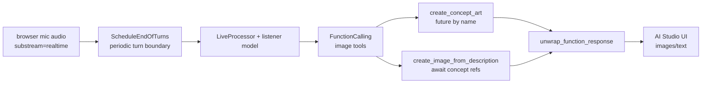

# Live Illustrator

## Source References

- `examples/live_illustrator/illustrator.py`
- `examples/live_illustrator/illustrator_ais.py`
- `examples/live_illustrator/ais_app/index.tsx`
- `examples/live_illustrator/README.md`
- `genai_processors/core/audio.py`
- `genai_processors/core/function_calling.py`
- `genai_processors/core/realtime.py`
- `genai_processors/dev/live_server.py`

## Entrypoint

- Server: from `examples/live_illustrator`, run `python3 illustrator_ais.py`.
- AI Studio applet source: `examples/live_illustrator/ais_app/`.
- Factory: `illustrator.create_live_illustrator(api_key,
  system_instruction=None, image_period_sec=20)`.

## Pipeline / Data Flow

- Browser app streams mic audio as `audio/l16;rate=24000` parts on substream
  `realtime` and sends config as `application/x-config` metadata.
- `ScheduleEndOfTurns` passes text/audio, removes explicit end-of-turn text
  parts, and inserts `content_api.END_OF_TURN` every configured period when no
  model turn is in progress.
- `ImageGenerator` exposes `create_concept_art` and
  `create_image_from_description` async tools backed by an image model.
- Concept art requests are stored in futures by name so later image requests
  can await and reuse them as references.
- `FunctionCalling` wraps a `realtime.LiveProcessor` whose turn processor
  filters function responses, converts audio to WAV, tracks turn start/end, and
  calls the listener model.
- `unwrap_function_response` converts function-response image payloads into
  normal media/text parts for UI display.
- `hide_uninteresting_parts` removes empty/model-internal chatter before output.

## Dependencies / Env

- Requires `GOOGLE_API_KEY`.
- Default WebSocket port: `8765`.
- Listener model: `gemini-3-flash-preview`.
- Image model: `gemini-2.5-flash-image`.
- Optional server flags: `--trace_dir`, `--max_size_bytes`.

## Demonstrated Processor Contracts

- Async tools can produce background image-generation results while the listener
  model continues processing narration.
- Function responses can carry nested inline media; a postprocessor can unwrap
  them into ordinary `ProcessorPart`s.
- `realtime.LiveProcessor` can be cadenced by generated end-of-turn parts rather
  than only raw VAD events.
- Reserved substreams are normalized for UI display by setting role to `model`
  when needed.

## Orchestration Diagram



The listener model does not draw directly. It narrates/understands audio, emits
tool calls, and receives async function responses. Image payloads are unwrapped
after function calling so the UI sees ordinary media parts.

## Concept Reference State

Concept art requests create named futures:

```text
concept_futures[name] = Future[image parts]
```

Later image requests can depend on those names:

```text
image(description, concept_names):
  refs = await gather(concept_futures[name] for name in concept_names)
  return image_model(description + refs)
```

This is a small dependency graph embedded inside async tools. Missing concept
names are hard errors because the graph edge cannot be resolved.

## Cadence Formula

`ScheduleEndOfTurns` inserts an end-of-turn when no model turn is in progress
and the configured period elapses:

```text
if now - last_end_of_turn >= image_period_sec and not model_turn_active:
  yield END_OF_TURN
```

Increasing `image_period_sec` reduces image calls and makes the UI calmer.

## Gotchas

- Image generation volume can trigger throttling; increase `image_period_sec`
  for lower request pressure.
- Concept art names must match previous tool calls or image generation raises
  `ValueError`.
- There is a typo in the concept-art early function response name
  `create_concept_art``; downstream code should not depend on that exact early
  name.
- The app disconnects when image settings change; reconnect before recording.
