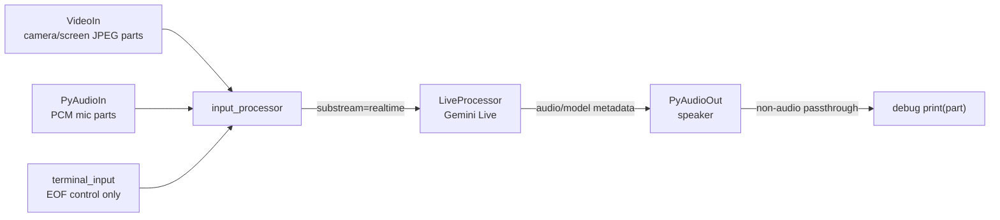

# Live Simple CLI

## Source References

- `examples/live_simple_cli.py`
- `genai_processors/core/audio_io.py`
- `genai_processors/core/live_model.py`
- `genai_processors/core/video.py`
- `genai_processors/core/text.py`

## Entrypoint

- Run with `python3 examples/live_simple_cli.py`.
- Flags: `--mode=camera|screen`, `--debug`.

## Pipeline / Data Flow

- `video.VideoIn(video_mode=...) + audio_io.PyAudioIn(..., use_pcm_mimetype=True)`
  creates a realtime camera/screen plus mic input stream.
- `live_model.LiveProcessor` connects directly to Gemini Live API using native
  audio output.
- `audio_io.PyAudioOut` plays returned audio and handles interruption behavior.
- The final agent is `input_processor + live_processor + play_output`.
- `text.terminal_input()` is only used as a control stream to keep the CLI alive
  and allow Ctrl-D exit.

## Dependencies / Env

- Requires `GOOGLE_API_KEY`.
- Requires `pyaudio`, `google-genai`, and live/audio extras installed.
- Uses model `gemini-2.5-flash-native-audio-preview-12-2025`.
- Live API config uses `api_version='v1alpha'`.

## Demonstrated Processor Contracts

- Device processors emit audio/video `ProcessorPart`s suitable for Live API
  realtime input.
- `LiveProcessor` is an end-to-end bidirectional processor, not a turn wrapper.
- `PyAudioOut` consumes streamed audio parts and reacts to interruption metadata.

## Live Routing Diagram



This is the minimal native Live example. It demonstrates direct media routing:
audio and video stay as realtime `ProcessorPart`s and are sent to
`session.send_realtime_input(...)` by `LiveProcessor`. There is no local STT,
local TTS, custom state machine, or function-calling wrapper.

## Semantic Boundary

Use this example when the model owns the dialogue timing. Use
`live-commentator.md` when the application owns scheduling and event-triggered
interruptions. The difference is:

```text
live-simple:     device stream -> Live API -> audio output
live-commentator: device stream -> detector -> state machine -> Live API -> paced output
```

## Gotchas

- Headphones are expected; default device input/output usually lacks echo
  cancellation.
- Live API expects `audio/pcm`; the example sets `use_pcm_mimetype=True`.
- Only `camera` and `screen` are accepted video modes.
- The example prints non-audio/status parts yielded by the pipeline.
