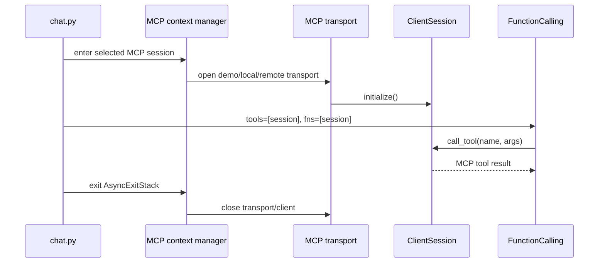

# MCP Server Helpers

## Source References

- `examples/mcp_server.py`
- `examples/chat.py`
- `genai_processors/core/function_calling.py`

## Entrypoint

- Imported by examples; not a standalone CLI.
- Main public helpers:
  `get_demo_mcp_session()`, `get_local_mcp_session(command)`,
  `get_remote_mcp_session(address, api_key_header)`.

## Pipeline / Data Flow

- `_create_demo_server()` builds a `fastmcp.FastMCP` server with `add`,
  `multiply`, `greet`, and `get_weather` tools.
- `get_demo_mcp_session()` connects server and client in memory.
- `get_local_mcp_session()` parses a shell-like command with `shlex.split`,
  launches a stdio MCP server, initializes a `ClientSession`, and yields it.
- `get_remote_mcp_session()` creates an `httpx.AsyncClient`, opens streamable
  HTTP transport, initializes a `ClientSession`, and yields it.
- `examples/chat.py` passes the yielded session as both model tool declaration
  and local function implementation.

## Dependencies / Env

- Requires `mcp` and `httpx`.
- Remote sessions may require caller-supplied headers, commonly
  `{'X-Goog-Api-Key': <key>}`.

## Demonstrated Processor Contracts

- MCP `ClientSession` can be treated as a Gemini tool object and as the callable
  function backend for `FunctionCalling`.
- Async context managers are used so transports close with the surrounding
  `AsyncExitStack`.

## Session Lifecycle

The same object carries two semantics:

- declaration surface: tells the model which tools exist;
- execution surface: lets the local function-calling loop invoke those tools.

Keep those paired. Passing the session only to the model creates calls that the
local loop cannot execute; passing it only to `fns` hides tools from the model.

## Gotchas

- Local command parsing is shell-like but does not run through a shell.
- Remote client sets `Accept: application/json, text/event-stream`.
- Demo tools are intentionally trivial and useful for contract tests, not app
  behavior.
