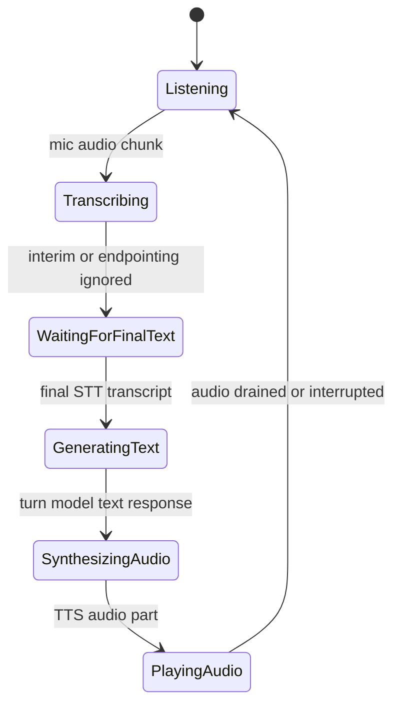

# Realtime Simple CLI

## Source References

- `examples/realtime_simple_cli.py`
- `examples/models.py`
- `genai_processors/core/audio_io.py`
- `genai_processors/core/speech_to_text.py`
- `genai_processors/core/realtime.py`
- `genai_processors/core/text_to_speech.py`
- `genai_processors/core/rate_limit_audio.py`

## Entrypoint

- Run with `python3 examples/realtime_simple_cli.py`.
- Model backend is selected through `examples/models.py` flags.

## Pipeline / Data Flow

- `audio_io.PyAudioIn(pya)` captures mic audio.
- `speech_to_text.SpeechToText(..., with_interim_results=False)` converts input
  speech to final text turns.
- `_filter_parts` removes reserved substreams and previous model audio before
  the turn LLM.
- `models.turn_based_model(...)` generates text.
- `text_to_speech.TextToSpeech(...)` converts model text to audio.
- `rate_limit_audio.RateLimitAudio(sample_rate=24000, delay_other_parts=True)`
  paces audio so interruption can stop playback cleanly.
- `realtime.LiveProcessor(turn_processor=genai_processor + tts)` manages the
  client-side realtime conversation loop.
- `audio_io.PyAudioOut(pya)` plays audio.

## Dependencies / Env

- Requires `GOOGLE_PROJECT_ID` for Google Cloud Speech-to-Text and TTS.
- Requires `GOOGLE_API_KEY` indirectly through `examples/models.py` for Gemini.
- Requires PyAudio plus cloud speech/TTS packages.

## Demonstrated Processor Contracts

- `@processor.create_filter` returns a part-level filter processor.
- `realtime.LiveProcessor` can wrap a turn-based processor to simulate realtime
  bidirectional behavior.
- Reserved substreams must be filtered before text-only turn models.
- Audio output from previous model turns should not be replayed into the LLM
  prompt when transcription is the intended history.

## Data Lifecycle



The example is "realtime" by orchestration, not by using Gemini Live native
audio. It composes three turn-ish services into a bidi processor:

```text
mic audio -> STT final text -> turn LLM text -> TTS audio -> paced playback
```

`_filter_parts` is the semantic gate between realtime context and the turn
model. It removes reserved substreams and previous model audio so the text LLM
sees transcripts/history rather than raw playback artifacts.

## Timing Contract

`RateLimitAudio(sample_rate=24000)` assumes 16-bit audio:

```text
audio_duration_sec = len(audio_bytes) / (2 * 24000)
```

Generated audio is split/paced downstream so a later `interrupted` state can
flush queued playback. Without pacing, the whole TTS response may be buffered by
the speaker before user speech can stop it.

## Gotchas

- Cloud Speech-to-Text and Text-to-Speech APIs must be enabled in the project.
- The TTS processor emits audio at 24 kHz; rate limiting must match.
- Headphones are expected to avoid model audio reentering the mic.
