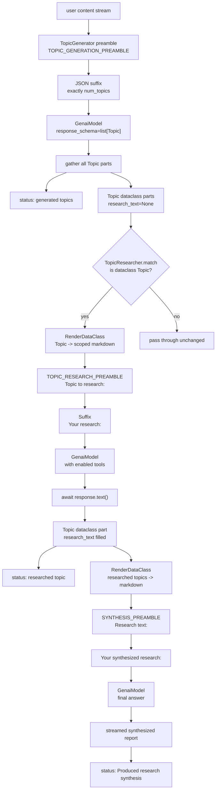
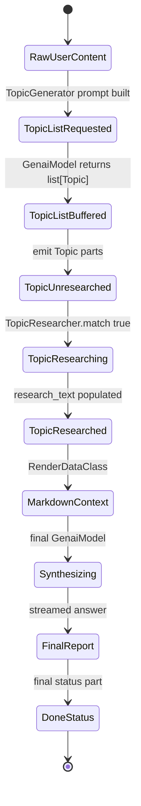
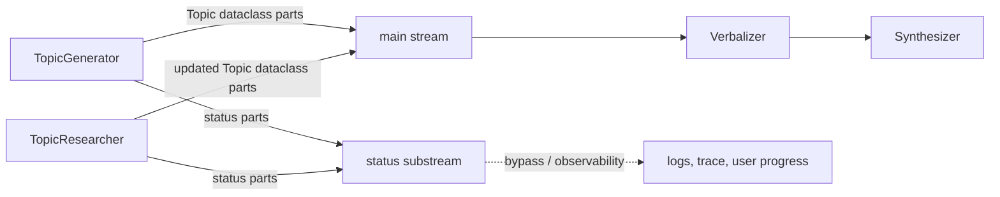

# Research Agent

`examples/research` is the repo's clearest example of a structured multi-step
agent. It is a map-reduce style research workflow built from normal processors:
one model decomposes the user request into typed topics, one part processor
researches each topic, a template converts typed results back into Markdown,
and a final model synthesizes a cohesive answer.

Use this page as the blueprint for implementing similar agents in other repos.
The important pattern is not "three prompts"; it is typed intermediate state,
stage-local prompts, explicit fan-out, side-channel progress, and a final join.

## Source References

- Agent pipeline: `examples/research/agent.py:51-131`
- Shared interfaces: `examples/research/interfaces.py:26-74`
- Topic generator: `examples/research/processors/topic_generator.py:31-114`
- Topic researcher: `examples/research/processors/topic_researcher.py:32-107`
- Prompt contracts: `examples/research/prompts.py:18-44`
- Human overview: `examples/research/README.md`
- Notebook entrypoint: `notebooks/research_example.ipynb`
- Dataclass part APIs: `genai_processors/content_api.py:521-574`
- Processor/part-processor contracts:
  `genai_processors/processor.py:149-283`,
  `genai_processors/processor.py:372-430`
- Jinja dataclass renderer:
  `genai_processors/core/jinja_template.py:31-280`

## Entrypoint

- Imported as `ResearchAgent(api_key, config=Config(...))`.
- Notebook entrypoint: `notebooks/research_example.ipynb`.

The constructor builds the whole graph once:

```text
TopicGenerator
  + TopicResearcher
  + RenderDataClass(Topic -> markdown)
  + Preamble(SYNTHESIS_PREAMBLE, "Research text: ")
  + Suffix("Your synthesized research: ")
  + GenaiModel(synthesizer)
```

`ResearchAgent.call()` streams the pipeline output and then emits one final
status part: `"Produced research synthesis!"`.

## Core Data Types

`Topic` is the intermediate state carrier:

```text
Topic(
  topic: str,
  relationship_to_user_content: str,
  research_text: str | None = None,
)
```

Semantic meaning:

- `topic`: the bounded research question or area.
- `relationship_to_user_content`: why this topic matters for the original user
  request.
- `research_text`: detailed, topic-scoped findings added by `TopicResearcher`.

`Config` controls stage behavior:

| Field | Default | Used By | Meaning |
| --- | --- | --- | --- |
| `topic_generator_model_name` | `gemini-2.5-flash` | `TopicGenerator` | Decomposition model. |
| `topic_researcher_model_name` | `gemini-2.5-flash` | `TopicResearcher` | Per-topic tool-enabled research model. |
| `research_synthesizer_model_name` | `gemini-2.5-flash` | `ResearchAgent` | Final synthesis model. |
| `num_topics` | `5` | `TopicGenerator` | Target fan-out width. |
| `excluded_topics` | `None` | `TopicGenerator` | Negative constraints for decomposition. |
| `enabled_research_tools` | Google Search | `TopicResearcher` | Tool declarations available during per-topic research. |

## Pipeline Diagram



## Stage Semantics

### Stage 1: TopicGenerator

`TopicGenerator` is a whole-stream `Processor` because decomposition depends on
the complete user request. It prepends topic-generation instructions, appends a
JSON format suffix, calls a Gemini model with `response_schema=list[Topic]`,
then accumulates all model output before yielding anything.

Pseudo-flow:

```text
input_content = user stream
prompt = TOPIC_GENERATION_PREAMBLE + num_topics/exclusions + input_content + JSON suffix
raw_topics = GenaiModel(prompt, response_schema=list[Topic])
topics = [part.get_dataclass(Topic) for part in raw_topics]
yield status("Generated n topics")
for each topic:
  yield status("Topic i: ...")
  yield ProcessorPart.from_dataclass(topic)
```

The accumulation is intentional: this stage wants a complete list of topics
before fan-out. If topic streaming is required in another agent, the generator
would need a different parser and contract.

### Stage 2: TopicResearcher

`TopicResearcher` is a `PartProcessor` because each topic can be researched
independently.

Match predicate:

```text
match(part) = content_api.is_dataclass(part.mimetype, Topic)
```

Per-topic transform:

```text
input_topic = part.get_dataclass(Topic)
research_prompt =
  RenderDataClass(input_topic)
  + TOPIC_RESEARCH_PREAMBLE
  + "Topic to research: "
  + "Your research: "
research_text = await GenaiModel(research_prompt, tools=enabled_research_tools).text()
updated_topic = Topic(
  topic=input_topic.topic,
  relationship_to_user_content=input_topic.relationship_to_user_content,
  research_text=research_text,
)
yield ProcessorPart.from_dataclass(updated_topic)
yield status("Researched topic ...")
```

The `await response.text()` call is a local join. Each topic emits only after
its research text has fully arrived.

### Stage 3: Verbalization

`RenderDataClass` converts each researched `Topic` into Markdown:

```text
## {topic}
*{relationship_to_user_content}*

### Research

{research_text}
```

This is the type-to-text boundary. Before this point, downstream processors can
route and match on `Topic` dataclass MIME. After this point, the final
synthesizer sees ordinary Markdown research context.

### Stage 4: Synthesis

The final model receives:

```text
SYNTHESIS_PREAMBLE
"Research text: "
rendered topic markdown...
"Your synthesized research: "
```

The synthesis prompt asks the model to produce one coherent answer and to
reference each researched topic at least once. It does not have tools by
default; tool use is isolated to the per-topic research stage.

## Map-Reduce Formula

The agent is a typed map-reduce:

```text
Q = user query/content
N = config.num_topics

topics = Decompose(Q, N, excluded_topics)

researched_topics = [
  Research(topic_i, tools=enabled_research_tools)
  for topic_i in topics
]

context = "\n\n".join(RenderTopic(topic_i) for topic_i in researched_topics)

answer = Synthesize(Q, context)
```

Model-call count:

```text
calls = 1 topic-generation call + len(topics) topic-research calls + 1 synthesis call
```

With the default config:

```text
calls = 1 + 5 + 1 = 7 model calls
```

If every per-topic research call takes time `r_i`, topic generation takes `g`,
and synthesis takes `s`, the ideal parallel latency is:

```text
t_total_ideal = g + max(r_i for i in topics) + s
```

If topic research is effectively sequential in a host/runtime, latency becomes:

```text
t_total_sequential = g + sum(r_i for i in topics) + s
```

The processor graph is semantically parallelizable at the topic-research stage,
but actual concurrency depends on how the lifted `PartProcessor` is consumed and
on provider/tool rate limits.

## Data State Machine



State transitions are represented in the stream itself. There is no external
database or agent memory in this example.

## Prompt Contract

| Prompt | Stage | Contract |
| --- | --- | --- |
| `TOPIC_GENERATION_PREAMBLE` | Decomposition | Produce concrete research areas related to user content. |
| generated topic-count/exclusion text | Decomposition | Enforce `num_topics` and omit configured exclusions. |
| JSON suffix | Decomposition | Return exactly `num_topics` objects matching `Topic`. |
| `TOPIC_RESEARCH_PREAMBLE` | Per-topic research | Research only the assigned topic, in relation to the user input. |
| `SYNTHESIS_PREAMBLE` | Final synthesis | Combine topic research into one coherent answer and reference each topic. |

Important semantic split:

- The generator prompt asks for research planning.
- The researcher prompt asks for scoped evidence/finding collection.
- The synthesis prompt asks for final communication.

Do not collapse these stages unless the replacement agent no longer needs
traceable intermediate topics.

## Stream And Substream Semantics

The main content path carries dataclass and text parts. Status updates are
side-channel progress parts produced with `processor.status(...)`.



LLM agents implementing similar flows should keep progress/status separate from
model-visible research context. If status text is useful to a downstream model,
copy it deliberately into the default stream rather than relying on accidental
substream behavior.

## Concurrency And Ordering

`TopicGenerator` emits:

```text
status(generated)
status(topic 1)
Topic 1
status(topic 2)
Topic 2
...
```

`TopicResearcher` only matches `Topic` dataclass parts. Non-topic parts, such as
status parts, pass through the lifted part-processor behavior and should not
become research prompts.

The final synthesizer needs all rendered Markdown context before it can produce
a coherent answer. Conceptually:

```text
fan-out:  Topic -> Research(Topic)
join:     all researched topics -> synthesis prompt
```

If implementing a more advanced agent, make the join explicit if you need
strict ordering, deduplication, citation validation, or partial result display.

## Error And Drift Notes

- `TopicGenerator` suffix says `relationship_to_user_content: list[str]`, while
  the `Topic` dataclass defines `relationship_to_user_content: str`. The schema
  passed to the model is authoritative for parsing, but the prompt text should
  be fixed if this example is hardened.
- `TopicResearcher` awaits `.text()`, so non-text model output or tool output
  that cannot reduce to text will fail at this boundary.
- Per-topic research prompt says not to include citation numbers. If a future
  implementation needs citations, add citation fields to the dataclass instead
  of asking the final synthesizer to recover structure from prose.
- Retry attempts are set to `100` for model calls. This improves resilience but
  can hide slow failures and increase cost/time under persistent provider
  errors.
- The final synthesizer has no search tools by default; all external retrieval
  must happen in per-topic research.

## Replication Blueprint

When building a similar agent in another repo:

1. Define a typed intermediate dataclass for the decomposed work item.
2. Make the decomposer return `list[WorkItem]` with a schema-constrained model.
3. Use a `PartProcessor` for work-item execution when items are independent.
4. Store item-local results back into the same dataclass, not into loose text.
5. Render typed results into a final prompt only at the synthesis boundary.
6. Keep progress as status/control parts.
7. Add a final join stage that owns synthesis, ranking, validation, or report
   formatting.

Recommended generic shape:

```text
UserRequest
  -> Planner(response_schema=list[Task])
  -> TaskExecutor(PartProcessor[Task -> CompletedTask])
  -> RenderCompletedTask
  -> Synthesizer
  -> FinalAnswer
```

Use more structure when requirements include traceability:

```text
CompletedTask(
  task: str,
  relationship_to_user_request: str,
  findings: list[Finding],
  citations: list[Citation],
  confidence: float,
)
```

## Extension Ideas

- Add citation structure to `Topic` and require researcher output as JSON.
- Add a validation processor between research and synthesis to detect empty,
  duplicate, or off-scope research.
- Add ranking or clustering before synthesis when `num_topics` is large.
- Cache `TopicResearcher` per topic for repeated notebooks or iterative
  synthesis.
- Emit UI-friendly progress parts with topic ids so clients can show a
  dashboard while research is running.
- Split synthesis into outline then final answer for long reports.

## Gotchas

- `TopicGenerator` accumulates all generated topics before yielding them.
- `TopicResearcher` calls `await response.text()`, so each topic research result
  is gathered before emitting the updated topic.
- Research fan-out comes from part processing; synthesis happens after topics
  are verbalized back into text.
- Prompt file says no citation numbers in per-topic research; final synthesis
  quality depends on model/tool output.
- The typed intermediate contract is the main reuse point. Prompts are easier to
  swap than the data lifecycle.
