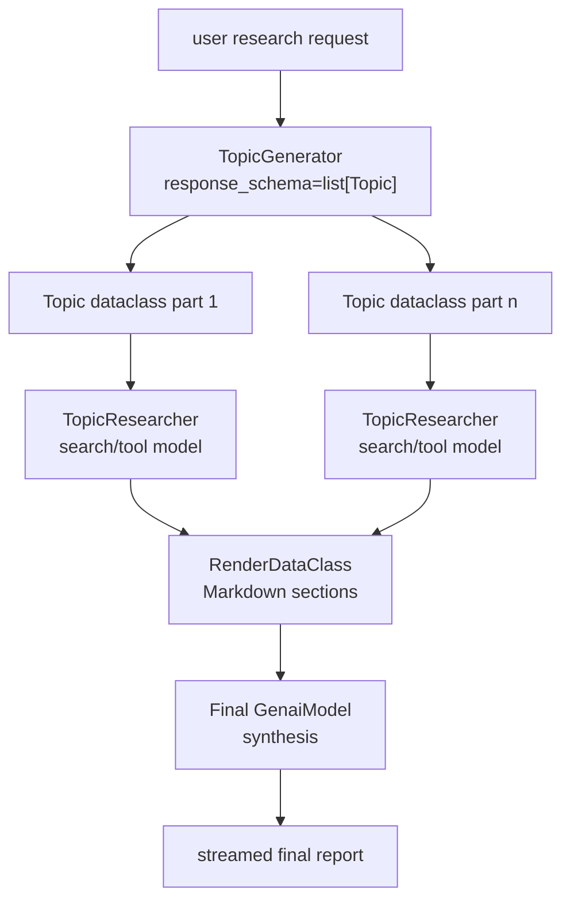

# Research Agent

## Source References

- `examples/research/agent.py`
- `examples/research/interfaces.py`
- `examples/research/processors/topic_generator.py`
- `examples/research/processors/topic_researcher.py`
- `examples/research/prompts.py`
- `examples/research/README.md`
- `notebooks/research_example.ipynb`

## Entrypoint

- Imported as `ResearchAgent(api_key, config=Config(...))`.
- Notebook entrypoint: `notebooks/research_example.ipynb`.

## Pipeline / Data Flow

- `TopicGenerator` prepends topic-generation prompt text, appends JSON format
  constraints, calls Gemini with `response_schema=list[Topic]`, emits status
  parts, then emits one dataclass `Topic` part per topic.
- `TopicResearcher` matches `Topic` dataclass parts, verbalizes each topic with
  Jinja, prepends research prompt text, calls Gemini with configured tools, and
  emits an updated `Topic` dataclass with `research_text`.
- `ResearchAgent` verbalizes researched topics to Markdown with
  `jinja_template.RenderDataClass`.
- Preamble and suffix frame the gathered research for a final synthesis
  `GenaiModel`.
- Final output is streamed, then a status part says synthesis was produced.

## Dependencies / Env

- Requires a caller-provided Gemini API key.
- Default models in `Config`: `gemini-2.5-flash` for topic generation,
  research, and synthesis.
- Default research tool: Google Search.
- Uses `dataclasses_json`, Jinja template processor, and Google GenAI types.

## Demonstrated Processor Contracts

- Structured intermediate data flows through the stream as dataclass
  `ProcessorPart`s.
- `PartProcessor.match()` filters only `Topic` parts for research.
- Status parts can report progress without replacing content parts.
- Config dataclass centralizes model names, topic count, excluded topics, and
  enabled tools.

## Research DAG



The agent is a staged map-reduce:

```text
topics = TopicGenerator(query)
researched_topics = map(TopicResearcher, topics)
markdown_context = render(researched_topics)
final_report = Synthesizer(markdown_context)
```

Status parts are side-channel progress. They should not be treated as research
content for synthesis unless explicitly reintroduced into the prompt.

## Cost And Latency Shape

Let `n = topic_count`.

```text
model_calls ~= 1 topic-generation call + n topic-research calls + 1 synthesis call
```

Because topic research is implemented as a `PartProcessor`, concurrency depends
on how the surrounding processor composition consumes topic parts. The semantic
dependency graph is parallelizable per topic, while final synthesis is a join
that must wait for rendered research context.

## Gotchas

- `TopicGenerator` accumulates all generated topics before yielding them.
- `TopicResearcher` calls `await response.text()`, so each topic research result
  is gathered before emitting the updated topic.
- Research fan-out comes from part processing; synthesis happens after topics
  are verbalized back into text.
- Prompt file says no citation numbers in per-topic research; final synthesis
  quality depends on model/tool output.
