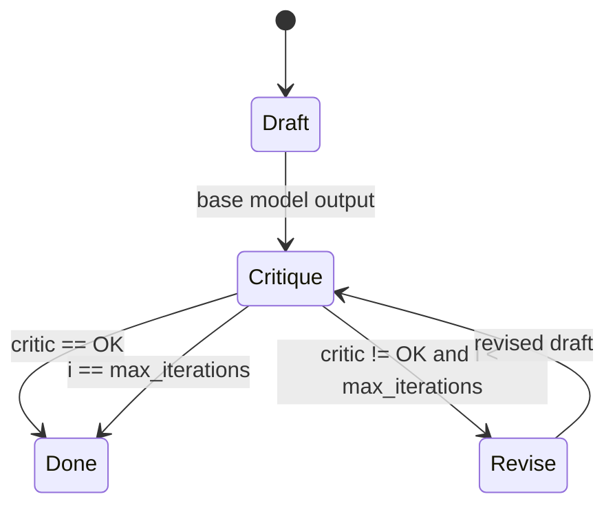

# Smart Model Processors

## Source References

- `examples/smart_model.py`
- `examples/models.py`
- `genai_processors/core/genai_model.py`
- `genai_processors/core/function_calling.py`

## Entrypoint

- Imported by `examples/models.py`.
- Select via Gemini model names:
  `--model_name=critic:<base_model>` or `--model_name=research:<base_model>`.

## Pipeline / Data Flow

- `CriticReviser` gathers the input stream, asks the base model for a draft,
  then loops critic and revision calls until critic text is `OK` or
  `max_iterations` is reached.
- `Researcher` builds a Gemini model with Google Search plus its own
  `research_topic` callable.
- `Researcher.call()` gathers input, runs tool-enabled recursive research, then
  sends the research trace to a separate reviser model for a clean report.
- `research_topic(query_to_investigate, nesting_level)` calls the same
  processor recursively and returns gathered content.

## Dependencies / Env

- Receives `model_name` and `api_key` from `examples/models.py`.
- Uses high retry HTTP options for research calls.

## Demonstrated Processor Contracts

- Processors may `await content.gather()` when they need to reuse full input.
- A processor can call another processor multiple times internally before
  yielding final parts.
- Tool functions can be async methods that return `ProcessorContentTypes`.
- `function_calling.FunctionCalling` can execute callable tools around a model
  with automatic function calling disabled.

## Critic/Reviser Loop



Formula:

```text
draft_0 = model(input)
for i in 0..max_iterations-1:
  critique_i = critic(input, draft_i)
  if critique_i == "OK": return draft_i
  draft_{i+1} = reviser(input, draft_i, critique_i)
return draft_last
```

This deliberately buffers content because the same input/draft must be reused
across multiple model calls.

## Recursive Research Semantics

`Researcher` exposes `research_topic` as a callable tool to its own
function-calling loop. The recursion state is `nesting_level`:

```text
research_topic(query, level):
  if level is too deep: summarize directly
  else: call Researcher(query, level + 1)
```

The outer call then sends the accumulated research trace to a reviser model.
This pattern is powerful but easy to overrun; prompts and max depth are part of
the safety boundary.

## Gotchas

- These are application-specific agents, not core library abstractions.
- `CriticReviser` buffers input and intermediate model output; it is not
  streaming-first.
- `Researcher` is recursive and can be expensive; prompts constrain depth and
  root-level decomposition.
- The research system instructions are long and opinionated; adapt before reuse.
