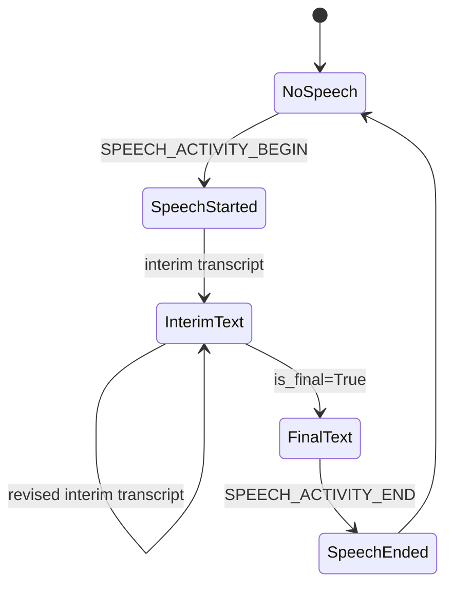

# Speech-To-Text CLI

## Source References

- `examples/speech_to_text_cli.py`
- `genai_processors/core/audio_io.py`
- `genai_processors/core/speech_to_text.py`
- `genai_processors/core/text.py`

## Entrypoint

- Run with `python3 examples/speech_to_text_cli.py`.

## Pipeline / Data Flow

- `audio_io.PyAudioIn(pya)` streams microphone audio parts.
- `speech_to_text.SpeechToText(project_id=..., with_interim_results=True)`
  emits endpointing and transcription parts.
- The script prints every yielded part with timestamps.
- `text.terminal_input()` keeps the async pipeline alive until Ctrl-D.

## Dependencies / Env

- Requires `GOOGLE_PROJECT_ID`.
- Requires `pyaudio`, `google-cloud-speech`, and `genai-processors`.

## Demonstrated Processor Contracts

- STT yields text `ProcessorPart`s on `input_transcription`.
- Interim transcripts carry `metadata={'is_final': False}`; final transcripts
  carry `metadata={'is_final': True}`.
- Endpointing emits text-like speech activity markers on `input_endpointing`.

## Output State Semantics

The ordering is service-driven, so consumers should not assume every
`SPEECH_ACTIVITY_END` has already been followed by its final transcript. Treat
endpointing and transcription as related substreams, not a single ordered text
channel.

## Gotchas

- Final transcript may arrive after `SPEECH_ACTIVITY_END`.
- Endpointing parts identify which audio region belongs to the transcript.
- This is inspection-oriented; it does not aggregate or render a final message.
