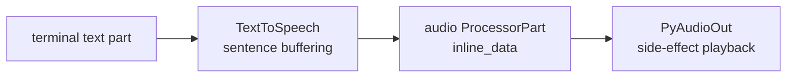

# Text-To-Speech CLI

## Source References

- `examples/text_to_speech_cli.py`
- `genai_processors/core/text_to_speech.py`
- `genai_processors/core/audio_io.py`
- `genai_processors/core/text.py`

## Entrypoint

- Run with `python3 examples/text_to_speech_cli.py`.

## Pipeline / Data Flow

- `text.terminal_input('message > ')` reads terminal text.
- `text_to_speech.TextToSpeech(project_id=...)` synthesizes audio.
- `audio_io.PyAudioOut(pya)` plays returned audio parts.
- The loop ignores output values because playback is the side effect.

## Dependencies / Env

- Requires `GOOGLE_PROJECT_ID`.
- Requires `pyaudio`, `google-cloud-texttospeech`, and `genai-processors`.

## Demonstrated Processor Contracts

- TTS consumes text parts and yields audio parts.
- Audio playback is a processor stage, so TTS can be composed with other stream
  processors.

## Synthesis Lifecycle

Semantically this example is a stream-to-side-effect pipeline. The final stage
does not need to return useful values because playback is the observable output.
For a UI or network runtime, replace `PyAudioOut` with a serializer or websocket
output stage and keep `TextToSpeech` unchanged.

## Gotchas

- Input should end with punctuation to signal sentence completion.
- The TTS processor stops after inactivity after the first sentence.
- Despite the prompt saying "Enter q to quit", the implemented exit path is
  Ctrl-D through terminal EOF.
