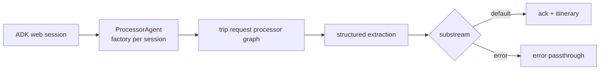

# Trip Request ADK

## Source References

- `examples/trip_request_adk/agent.py`
- `genai_processors/core/adk.py`
- `genai_processors/core/genai_model.py`
- `genai_processors/core/preamble.py`
- `genai_processors/switch.py`

## Entrypoint

- From `examples`, run `adk web`.
- Select the `trip_request_adk` agent in the ADK UI.

## Pipeline / Data Flow

- `create_trip_request_processor()` builds the same two-stage trip processor
  used by the CLI family.
- First Gemini model extracts `TripRequest` JSON.
- `process_json_output` emits either normalized trip info or an `error`
  substream.
- `switch.Switch` routes valid parts to `parallel_concat` of user preamble and
  itinerary generation.
- `root_agent = adk.ProcessorAgent(create_trip_request_processor, ...)` exposes
  the processor factory to ADK.

## Dependencies / Env

- Requires `GOOGLE_API_KEY`.
- Requires `google-adk` and `genai-processors`.
- Uses `gemini-2.5-flash-lite` for both extraction and itinerary stages.

## Demonstrated Processor Contracts

- `adk.ProcessorAgent` accepts a zero-arg processor factory, not a single
  already-consumed stream.
- Processor composition remains unchanged when hosted behind ADK.
- Structured dataclass extraction and substream switching behave the same in
  web agent runtime as in CLI runtime.

## Hosting Boundary

`ProcessorAgent` is a host adapter, not a rewrite of the pipeline. The semantic
unit remains the processor graph returned by `create_trip_request_processor()`.
That factory boundary matters because web runtimes can create independent
sessions without reusing a consumed async stream.

## Gotchas

- Run `adk web` from `examples` so the package-style agent folder is discoverable.
- The ADK example uses flash-lite for extraction, unlike the Gemini CLI which
  uses flash for extraction.
