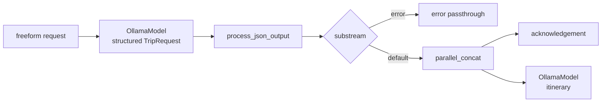

# Trip Request CLI: Ollama

## Source References

- `examples/trip_request_cli_ollama.py`
- `genai_processors/core/ollama_model.py`
- `genai_processors/core/preamble.py`
- `genai_processors/switch.py`
- `genai_processors/processor.py`

## Entrypoint

- Run with `python3 examples/trip_request_cli_ollama.py`.

## Pipeline / Data Flow

- Same logical flow as `trip_request_cli.py`: date suffix, structured
  extraction, dataclass parsing, substream switch, acknowledgement plus
  itinerary generation.
- Both extraction and itinerary stages use `ollama_model.OllamaModel`.
- Default local model in this example is `gemma3`.

## Dependencies / Env

- Requires a reachable Ollama service with `gemma3` available.
- The file still reads `GOOGLE_API_KEY` and validates it, although the model
  stages are Ollama-backed.
- Uses `dataclasses_json` and pydantic dataclasses.

## Demonstrated Processor Contracts

- Ollama model adapter mirrors the `GenerateContentConfig` shape used by Gemini
  examples, including `system_instruction`, `response_schema`, and
  `response_mime_type`.
- Structured dataclass parts and `switch.Switch` routing are backend-agnostic.
- `processor.parallel_concat` hides slow itinerary latency behind the immediate
  preamble.

## Backend-Independent Contract



The example proves that the structured-routing pattern is not Gemini-specific.
The stable contract is the stream envelope:

```text
valid dataclass -> default substream -> planning branch
invalid dataclass -> error substream -> passthrough
```

Model quality changes the probability of valid JSON, but not the processor
graph.

## Gotchas

- The `GOOGLE_API_KEY` requirement appears unnecessary for the Ollama stages but
  is enforced by the script.
- There is no Google Search tool in the Ollama generation stage.
- Local structured JSON quality depends on the pulled Ollama model.
