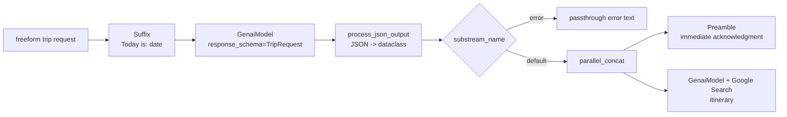

# Trip Request CLI

## Source References

- `examples/trip_request_cli.py`
- `genai_processors/core/genai_model.py`
- `genai_processors/core/preamble.py`
- `genai_processors/switch.py`
- `genai_processors/processor.py`

## Entrypoint

- Run with `python3 examples/trip_request_cli.py`.

## Pipeline / Data Flow

- User enters one complete freeform trip request per loop iteration.
- `preamble.Suffix(content_factory=lambda: f'Today is: ...')` injects current
  date into the extraction prompt.
- First `genai_model.GenaiModel` returns JSON constrained by `TripRequest`.
- `process_json_output` converts a valid `TripRequest` into prompt text or
  emits an error part on substream `error`.
- `switch.Switch(content_api.get_substream_name)` routes normal parts to
  `processor.parallel_concat([msg_to_user, generate_trip])`.
- Second `GenaiModel` generates an itinerary with Google Search enabled.
- Error substreams pass through unchanged.

## Dependencies / Env

- Requires `GOOGLE_API_KEY`.
- Uses `dataclasses_json`, pydantic dataclasses, and `google-genai`.
- Extraction model: `gemini-2.5-flash`.
- Itinerary model: `gemini-2.5-flash-lite`.

## Demonstrated Processor Contracts

- Dataclass schema output: `response_schema=TripRequest` and
  `response_mime_type='application/json'`.
- `part.get_dataclass(TripRequest)` parses model JSON into typed data.
- `@processor.part_processor_function` is the concise form for stateless
  part-to-part transforms.
- `processor.parallel_concat` runs acknowledgement and generation concurrently
  and concatenates their streams.
- `switch.Switch` uses substream names as control flow.

## Structured Routing Diagram



The first model is a semantic firewall:

```text
freeform_user_text -> TripRequest(start_date, end_date, destination, error)
```

Only the normalized dataclass text reaches the tool-enabled itinerary model. If
`error != ""`, the stream is routed to `error` and bypasses the search-enabled
stage.

## Latency Formula

Let:

```text
t_extract = structured extraction latency
t_ack = preamble emission time
t_plan = itinerary generation latency
```

Valid requests perceive an early response after approximately:

```text
t_first_visible = t_extract + t_ack
```

Full completion is:

```text
t_total = t_extract + max(t_ack, t_plan)
```

because `parallel_concat([msg_to_user, generate_trip])` starts both branches
from the same normalized input while concatenating branch outputs.

## Gotchas

- There is no conversation history; each input must be self-contained.
- The first model has no tools, intentionally reducing prompt-injection attack
  surface before the tool-enabled itinerary model.
- `TripRequest.error` must be empty for the request to proceed.
