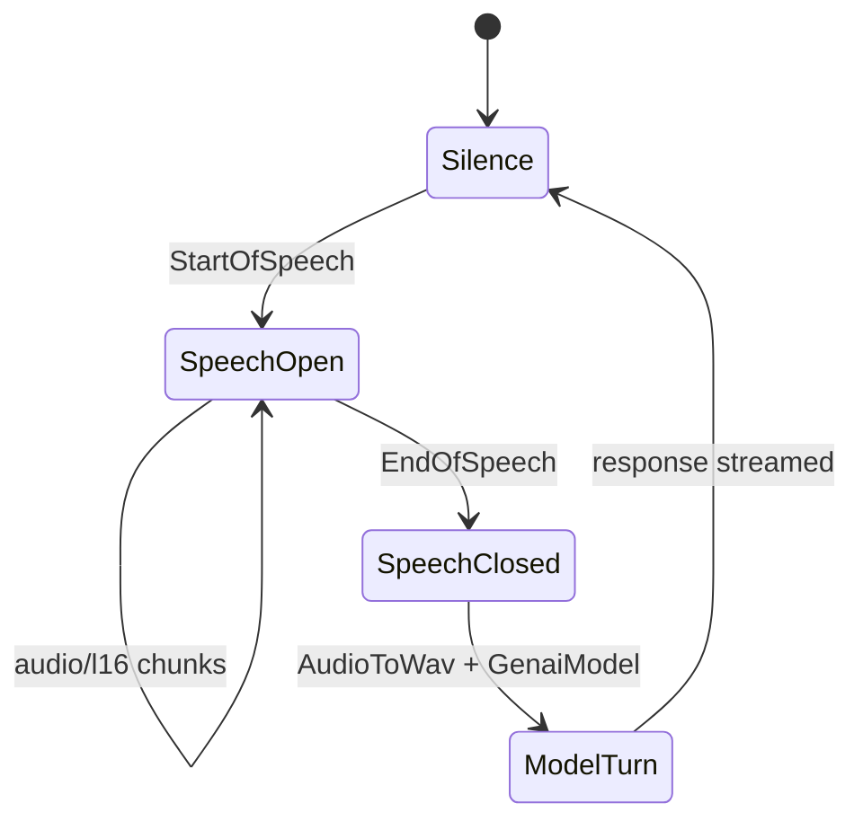

# VAD CLI

## Source References

- `examples/vad_cli.py`
- `genai_processors/core/audio_io.py`
- `genai_processors/core/vad.py`
- `genai_processors/core/speech_events.py`
- `genai_processors/core/audio.py`
- `genai_processors/core/realtime.py`
- `genai_processors/core/genai_model.py`

## Entrypoint

- Run with `python3 examples/vad_cli.py`.

## Pipeline / Data Flow

- `audio_io.PyAudioIn(pya)` captures microphone audio.
- `vad.Vad()` emits speech activity events and passes audio.
- `add_speech_event_status` prints start/end speech status while yielding parts
  unchanged.
- `realtime.LiveProcessor(turn_processor=audio.AudioToWav() + base_model,
  trigger_model_mode=END_OF_SPEECH)` accumulates audio until VAD end-of-speech.
- `audio.AudioToWav()` converts accumulated audio into one WAV part for Gemini.
- `text.terminal_output(...)` prints model output.

## Dependencies / Env

- Requires `GOOGLE_API_KEY`.
- Requires `pyaudio` and `genai-processors`.
- Uses `gemini-2.5-flash`.

## Demonstrated Processor Contracts

- Speech event parts are regular `ProcessorPart`s recognized by
  `speech_events.is_start_of_speech` and `is_end_of_speech`.
- `realtime.LiveProcessor` can trigger turn processing from audio endpointing
  instead of terminal turns.
- `AudioToWav` is a turn-stage converter for accumulated raw audio.

## Endpointing State Flow



`Vad()` does not call the model. It marks the stream with speech-event parts and
passes audio through. `realtime.LiveProcessor(trigger_model_mode=END_OF_SPEECH)`
uses those markers as a deterministic turn boundary.

## Data Formula

For one user utterance:

```text
utterance_audio = concat(audio_chunks between StartOfSpeech and EndOfSpeech)
wav_part = AudioToWav(utterance_audio)
model_response = GenaiModel(wav_part)
```

This is useful for audio-in turn models that prefer a complete utterance rather
than arbitrary mic chunks.

## Gotchas

- Default VAD is aggressive; users need clear/loud speech.
- `GOOGLE_API_KEY` is read with `os.environ.get`; missing key reaches model
  construction rather than failing early with a custom message.
- Always terminate PyAudio in `finally`; this example does.
