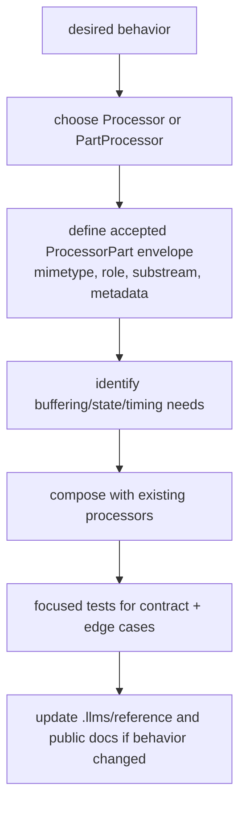

# Extension And Change Guide

Use this checklist before changing or adding processors.

## Source References

- Coding-agent rules: `llms.txt:1-35`
- Public exports: `genai_processors/__init__.py:22-50`
- Processor contracts and wrappers: `genai_processors/processor.py:149-430`,
  `genai_processors/processor.py:560-670`,
  `genai_processors/processor.py:898-1360`
- Cache wrappers and source helpers: `genai_processors/processor.py:1360-1649`
- Stream utilities: `genai_processors/streams.py:27-265`
- Contribution layout: `CONTRIBUTING.md:33-48`
- CI validation: `.github/workflows/python-tests.yml:16-42`

## Extension Checklist

1. Read `llms.txt`, then the local module you are changing.
2. Preserve the async stream contract. `Processor.call` accepts
   `ProcessorStream` and yields `ProcessorPartTypes`; `PartProcessor.call`
   accepts one `ProcessorPart` and yields `ProcessorPartTypes`.
3. Do not call `.call()` directly from application code. Invoke processors with
   `processor(content)` and gather with
   `await processor(content).gather()` unless streaming output is required.
4. Accept wide `ProcessorContentTypes` at boundaries. Do not force callers to
   pre-wrap plain strings or parts.
5. Preserve multimodal content. Do not narrow to `.text` until the final point
   where text is truly required.
6. Check MIME before text-only logic when the code can handle non-text parts;
   otherwise let the existing `ValueError` expose unsupported content.
7. Add or update focused tests in `genai_processors/tests/` or
   `genai_processors/contrib/tests/`.
8. Update docs when public behavior, examples, or contribution guidance changes.
9. Re-run the relevant pytest target and any docs-only validation listed in
   `testing/test-matrix.md`.

## Change Design Flow



Use a `Processor` when the transformation depends on whole streams, ordering,
cross-part state, context windows, model calls, or side effects. Use a
`PartProcessor` when each part can be matched and transformed independently.

Decision formula:

```text
if output_i depends only on input_i:
  PartProcessor is usually sufficient
else:
  Processor is required
```

Exceptions: a `PartProcessor` may still emit multiple parts or zero parts, but
it should not need to look ahead in the stream.

## Adding Shared Processors

`CONTRIBUTING.md` asks shared community processors to live under
`genai_processors/contrib/` with this shape:

- `genai_processors/contrib/your_processor.py`
- `genai_processors/contrib/your_processor.md`
- `genai_processors/contrib/tests/your_processor_test.py`

For larger processors, use a subdirectory under `genai_processors/contrib/` or
keep the implementation in another repository and link from
`genai_processors/contrib/README.md`.

## Contract Reminders

- `Processor.__call__` is final and handles normalization, tracing, and task
  context. Implement `call` only.
- `PartProcessor.__call__` normalizes one part and skips processing when
  `match(part)` is false.
- `part_processor_function` and processor wrappers require async generator
  functions, not plain async functions.
- `streams.split` shares part objects by default. Use `with_copy=True` when
  branches may mutate metadata or other part fields.

## Semantic Review Matrix

| Question | Good Answer | Risk Signal |
| --- | --- | --- |
| What does `match()` mean? | precise MIME/dataclass/substream predicate | broad `True` on destructive processor |
| What is buffered? | bounded queue/window or explicit gather | accidental full-stream gather |
| What is model-visible? | default stream or deliberate reintroduction | status/debug/control leaked to prompt |
| What can fail? | exception parts or explicit raised errors | hidden task exceptions |
| What is cache identity? | `key_prefix` includes behavior-changing options | cross-model stale results |
| What validates it? | focused tests plus docs references | only manual run |

## Drift Checklist

Before changing public docs, packaging, or generated instructions, compare:

- `llms.txt` against examples and actual APIs.
- `README.md` and `README.pypi.md` against `pyproject.toml` package metadata.
- `genai_processors/__init__.py` `__version__` against release notes, tags, and
  PyPI-facing docs when present.
- `documentation/mkdocs.yml` navigation against `documentation/docs/` files.
- `.github/workflows/python-tests.yml` against supported Python classifiers in
  `pyproject.toml`.
