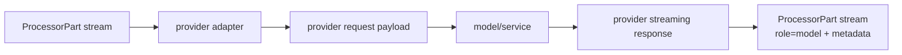

# Built-In Processors

Core processors live under `genai_processors.core`. They are composable
`Processor`s, `PartProcessor`s, or `@processor.source()` sources.

## Source References

- Core processor package: `genai_processors/core/`
- Models and realtime:
  `genai_processors/core/genai_model.py:86-322`,
  `genai_processors/core/live_model.py:61-241`,
  `genai_processors/core/realtime.py:58-360`,
  `genai_processors/core/ollama_model.py:53-301`,
  `genai_processors/core/transformers_model.py:41-360`
- Tooling and structured output:
  `genai_processors/core/function_calling.py:202-660`,
  `genai_processors/core/constrained_decoding.py:26-120`
- Prompting and text:
  `genai_processors/core/preamble.py:26-84`,
  `genai_processors/core/jinja_template.py:31-280`,
  `genai_processors/core/text.py:35-560`,
  `genai_processors/core/window.py:42-280`
- Media, documents, and IO:
  `genai_processors/core/audio.py:28-110`,
  `genai_processors/core/audio_io.py:35-146`,
  `genai_processors/core/video.py:37-220`,
  `genai_processors/core/pdf.py:41-135`,
  `genai_processors/core/web.py:57-104`,
  `genai_processors/core/drive.py:181-419`
- Matching tests: `genai_processors/tests/*_test.py`

## Models And Realtime

- `genai_model.GenaiModel`: Gemini turn-based streaming API wrapper.
- `genai_model.ImagePreprocess`: uploads image parts through the Gemini File
  API and yields file handles for reuse.
- `live_model.LiveProcessor`: Gemini Live API adapter for realtime media,
  client content, tool responses, tool calls, and Live metadata.
- `realtime.LiveProcessor`: client-side realtime wrapper around a turn-based
  processor using rolling prompts and speech/end-of-turn triggers.
- `ollama_model.OllamaModel`: local Ollama chat streaming adapter.
- `transformers_model.TransformersModel`: Hugging Face Transformers chat
  adapter.

### Model Adapter Semantics



Every model adapter performs the same semantic sandwich: normalize
`ProcessorPart`s into a provider payload, stream provider output, then restore
the library envelope. Provider differences should stay inside the adapter.

## Tooling And Structured Output

- `function_calling.FunctionCalling`: executes Python/MCP tools from model
  function-call parts and feeds function responses back to the model.
- `function_calling.cancel_fc` and `function_calling.list_fc`: model-facing
  tool declarations for cancellation/listing in bidi function calling.
- `constrained_decoding.StructuredOutputParser`: parses streamed JSON into
  schema-backed dataclass/enum parts.
- `adk.ProcessorAgent`: adapts processors into an ADK agent.

Tooling processors treat tool calls as stream data. The runtime loop is:

```text
model output function_call -> local execution -> function_response part -> model
```

Structured output processors narrow text or JSON into typed parts; downstream
processors should match the typed MIME/dataclass envelope instead of reparsing
strings.

## Prompting, Text, And Templates

- `preamble.Preamble`: prepends fixed content to a stream.
- `preamble.Suffix`: appends fixed content after a stream.
- `jinja_template.JinjaTemplate`: renders prompts/templates over stream
  content.
- `jinja_template.RenderDataClass`, `RenderJson`, `RenderProtoMessage`:
  render structured parts.
- `text.MatchProcessor`: extracts regex matches into a chosen substream.
- `text.UrlExtractor`: emits `FetchRequest` dataclass parts for URLs.
- `text.HtmlCleaner`: cleans HTML to HTML or plain text.
- `text.terminal_input` and `text.terminal_output`: CLI stream I/O helpers.

## Media

- `audio.AudioToWav`: concatenates `audio/l16` or `audio/pcm` chunks into
  `audio/wav`.
- `audio_io.PyAudioIn`: microphone source yielding realtime audio parts.
- `audio_io.PyAudioOut`: speaker output processor for audio parts.
- `rate_limit_audio.RateLimitAudio`: chunks and paces audio at playback rate.
- `speech_to_text.SpeechToText`: Google Speech-to-Text stream transcriber with
  speech event output.
- `text_to_speech.TextToSpeech`: Google Text-to-Speech output processor.
- `vad.Vad`: voice activity detector emitting speech events.
- `speech_events.StartOfSpeech` and `EndOfSpeech`: speech event marker types.
- `video.VideoIn`: camera/screen image source.
- `video.VideoExtract`: explodes video files into image/audio parts.

Media processors are usually envelope-sensitive:

```text
bytes + mimetype + substream -> routing and decoding behavior
```

Never infer media type only from filename when a `ProcessorPart` already has an
explicit MIME type.

## Documents, Files, And Web

- `pdf.PDFExtract`: extracts PDF text and page screenshots.
- `drive.Docs`: exports Google Docs as PDF parts.
- `drive.Sheets`: fetches Google Sheets as CSV text parts.
- `drive.Slides`: exports selected Google Slides as per-slide PDF parts.
- `filesystem.GlobSource`: source for files matching a glob.
- `web.UrlFetch`: fetches explicit `FetchRequest` URL parts.
- `github.GithubProcessor`: fetches GitHub URL content.

## Stream And Context Utilities

- `window.Window`: applies a processor over compressed/sliding content windows.
- `window.RollingPrompt`, `drop_old_parts`, and `keep_last_n_turns`: prompt
  history utilities.
- `timestamp.add_timestamps`: inserts timestamp text parts, usually around
  media frames.
- `event_detection.EventDetection`: detects model-described state transitions
  in image streams and emits event notifications.

## Selection Matrix

| Need | Prefer |
| --- | --- |
| Turn-based text/multimodal model | `genai_model.GenaiModel` or provider adapter |
| Native realtime audio/video | `live_model.LiveProcessor` |
| Simulated realtime over turn model | `realtime.LiveProcessor` |
| Per-part media conversion | `PartProcessor` media helpers |
| Tool loop around model | `function_calling.FunctionCalling` |
| Prompt decoration | `Preamble`, `Suffix`, `JinjaTemplate` |
| Sliding context | `window.Window` / rolling prompt helpers |
| Device source/sink | `audio_io` / `video` processors |
