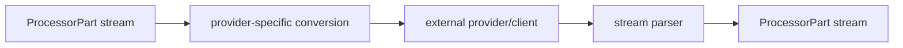

# Contrib Processors

Contrib processors live under `genai_processors.contrib`. They are maintained
on a best-effort basis and may have narrower contracts than core processors.

## Source References

- Community contrib policy: `genai_processors/contrib/README.md:1-11`,
  `CONTRIBUTING.md:33-48`
- OpenRouter adapter: `genai_processors/contrib/openrouter_model.py:81-434`
- OpenRouter behavior tests:
  `genai_processors/contrib/tests/openrouter_model_test.py:37-408`
- LangChain adapter: `genai_processors/contrib/langchain_model.py:42-162`
- LangChain behavior tests:
  `genai_processors/contrib/tests/langchain_model_test.py:32-260`

## In-Repo Contrib

### OpenRouterModel

`openrouter_model.OpenRouterModel` wraps OpenRouter's streaming chat
completion API.

- Constructor: `api_key`, `model_name`, optional `base_url`, `site_url`,
  `site_name`, and `generate_content_config`.
- Supports text and image inputs, function calls, function responses, provider
  options, fallback models, transforms, response schema conversion, and
  streaming SSE output.
- Emits text delta parts with model role and response metadata.
- Accumulates streamed function-call deltas and emits one function-call part
  when the stream finishes.
- Emits a final empty model part with `finish_reason` and
  `turn_complete=True`.
- Provides `aclose` and async context manager methods for closing the httpx
  client.

### LangChainModel

`langchain_model.LangChainModel` wraps any LangChain `BaseChatModel`.

- Constructor: `model`, optional `system_instruction`, optional
  `ChatPromptTemplate`.
- Buffers input, prepends system instruction, converts parts to LangChain
  messages, and streams `model.astream`.
- Supports text and image input.
- Output must be string content; multimodal output raises
  `NotImplementedError`.
- GenAI-level tool calls/responses and structured decoding are not translated.

## External Community Links

`genai_processors/contrib/README.md` lists community processors that are not
vendored into this repo:

- `mbeacom/genai-processors-pydantic`: `PydanticValidator` validates JSON
  `ProcessorPart` content against a Pydantic model.
- `mbeacom/genai-processors-url-fetch`: `UrlFetchProcessor` detects URLs,
  fetches content concurrently, and yields extracted HTML, text, or Markdown
  parts.

## Guidance

- Prefer core processors when an equivalent exists and stable behavior matters.
- Check contrib tests before depending on edge behavior:
  `genai_processors/contrib/tests/openrouter_model_test.py` and
  `genai_processors/contrib/tests/langchain_model_test.py`.
- Treat provider-specific options as pass-through unless the adapter explicitly
  maps them to `ProcessorPart` contracts.

## Adapter Boundary

Contrib adapters should keep unstable provider semantics behind the conversion
and parse steps. The public promise is still the `Processor` contract.

## Risk Matrix

| Adapter | Strong Contract | Weaker Edge |
| --- | --- | --- |
| OpenRouterModel | text/image input, streaming text, function calls/responses, final metadata | provider-specific config pass-through and SSE quirks |
| LangChainModel | text/image input conversion, string output chunks | multimodal output, GenAI tool-call translation, structured decoding |

Before promoting contrib behavior into core docs, confirm it has tests for input
conversion, streaming output, error handling, and provider-specific metadata.
