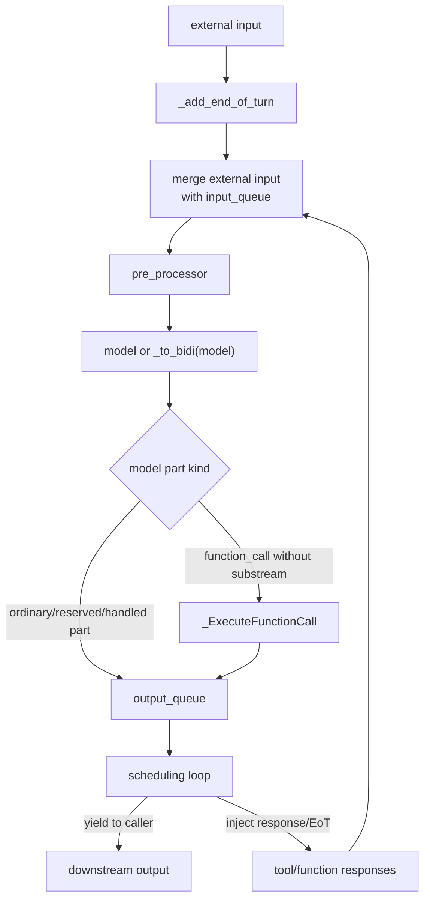

# Function Calling And MCP

`genai_processors.core.function_calling.FunctionCalling` is the tool-use loop.
It wraps a model processor, intercepts model-emitted function calls, executes
matching Python or MCP tools, injects function responses back into the prompt,
and repeats until no more work is scheduled or the call limit is reached.

## Source References

- Function-call part constructors and helpers:
  `genai_processors/content_api.py:402-455`,
  `genai_processors/content_api.py:583-654`
- FunctionCalling runtime:
  `genai_processors/core/function_calling.py:297-829`
- MCP adapters: `genai_processors/mcp.py:48-151`
- Tool declaration utilities: `genai_processors/tool_utils.py:24-153`
- Reserved substream capture: `genai_processors/context.py:25-158`,
  `genai_processors/processor.py:973-1089`
- Function-calling tests:
  `genai_processors/tests/function_calling_test.py:101-760`,
  `genai_processors/tests/mcp_test.py:1-220`,
  `genai_processors/tests/tool_utils_test.py:1-136`

## Semantic Model

Function calling is a deterministic scheduler around a model. It has four
streams:

- original user/content input;
- model output, including ordinary parts and function calls;
- tool output, converted to function responses;
- internal scheduling control, represented by end-of-turn parts and queue
  termination.

The loop does not declare tools to the model by itself. The model provider must
already know the tool declarations. `FunctionCalling` executes calls that the
model emits.



## Model Contract

- The model must emit `ProcessorPart`s whose underlying GenAI `Part` contains
  `function_call`.
- Tool results are represented as `ProcessorPart.from_function_response(...)`.
- The model adapter is responsible for formatting/parsing tool parts for its
  provider.
- For Gemini, pass the same tools to the model config and to
  `FunctionCalling`, and disable SDK automatic function calling to avoid
  duplicate calls.
- Function-call traffic is tagged with the configured substream, default
  `function_call`.
- Function calls already carrying a substream are treated as already handled.

## Constructor

Use:

```python
FunctionCalling(
    model,
    is_bidi_model=False,
    substream_name="function_call",
    pre_processor=None,
    fns=[tool_fn],
    max_function_calls=None,
)
```

- `model` may be turn-based or bidi/realtime.
- `is_bidi_model=False` wraps the model into a bidi-style loop internally.
- `pre_processor` runs over original input, function responses, and model
  output from previous iterations before each model call.
- `fns` may contain Python callables and MCP client sessions.
- Default `max_function_calls` is 5 for turn-based models and unbounded for
  bidi models.

## Bidi Reduction

Turn-based models are adapted with `_to_bidi(model)`:

```text
prompt = []
dirty_prompt = False

for part in input:
  if is_end_of_turn(part):
    dirty_prompt = False
    yield from model(prompt)
    yield END_OF_TURN as model
  else:
    prompt.append(part)
    if part.role == "user":
      dirty_prompt = True

on stream end:
  if dirty_prompt:
    yield from model(prompt)
    yield END_OF_TURN as model
```

This keeps one scheduling loop for both realtime and turn-based providers. For
turn-based models, async tools can still delay the next model call because the
turn model only runs when the scheduler injects an end-of-turn.

## Function-Call Loop Formula

The loop state is:

```text
running_fc_count: number of yielded function calls whose terminal response has
  not been observed yet
model_outputting: true while the model is streaming a turn
fn_call_count: total intercepted function calls
fn_call_count_limit: max_function_calls or infinity
schedule_model_call: deferred request to send END_OF_TURN
```

Input stream construction:

```text
input_stream =
  streams.merge(
    _add_end_of_turn(external_content),
    streams.dequeue(input_queue),
    stop_on_first=is_bidi_model,
  )
```

Function response scheduling:

```text
if scheduling == SILENT:
  do not trigger the model
elif scheduling == WHEN_IDLE:
  if model_outputting:
    schedule_model_call = True
  else:
    input_queue.put(END_OF_TURN)
else:
  input_queue.put(END_OF_TURN)
```

Model end-of-turn handling:

```text
model_outputting = False
flush deferred function responses

if not is_bidi_model:
  if schedule_model_call:
    input_queue.put(END_OF_TURN)
    schedule_model_call = False
  elif no_non_silent_deferred and running_fc_count == 0:
    input_queue.put(None)
    output_queue.put(None)
else:
  if schedule_model_call:
    input_queue.put(END_OF_TURN)
    schedule_model_call = False
  elif running_fc_count == 0:
    yield model END_OF_TURN
```

Call-limit guard:

```text
fn_call_count += 1
if fn_call_count > fn_call_count_limit:
  ignore this function call
```

After the limit is reached, the scheduler allows one extra response-processing
iteration so the model can observe the last allowed tool response, then it
closes the input and output queues.

## Runtime Dispatch Matrix

| Incoming Model/Tool Part | Guard | Runtime Action | Output / Injection |
| --- | --- | --- | --- |
| function call with no substream | under call limit | tag with `function_call`, execute matching tool | Yield call notification; later yield response. |
| function call with substream | already handled | do not execute | Yield normally. |
| unknown function name | no matching callable | create error function response | Yield model call and error response. |
| sync function, turn model | not bidi and not coroutine/generator | run with `asyncio.to_thread`, wait | Yield terminal function response. |
| sync function, bidi model | `is_bidi_model=True` | run as background task | Yield silent "Running in background." then later response. |
| coroutine function | coroutine callable | run as background task | Yield silent running response then later response. |
| async generator function | async generator callable | stream background responses | Mark intermediate responses as continuing; emit terminal response when done. |
| function response on reserved substream | reserved by context | yield directly | Do not feed into model prompt through normal loop. |
| function response with `SILENT` | scheduling silent | add to prompt when appropriate, no turn trigger | Model is not asked to respond immediately. |
| function response with `WHEN_IDLE` | model is outputting | defer and set `schedule_model_call` | Trigger after current model output finishes. |
| function response with other scheduling | immediate scheduling | inject `END_OF_TURN` | Model turn requested immediately. |
| model end-of-turn | role model and `turn_complete` | flush deferred responses | Stop or schedule next turn based on state. |

## Tool Execution

Tools must have JSON-serializable arguments. Return values may be
JSON-serializable values, `ProcessorPart`s, `ProcessorContent`, or explicit
function-response parts.

Return normalization:

```text
if return_value is a single FunctionResponse part:
  update id/name/substream/role in place
elif return_value can be JSON serialized:
  FunctionResponse.response = {"result": return_value}
elif return_value can be rendered as strict text:
  FunctionResponse.response = {"result": text}
else:
  FunctionResponse.parts = inline blobs for each returned part
```

Error normalization:

```text
FunctionResponse.response = {
  "error": "Failed to invoke function name(args): exception"
}
is_error = True
```

Async background tools use semantic IDs:

```text
task_id = f"{function_name}_{counter_for_function_name}"
```

When the provider did not supply a function-call ID, this generated ID is used
for later `list_fc` and `cancel_fc` operations.

## Scheduling

Function responses may use GenAI `FunctionResponseScheduling`.

- `SILENT`: add to the prompt without triggering model output.
- `WHEN_IDLE`: trigger after the current model output finishes, or immediately
  if the model is already idle.
- Other scheduling, including interrupt-style behavior, requests an immediate
  model turn by injecting end-of-turn.

The loop tracks whether the model is outputting, how many function calls are
running, and whether another model call is scheduled.

Deferred responses are flushed when the model emits end-of-turn. This prevents
silent or wait-until-idle responses from interrupting an in-progress model
stream.

## Cancellation And Listing

`cancel_fc(function_ids)` and `list_fc()` are interface functions to expose to
models. In bidi mode, `FunctionCalling` installs real implementations.

- `list_fc` returns a function response describing running background calls.
- `cancel_fc` cancels matching tool tasks and returns an error response when
  requested IDs are missing.
- A model can also emit tool-cancellation parts; `ProcessorPart` exposes
  `tool_cancellation` for function responses named `tool_cancellation`.

Cancellation result semantics:

| Requested IDs | Result | `is_error` |
| --- | --- | --- |
| all found/cancelled or already done | `"OK, cancelled."` | `False` |
| some found and some missing | partial summary | `True` |
| none found | missing summary | `True` |

## MCP

`genai_processors.mcp` converts MCP tools into Python callables usable by
`FunctionCalling`.

- Pass a GenAI MCP client session in `fns`; initialization runs lazily on the
  first processor call.
- Each MCP tool becomes an async callable named after the MCP tool and with the
  MCP description as its docstring.
- `create_mcp_tool(session, tool)` calls `session.call_tool(tool.name, kwargs)`.
- MCP tool errors raise `McpToolError`; `FunctionCalling` catches it and emits
  an error function response.
- MCP `TextContent`, `ImageContent`, `AudioContent`, embedded resources, and
  resource links are converted into `ProcessorPart`s, then wrapped in one
  function response.

MCP content conversion:

| MCP Content Block | ProcessorPart Conversion |
| --- | --- |
| `TextContent` | text part with `block.text` |
| `ImageContent` | base64 decoded bytes with `block.mimeType` |
| `AudioContent` | base64 decoded bytes with `block.mimeType` |
| `EmbeddedResource` text | text with resource MIME or `text/plain` |
| `EmbeddedResource` blob | base64 decoded bytes with resource MIME |
| `ResourceLink` | text part containing URI string |
| unsupported block | `ValueError` |

## Tool Declarations

`genai_processors.tool_utils` turns Python callables and GenAI `Tool`s into
provider payloads.

- `to_function_declarations` uses GenAI SDK schema inference and docstring
  parsing to populate declaration descriptions and parameter descriptions.
- `function_declaration_to_json` emits an OpenAI/Ollama-style function tool
  JSON object.
- `to_schema` and `to_json_schema` route Python/GenAI schema objects through
  the GenAI SDK schema transformer.
- Server-side Gemini tools such as retrieval, Google Search, Maps, URL context,
  code execution, and computer use are rejected for non-Gemini providers unless
  explicitly allow-listed.

## Invariants

- The provider must know the same callable names that `FunctionCalling` can
  execute.
- Intercepted model function calls are emitted as notifications on the
  function-call substream before their responses.
- Function calls with an existing substream are not executed again.
- Unknown tools and tool exceptions become error function responses, not
  uncaught runtime exceptions.
- Reserved substreams bypass the model prompt through normal chain capture.
- Async tools must produce a terminal response with falsy `will_continue` so
  `running_fc_count` can decrement.
- `SILENT` responses must not schedule a model turn.
- `WHEN_IDLE` responses must not interrupt current model output.

## Failure Modes And Gotchas

- Passing tools to `FunctionCalling` but not to the model config means the model
  has no declarations to call.
- Leaving Gemini SDK automatic function calling enabled can duplicate tool
  execution.
- A function call emitted with a substream is considered handled and will not be
  executed by this loop.
- `max_function_calls` can silently ignore calls beyond the limit.
- Long-running async tools keep the loop alive until they produce terminal
  responses or are cancelled.
- Missing or unstable function-call IDs make cancellation harder; generated IDs
  are semantic but local to one processor call.
- Returning nested function responses inside `ProcessorContent` can be
  ambiguous; the runtime unwraps a single function-response part specially.
- MCP `isError` responses become tool errors, not normal successful content.

## Replication Pattern

For another tool loop:

- Keep tool protocol messages as structured function-call/function-response
  parts.
- Separate model streaming from tool execution with queues.
- Use end-of-turn as the scheduling boundary.
- Defer wait-until-idle responses while the model is outputting.
- Represent tool failures as model-visible error responses.
- Keep cancellation/listing as ordinary tools only when the model can act on
  running background tasks.
