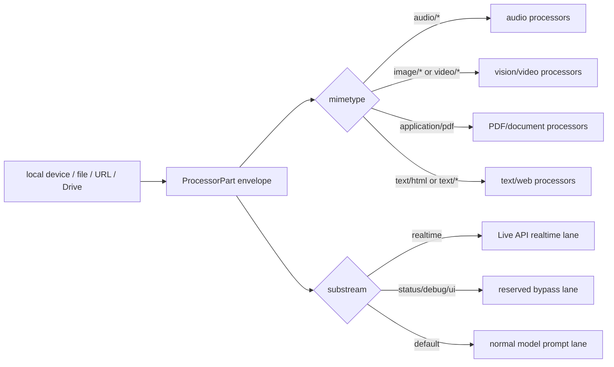
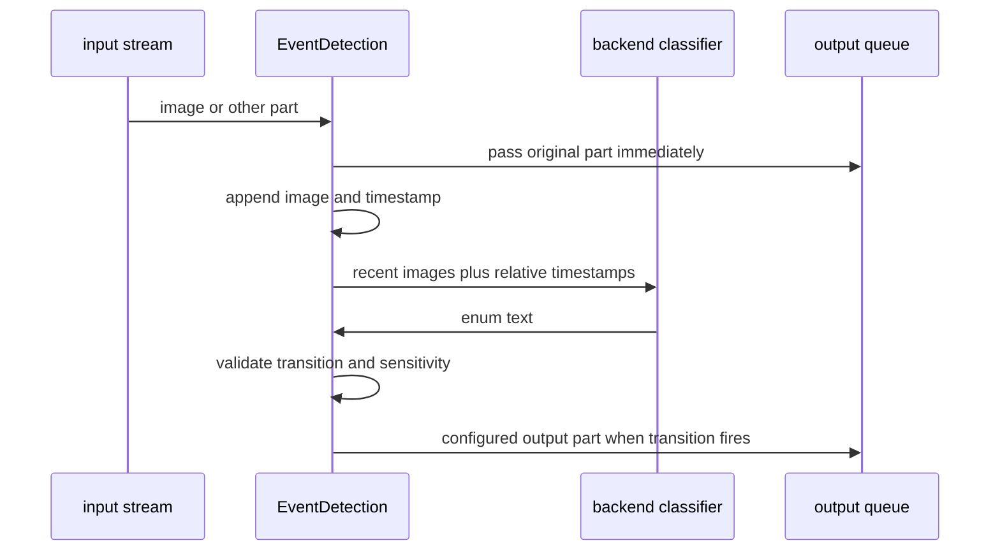
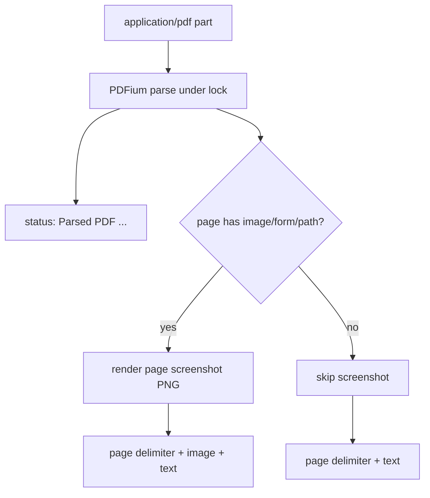
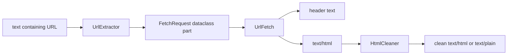

# Media IO And Documents

All media and document processors exchange `ProcessorPart`s. Use MIME types to
route modalities and substreams to isolate realtime input, status, debug, and
UI traffic.

## Source References

- Media content contract: `genai_processors/content_api.py:39-1226`
- MIME helpers: `genai_processors/mime_types.py:127-247`
- Audio processors: `genai_processors/core/audio.py:28-110`,
  `genai_processors/core/audio_io.py:35-146`,
  `genai_processors/core/speech_to_text.py:51-420`,
  `genai_processors/core/text_to_speech.py:41-140`,
  `genai_processors/core/vad.py:77-314`,
  `genai_processors/core/rate_limit_audio.py:28-178`
- Speech event dataclasses: `genai_processors/core/speech_events.py:30-66`
- Video and event processors: `genai_processors/core/video.py:32-294`,
  `genai_processors/core/event_detection.py:137-296`
- Document and fetch processors: `genai_processors/core/pdf.py:38-135`,
  `genai_processors/core/web.py:57-104`,
  `genai_processors/core/github.py:31-120`,
  `genai_processors/core/drive.py:181-419`,
  `genai_processors/core/filesystem.py:29-80`,
  `genai_processors/core/text.py:310-498`
- Media tests: `genai_processors/tests/audio_test.py`,
  `genai_processors/tests/video_test.py`, `genai_processors/tests/pdf_test.py`,
  `genai_processors/tests/web_test.py`, `genai_processors/tests/drive_test.py`

## Semantic Model

Media processors use `ProcessorPart` as a typed envelope:

```text
ProcessorPart =
  underlying GenAI Part
  + role
  + substream_name
  + mimetype
  + metadata
```

The MIME type determines modality. The substream determines routing. The same
audio bytes can be realtime input, ordinary prompt content, status-adjacent
debug output, or local UI data depending on the envelope.



## ProcessorPart Media Contract

- `ProcessorPart(bytes, mimetype=...)` requires an explicit MIME type.
- Text bytes are decoded to text when the MIME type is text-like; other bytes
  become inline data.
- `ProcessorPart(PIL.Image.Image)` serializes the image into inline bytes and
  infers or validates an `image/*` MIME type.
- `ProcessorPart.from_uri(...)` creates URI/file data parts.
- `ProcessorPart.file` reconstructs a GenAI `File` when metadata `is_file` is
  set.
- Accessors include `.bytes`, `.text`, `.pil_image`, `.get_dataclass(...)`,
  `.function_call`, `.function_response`, `.to_dict()`, and `.from_dict()`.

Constructor dispatch:

| Value | Required Envelope | Result |
| --- | --- | --- |
| `str` | optional role/substream/metadata | text GenAI part |
| `bytes` | explicit `mimetype` | text decode if text MIME, otherwise inline data |
| `PIL.Image.Image` | optional `image/*` MIME | encoded image bytes |
| `genai_types.File` | file object | file data part and `metadata["is_file"]` |
| `genai_types.Part` | provider part | wraps as-is and infers MIME when possible |
| `ProcessorPart` | existing part | copies part/envelope unless overridden |

## Audio

- `audio_io.PyAudioIn` is a source that captures microphone chunks and yields
  `audio/l16;rate=...`, `audio/l24;rate=...`, or `audio/pcm;rate=...` parts on
  substream `realtime` by default.
- `audio_io.PyAudioOut` plays audio parts with PyAudio and passes through
  non-audio parts. Set `passthrough_audio=True` to keep audio in the output
  stream.
- `audio.AudioToWav` concatenates consecutive `audio/l16` or `audio/pcm` parts
  and emits one `audio/wav` part. It flushes when a non-audio part arrives, the
  MIME type changes, or the stream ends.
- `rate_limit_audio.RateLimitAudio` splits or paces audio chunks to natural
  playback speed for streaming TTS and interruption-friendly output.

Audio timing formulas in `RateLimitAudio` assume 16-bit PCM:

```text
audio_duration_sec(audio_bytes, sample_rate) =
  len(audio_bytes) / (2 * sample_rate)

chunk_target_bytes =
  int(MAX_AUDIO_PART_SEC * sample_rate * 2)

num_chunks =
  ceil(len(audio_bytes) / chunk_target_bytes)
```

With the current constant:

```text
MAX_AUDIO_PART_SEC = 0.05
chunk_target_bytes_at_24k = int(0.05 * 24000 * 2) = 2400
```

Playback pacing:

```text
start_playing_time = max(now - 0.05, start_playing_time)
sleep_sec = max(0, start_playing_time - now)
yield audio_part
start_playing_time += audio_duration_sec(audio_part.bytes, sample_rate)
```

Interrupt handling:

```text
if part.metadata["interrupted"]:
  clear queued audio parts
  enqueue interrupt state part
```

## Speech To Text, VAD, And TTS

`speech_to_text.SpeechToText` uses Google Cloud Speech streaming and emits:

- transcription parts on `input_transcription`;
- endpointing dataclass parts on `input_endpointing`;
- optional passthrough audio on the default substream.

Speech streaming restarts:

```text
restart when
  elapsed_sec > STREAMING_LIMIT_SEC and not user_speaking
or
  elapsed_sec > STREAMING_HARD_LIMIT_SEC

STREAMING_LIMIT_SEC = 180
STREAMING_HARD_LIMIT_SEC = 240
```

`vad.Vad` performs local WebRTC VAD and injects structured
`StartOfSpeech`/`EndOfSpeech` events.

VAD frame formulas:

```text
input_frame_bytes =
  int(input_sample_rate * frame_duration_ms / 1000 * 2)

vad_frame_bytes =
  int(vad_sample_rate * frame_duration_ms / 1000 * 2)

num_padding_frames =
  int(padding_duration_ms / frame_duration_ms)
```

Transition thresholds:

```text
start_of_speech when
  voiced_frames > speech_threshold * num_padding_frames

end_of_speech when
  unvoiced_frames > silence_threshold * num_padding_frames
```

`text_to_speech.TextToSpeech` streams text into Google Cloud TTS and emits
`audio/l16;rate=24000` model parts. It can pass text through while also
producing audio; ordering between pass-through text and generated audio is not
strictly preserved.

## Video

- `video.VideoIn` is a source for camera or screen frames. It yields JPEG image
  parts on substream `realtime` by default.
- `video.VideoExtract` matches video MIME types and expands a video file into
  image frames, audio, or both interleaved, depending on `VideoAVFormat`.
- Extracted frames are JPEG image parts with `metadata["video_timestamp"]`.
- Extracted audio is `audio/l16;rate=16000;channels=1`; in interleaved mode
  audio chunks follow frame timing.
- For native-video models, sending the whole video may be preferable. Use
  `VideoExtract` when a downstream processor needs frames, windows, tests, or a
  model without native video support.

Video timing formulas:

```text
frame_timestamp_sec = frame_idx / frames_per_second

audio_offset_samples_end =
  int(16000 * (frame_idx + 1) / frames_per_second)

audio_offset_bytes_end =
  audio_offset_samples_end * 2

audio_chunk =
  audio_data[previous_audio_offset_bytes : audio_offset_bytes_end]
```

## Event Detection

`event_detection.EventDetection` watches recent image parts, sends a short
image/timestamp window to a backend classifier, and emits configured transition
outputs.



Transition formula:

```text
event_name = response_text.strip().lower()
current_transition = (last_transition.to_state, event_name)

valid_transition =
  (current_transition in output_dict or current_transition.from_state == START)
  and current_transition.to_state != current_transition.from_state

sensitivity_reached =
  current_transition not in sensitivity
  or transition_counter[current_transition] > sensitivity[current_transition]
```

The strict `>` means a sensitivity value of `3` fires on the fourth repeated
detection.

## PDF

`pdf.PDFExtract` is a `PartProcessor` that matches `application/pdf`.

- It parses PDF bytes with pypdfium2 under a process lock because PDFium is not
  thread-safe.
- It emits a `status` part summarizing parsed page count and image-page count.
- It emits text delimiters and page text.
- Pages containing images/forms/paths are also rendered as PNG image parts.
- Input metadata `original_file_name` is used in status text when present.



## Google Drive Documents

`drive.Docs`, `drive.Sheets`, and `drive.Slides` are request-driven
`PartProcessor`s. Requests are dataclass JSON parts:
`DocsRequest`, `SheetsRequest`, and `SlidesRequest`.

- `Docs` exports a Google Doc as `application/pdf`.
- `Sheets` fetches grid data and emits CSV text parts for selected ranges or
  worksheets.
- `Slides` exports the deck as PDF, splits selected slides, and emits one PDF
  part per slide.
- Credentials may be passed in constructors; otherwise Google client defaults
  are used.
- Chain `PDFExtract` after Docs/Slides when you need local extraction; many
  Gemini models can consume PDF bytes directly through `GenaiModel`.

Drive request dispatch:

| Request MIME | Processor | Output |
| --- | --- | --- |
| `application/json; type=DocsRequest` | `Docs` | label text and full document PDF |
| `application/json; type=SheetsRequest` | `Sheets` | sheet label text and CSV |
| `application/json; type=SlidesRequest` | `Slides` | slide label text and per-slide PDF |

## Files, URLs, HTML, And GitHub

- `filesystem.GlobSource` yields files matching a glob in natural filename
  order. With `inline_file_data=True`, file bytes are loaded into parts with
  guessed MIME type and `metadata["original_file_name"]`. With
  `inline_file_data=False`, it yields file-data parts pointing at the path.
- `text.UrlExtractor` converts URLs in text into `FetchRequest` dataclass
  parts.
- `web.UrlFetch` matches `FetchRequest`, fetches the URL with httpx, yields a
  header text part, then yields fetched HTML as `text/html`. It is decorated
  with `yield_exceptions_as_parts`, so HTTP failures become status exception
  parts.
- `text.HtmlCleaner` converts HTML parts into cleaned HTML or plain text.
- `github.GithubProcessor` parses GitHub file URLs and fetches raw file content
  through the GitHub contents API.

Fetch pipeline:



## Runtime Dispatch Matrix

| Processor | Match / Input | Main Output | Pass-Through Behavior | Failure Mode |
| --- | --- | --- | --- | --- |
| `PyAudioIn` | source | realtime audio chunks | none | unsupported audio format raises |
| `PyAudioOut` | `audio/*` | speaker playback | non-audio always; audio only when configured | PyAudio/device errors propagate |
| `AudioToWav` | `audio/l16` or `audio/pcm` | `audio/wav` after flush | non-audio after flushing | unsupported audio MIME raises |
| `RateLimitAudio` | `audio/*` and interrupt metadata | paced/split audio | reserved parts can overtake audio | wrong sample-rate assumptions affect timing |
| `SpeechToText` | `audio/l16` at configured rate | transcription and endpointing parts | non-audio; optional audio passthrough | unsupported audio MIME/rate raises |
| `Vad` | `audio/l16` or `audio/pcm` | original audio plus speech events | non-audio immediately | invalid VAD settings or MIME raises |
| `TextToSpeech` | text parts | `audio/l16;rate=24000` | non-text and optional text | Cloud TTS errors propagate |
| `VideoIn` | source | realtime JPEG frames | none | camera/screen dependencies can fail |
| `VideoExtract` | `video/*` | frames/audio/interleaved parts | unmatched parts by PartProcessor framework | decode errors propagate from worker |
| `PDFExtract` | `application/pdf` | status, text, screenshots | unmatched parts by PartProcessor framework | PDF parse/render errors propagate |
| `UrlFetch` | `FetchRequest` | header and HTML | unmatched parts by PartProcessor framework | HTTP errors become status exception parts |
| `Docs/Sheets/Slides` | request dataclass MIME | PDF or CSV document parts | unmatched parts by PartProcessor framework | API/auth/parse errors propagate unless handled |

## Invariants

- Bytes parts require explicit MIME type.
- MIME type decides modality; substream decides routing.
- Realtime device media should use `substream_name="realtime"` when targeting
  Gemini Live.
- Reserved substreams such as `status`, `debug`, and `ui` bypass normal chain
  processing by default.
- Audio timing code assumes 16-bit PCM.
- `RateLimitAudio` flushes queued audio on `metadata["interrupted"]`.
- `PDFExtract` serializes PDFium access under a lock.
- `GlobSource` preserves natural filename order and stores
  `original_file_name` metadata.
- Document request processors match exact dataclass MIME strings.

## Failure Modes And Gotchas

- Constructing `ProcessorPart(bytes)` without `mimetype` raises immediately.
- Calling `.text` on non-text parts or `.pil_image` on non-image parts raises.
- `RateLimitAudio` does not parse channels and uses 2 bytes per sample; feed it
  the sample rate and PCM shape it expects.
- `TextToSpeech` does not preserve strict ordering between pass-through text and
  generated audio.
- `SpeechToText` expects `audio/l16` with the configured sample rate.
- `Vad` buffers audio around transitions so speech events can appear before or
  after the frames that caused them.
- `VideoExtract` decodes in a worker thread and can emit many parts; use it
  deliberately for large videos.
- `PDFExtract` can emit rendered page images for pages with vector paths, forms,
  or images, increasing prompt size.
- `UrlFetch` hardcodes a 10 second request timeout inside `call`, even though
  the client is constructed with `timeout_seconds`.
- Google Drive processors use synchronous Google client calls inside async
  `call` methods; large exports can block.

## Replication Pattern

When adding media or document processors:

- Match on MIME type or dataclass MIME, not filename text.
- Preserve role, substream, and useful metadata when transforming parts.
- Emit status parts for recoverable progress that should bypass models.
- Keep media timing formulas explicit and tied to sample rate/bytes per sample.
- Prefer file-data or provider-native media when downstream models support it.
- Use extraction processors when downstream code needs frames, chunks, pages,
  CSV ranges, or testable intermediate parts.
