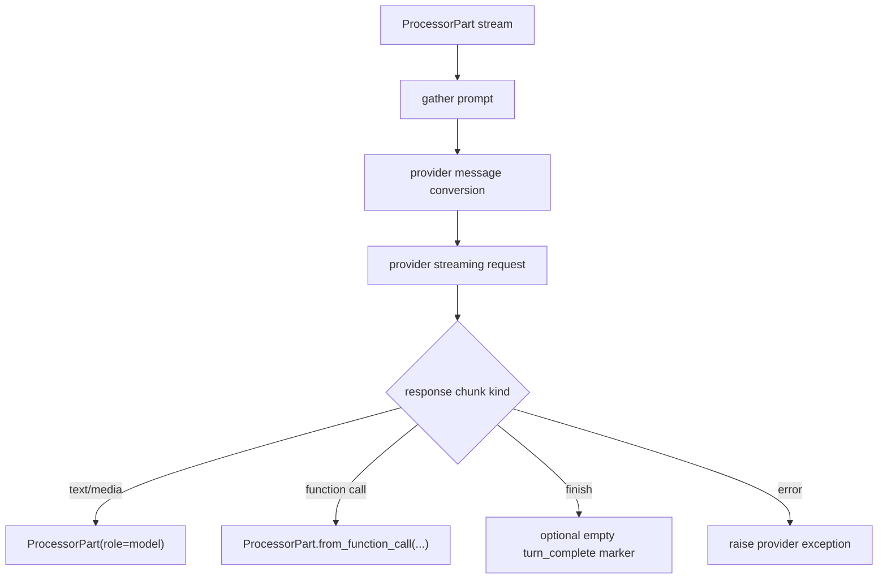
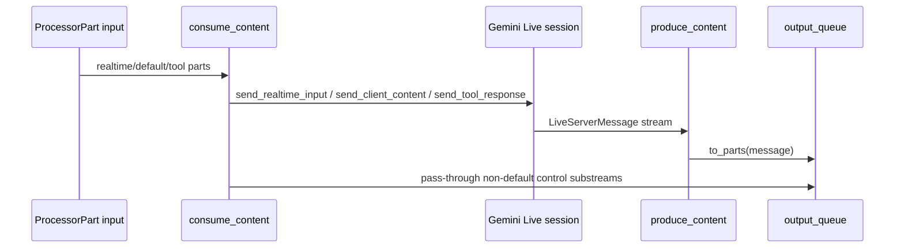

# Model Providers

Use model processors as ordinary `Processor`s: they consume `ProcessorPart`
streams and yield model output parts. Turn-based providers buffer their input
before making one request; they do not keep conversation state, so callers must
pass the full history for multi-turn context.

## Source References

- Gemini metadata, turn model, and image preprocessing:
  `genai_processors/core/genai_model.py:86-322`
- Gemini Live adapter: `genai_processors/core/live_model.py:61-241`
- Client-side realtime wrapper: `genai_processors/core/realtime.py:52-385`
- Ollama model adapter: `genai_processors/core/ollama_model.py:53-301`
- Transformers adapter:
  `genai_processors/core/transformers_model.py:41-465`
- OpenRouter contrib adapter:
  `genai_processors/contrib/openrouter_model.py:81-452`
- LangChain contrib adapter:
  `genai_processors/contrib/langchain_model.py:42-140`
- Tool declaration utilities: `genai_processors/tool_utils.py:24-153`
- Provider tests: `genai_processors/tests/genai_model_test.py:45-260`,
  `genai_processors/tests/live_model_test.py:1-260`,
  `genai_processors/tests/realtime_test.py:1-187`,
  `genai_processors/contrib/tests/openrouter_model_test.py:37-220`,
  `genai_processors/contrib/tests/langchain_model_test.py:32-160`

## Semantic Model

Provider processors translate between the common `ProcessorPart` stream and a
provider-specific API:

- turn-based provider: gather a finite prompt, call one model endpoint, stream
  the response, and finish.
- Live provider: keep a bidirectional session with separate send and receive
  loops.
- realtime wrapper: adapt a turn-based processor into a bidirectional
  conversation loop by keeping a rolling prompt and triggering turns.
- contrib provider: preserve the common envelope while mapping to another chat
  API, such as OpenRouter or LangChain.

The common contract is the same for all providers:

```text
AsyncIterable[ProcessorPart] -> Provider adapter -> AsyncIterable[ProcessorPart]
```

Provider state, tool support, media support, and turn-completion semantics vary.
Those differences are the main source of integration bugs.

## Provider Taxonomy

| Provider | Runtime Shape | Input Buffering | Output | Tool Parts | Media |
| --- | --- | --- | --- | --- | --- |
| `GenaiModel` | turn-based stateless | full gather before request | streamed candidate parts | provider parts, usually used with `FunctionCalling` | GenAI-supported parts via `to_genai_contents`; `ImagePreprocess` can upload images |
| Gemini `LiveProcessor` | bidirectional session | no full gather | server messages converted to parts | function responses in, function calls/cancellations out | realtime media on `substream_name="realtime"` |
| `realtime.LiveProcessor` | client-side bidi wrapper | rolling prompt window | turn model output plus turn-complete marker | whatever the wrapped turn processor supports | audio/text triggers; images possible but inefficient |
| `OllamaModel` | turn-based stateless | full gather before request | streamed JSON lines | OpenAI/Ollama-style tool calls | text and images in; image outputs as parts |
| `TransformersModel` | turn-based local model | full gather before generate | tokenizer streamer | token-level function-call parsing | text only; image input raises |
| `OpenRouterModel` | turn-based stateless over SSE | full gather before request | SSE text deltas and final marker | OpenAI-style function-call deltas | text and base64 image URLs |
| `LangChainModel` | turn-based wrapper | full gather before `astream` | text chunks | not implemented at GenAI processor level | text and images in; text out |

## Turn-Based Provider Flow



The model adapters are not conversation stores. For multi-turn behavior,
include previous user, model, function-call, and function-response parts in the
next prompt, or wrap the provider in a realtime/rolling-prompt processor.

## Gemini GenAI

`genai_processors.core.genai_model.GenaiModel` wraps
`client.aio.models.generate_content_stream`. Configure it with `api_key`,
`model_name`, optional `GenerateContentConfig`, `debug_config`, `http_options`,
and `stream_json`.

- Input is gathered, converted with `content_api.to_genai_contents`, then sent
  to the GenAI API.
- Streamed candidate parts are wrapped as `ProcessorPart`s with model role and
  metadata from `genai_response_to_metadata`: create time, response ID, model
  version, prompt feedback, usage metadata, automatic function-calling history,
  and parsed output.
- Streaming requests retry GenAI `APIError`s for HTTP 408, 429, 500, 502, 503,
  and 504.
- If `generate_content_config.response_schema` is set and `stream_json=False`,
  output is piped through `StructuredOutputParser`; set `stream_json=True` to
  receive raw JSON text chunks.
- `ImagePreprocess` uploads image parts through the File API and yields file
  handles; use it before `GenaiModel` to avoid re-uploading/tokenizing images
  in repeated calls.

Retry attempts:

```text
max_attempts =
  max(http_options.retry_options.attempts, 1) if provided
  else 5
```

Retry backoff for attempt index `i`:

```text
sleep_delay_sec = min(1.0 * 2**i, 60.0) + random_uniform(0.0, 1.0)
```

## Gemini Live API

`genai_processors.core.live_model.LiveProcessor` is the Gemini Live API
adapter. It opens `client.aio.live.connect(model, config)` and runs concurrent
send/receive loops.



Live input dispatch:

| Input Part | Live API Method | Effect |
| --- | --- | --- |
| `function_response` | `session.send_tool_response(...)` | Returns async tool output to the model. |
| `substream_name == "realtime"` and `audio_stream_end` | `send_realtime_input(audio_stream_end=True)` | Ends realtime audio stream. |
| `substream_name == "realtime"` and inline media | `send_realtime_input(media=...)` | Sends mic/camera/screen media. |
| `substream_name == "realtime"` and text | `send_realtime_input(text=...)` | Sends realtime text control. |
| default substream | `send_client_content(..., turn_complete=...)` | Sends turn-style content. |
| any other substream | output queue pass-through | Lets local control parts bypass the Live API. |

`to_parts()` converts Live server messages back into `ProcessorPart`s:

- audio/model parts from `model_turn`;
- `input_transcription` and `output_transcription` text substreams;
- metadata parts for `generation_complete`, `interrupted`,
  `usage_metadata`, `go_away`, and session resumption;
- function-call parts with metadata `id`;
- tool-cancellation parts.

## Client-Side Realtime Wrapper

`genai_processors.core.realtime.LiveProcessor` converts any turn-based
processor into a realtime-style bidirectional processor. It keeps a rolling
prompt, pre-processes pending context, and triggers model turns on explicit
end-of-turn parts or speech events.

- `turn_processor` handles one finite prompt; outputs are added back to the
  rolling prompt unless they are reserved substreams.
- `duration_prompt_sec` bounds rolling prompt history; `None` keeps all
  history.
- `AudioTriggerMode.FINAL_TRANSCRIPTION` triggers after final speech
  transcription; `END_OF_SPEECH` triggers earlier for audio-capable models.
- Start-of-speech cancels current output; end-of-speech or end-of-turn starts a
  new generation.
- Each completed model turn emits an empty model part with
  `metadata={"turn_complete": True}`.

Realtime dispatch:

| Incoming Part | Guard | Runtime Action |
| --- | --- | --- |
| reserved substream | `context.is_reserved_substream(...)` | Yield directly; do not add to model prompt. |
| final transcription substream | `substream_name == "input_transcription"` | Yield as user text; add to prompt only when metadata `is_final` is true. |
| start-of-speech event | `speech_events.is_start_of_speech(part)` | Clear user-not-talking event and cancel current generation. |
| end-of-speech event | `speech_events.is_end_of_speech(part)` | Set user-not-talking; optionally trigger generation. |
| end-of-turn part | `content_api.is_end_of_turn(part)` | Remove `turn_complete`, add to prompt, cancel current generation, trigger turn. |
| ordinary part | fallback | Add to rolling prompt. |

## Ollama

`genai_processors.core.ollama_model.OllamaModel` calls a local Ollama
`/api/chat` endpoint.

- Defaults to `http://127.0.0.1:11434`; use `host` to override.
- Accepts `system_instruction`, sampling options, stop sequences, `keep_alive`,
  response schemas, JSON schema, and tools.
- Converts `model` role to Ollama `assistant`, function calls to `tool_calls`,
  function responses to `tool` messages, text to `content`, and images to
  base64 `images`.
- Supports streamed text, streamed tool calls, and image outputs.
- Uses JSON/schema `format` for constrained output; with `response_schema` and
  `stream_json=False`, output is parsed by `StructuredOutputParser`.

Ollama message dispatch:

| ProcessorPart Kind | Ollama Message |
| --- | --- |
| `role="model"` | role becomes `assistant` |
| function call | `tool_calls` with function name and arguments |
| function response | role `tool`, `name`, JSON response content |
| text | `content` |
| image | base64 `images` |
| unsupported MIME | raises `ValueError` |

## Transformers

`genai_processors.core.transformers_model.TransformersModel` wraps Hugging Face
`AutoProcessor` and `AutoModelForCausalLM`.

- Buffers messages, applies the model chat template, and generates in a worker
  thread with a streamer that pushes `ProcessorPart`s back to asyncio.
- Supports text input, system instructions, sampling options, stop sequences,
  max output tokens, and tool declarations.
- Function calls/responses are mapped to common chat-template structures.
- Image input currently raises `ValueError("Images are not supported yet.")`.
- `tool_response_format` controls whether tool responses are rendered as a
  string or dict for the chat template.

Tool-call parsing is token-based, not text-regex-based:

```text
start_token = "<start_function_call>" or tokenizer special token
end_token = "<end_function_call>" or tokenizer special token
escape_token = "<escape>" or tokenizer special token

collect tokens from start_token through end_token
decode and repair escaped argument spans
parse: call:<function_name>{json_arguments}
yield ProcessorPart.from_function_call(...)
```

This reduces prompt-injection risk for models trained to use dedicated function
call tokens.

## OpenRouter

`genai_processors.contrib.openrouter_model.OpenRouterModel` streams
OpenRouter `/chat/completions` responses.

- Converts text, images, function calls, and function responses to OpenAI-like
  chat messages.
- Sends `stream=True`; parses SSE `data:` lines until `[DONE]`.
- Supports OpenRouter sampling/provider options, fallback models, transforms,
  tool declarations, tool choice, and JSON response schema conversion.
- Text deltas become model-role `ProcessorPart`s with usage/model metadata when
  present.
- Streaming function-call deltas are accumulated and emitted as one function
  call part at finish.
- HTTP errors include parsed OpenRouter error details when possible.

Function-call accumulation:

```text
accumulated.name += delta.function_call.name if present
accumulated.arguments += delta.function_call.arguments if present

on finish_reason:
  args = json.loads(accumulated.arguments or "{}")
  yield Part.from_function_call(name=accumulated.name, args=args)
  yield empty model part with finish_reason and turn_complete=True
```

`OpenRouterModel.key_prefix` includes the model name, which is important when
using cache wrappers.

## LangChain

`genai_processors.contrib.langchain_model.LangChainModel` wraps a LangChain
`BaseChatModel`.

- Prepends optional system instruction, converts parts to LangChain human,
  system, or AI messages, and streams `model.astream`.
- Consecutive parts with the same role are grouped into one LangChain message.
- Supports text and image input; images become data URL `image_url` content.
- Output is text-only; non-string streamed output raises
  `NotImplementedError`.
- GenAI-level tool translation and structured/constrained decoding are not
  implemented in this adapter.

## Provider Selection Matrix

| Need | Prefer | Reason |
| --- | --- | --- |
| Gemini Developer API turn calls | `GenaiModel` | Native GenAI response metadata and structured output support. |
| Live mic/camera/screen session | Gemini Live `LiveProcessor` | Uses provider realtime APIs and server-side VAD/tool signals. |
| Realtime UX over a turn model | `core.realtime.LiveProcessor` | Adds rolling prompt and speech-triggered turns locally. |
| Local model server | `OllamaModel` | Simple local `/api/chat` integration with text/image/tool support. |
| Fully local HF model | `TransformersModel` | Runs generation in-process with tokenizer-level streaming. |
| Multi-provider hosted models | `OpenRouterModel` | Unified OpenAI-like SSE endpoint and provider routing. |
| Existing LangChain model object | `LangChainModel` | Minimal bridge for LangChain chat models. |

## Invariants

- Turn-based providers are stateless across processor calls.
- Provider adapters should preserve `role`, `substream_name`, metadata, and
  function-call semantics when possible.
- Reserved substreams are runtime control lanes and should not be silently fed
  into provider prompts by wrappers that understand them.
- Tool declarations passed to non-Gemini providers must not contain unsupported
  Gemini server-side tools unless explicitly allow-listed.
- Structured-output parsing buffers provider text when `stream_json=False`.
- Live realtime device media must use `substream_name="realtime"`.
- Unknown non-default substreams in Gemini Live pass through unchanged.

## Failure Modes And Gotchas

- Forgetting to pass full history to a turn-based provider loses conversation
  context.
- Sending device media on the default substream to Gemini Live sends it as
  client content, not realtime input.
- Wrapping large image/video prompts in the client-side realtime wrapper can
  repeatedly retokenize media and add latency.
- `TransformersModel` rejects image parts.
- `LangChainModel` does not translate tool calls/responses at the GenAI
  processor level.
- OpenRouter function-call arguments are parsed only after finish; malformed
  streamed JSON raises `ValueError`.
- Cache wrappers around providers need behavior-specific prefixes. Include model
  name, prompt/schema version, tools, and relevant generation settings.
- GenAI streaming retries apply only to selected API status codes and can still
  surface provider exceptions after the attempt limit.

## Replication Pattern

When adding a provider adapter:

- Normalize inputs through `ProcessorPart` and `ProcessorContent`.
- Make buffering behavior explicit.
- Preserve roles and function-call/function-response parts structurally.
- Emit a clear turn-complete marker when downstream loops need one.
- Keep provider metadata in `part.metadata`, not in text.
- Document unsupported MIME types with explicit failures.
- Override `key_prefix` when model/config identity affects cache correctness.
