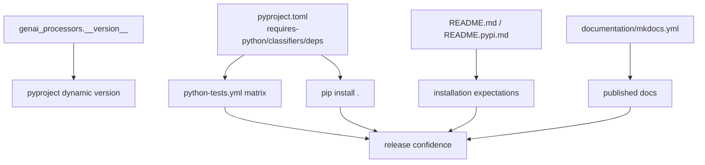

# Python Package And Docs Reference

## Source References

- Package metadata and dependencies: `pyproject.toml:1-96`
- Runtime version and LLM instruction marker:
  `genai_processors/__init__.py:16-24`
- Python CI workflow: `.github/workflows/python-tests.yml:16-42`
- Docs deploy workflow: `.github/workflows/deploy_docs.yml:1-32`
- MkDocs site config and navigation: `documentation/mkdocs.yml:1-90`
- MkDocs hook candidate: `documentation/hooks.py:1-14`
- Public README installation text: `README.md:84-104`

## Package Metadata

- Project name: `genai_processors`
- PyPI/install name used in docs: `genai-processors`
- Readme for package metadata: `README.pypi.md`
- License file: `LICENSE`
- Runtime Python: `>=3.11`
- Build backend: `flit_core.buildapi`
- Flit module: `genai_processors`, rooted at `.`
- Dynamic version: resolved by Flit from `genai_processors.__version__`
- Source distribution excludes `tests/`

The package classifiers list Python 3, 3.11, 3.12, and 3.13. Keep these
aligned with the CI matrix and runtime requirement.

## Dependency Groups

Runtime dependencies are listed in `project.dependencies`.

Optional groups:

- `contrib`: dependencies for processors under `genai_processors/contrib/`.
- `dev`: lint, format, pytest, and heavier optional test dependencies.

CI installs all three forms: `pip install .`, `pip install .[contrib]`, and
`pip install .[dev]`.

## CI Contract

Pull requests and pushes to `main` run on Ubuntu across Python `3.11`, `3.12`,
and `3.13`. The workflow:

1. upgrades `pip`;
2. installs package, contrib extras, and dev extras;
3. runs strict flake8 syntax/undefined-name checks;
4. runs advisory flake8 style checks with broad line length;
5. runs `pytest`.

## Release Consistency Graph



Consistency formula for release-facing edits:

```text
release_docs_are_consistent =
  python_requirement == classifiers == ci_matrix
  and README install text matches extras/dependencies
  and __version__ matches the intended release
```

If any term is false, document the drift or fix it before publishing.

## Docs Contract

Docs are built from the `documentation/` subfolder with MkDocs Material and the
include-markdown plugin. The deploy workflow runs only on pushes to `main`,
installs `mkdocs-material` and `mkdocs-include-markdown-plugin`, then runs:

```bash
mkdocs gh-deploy --force
```

from `documentation/`.

Local docs-only validation should use:

```bash
python -m pip install mkdocs-material mkdocs-include-markdown-plugin
cd documentation
mkdocs build --strict
```

## Known Drift Points

- `README.md` currently says Python 3.10+, while `pyproject.toml` requires
  Python `>=3.11`.
- `llms.txt` contains spelling and wording drift such as "injest" and
  "to it for you"; preserve intent but fix when editing that file.
- The package version lives in `genai_processors/__init__.py` as
  `__version__ = '2.0.3'`; `pyproject.toml` uses dynamic versioning.
- MkDocs nav in `documentation/mkdocs.yml` must match files under
  `documentation/docs/`.
- CI Python versions and `pyproject.toml` classifiers should move together.
