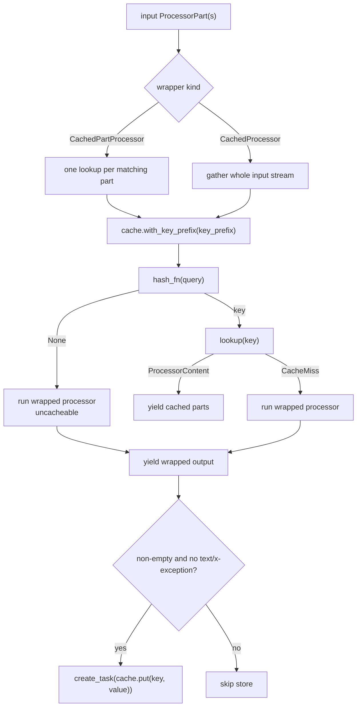
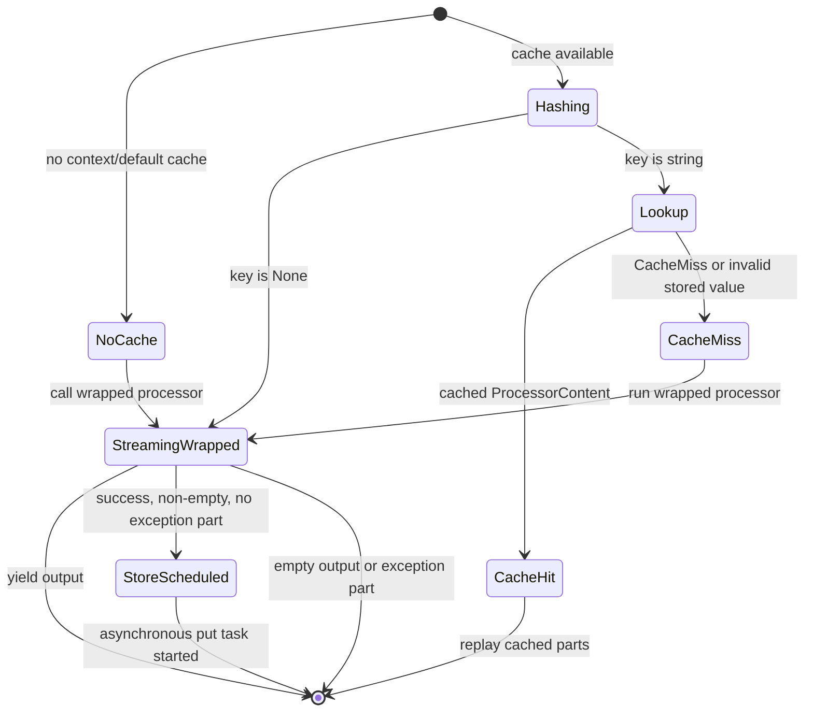

# Caching

Caching stores `ProcessorContent` outputs for repeated processor inputs. Use it
around expensive, deterministic work: LLM calls, metadata extraction, document
processing, embeddings, or remote fetches. The cache layer is intentionally
below provider logic: it only sees `ProcessorPart` envelopes and serialized
content, not model-specific prompts.

## Source References

- Cache interface: `genai_processors/cache_base.py:24-68`
- Default hashing and in-memory backend: `genai_processors/cache.py:39-137`
- SQL cache context and backend: `genai_processors/sql_cache.py:52-236`
- Cached wrappers: `genai_processors/processor.py:1522-1649`
- Exception MIME helper: `genai_processors/mime_types.py:247-250`
- Part serialization contract: `genai_processors/content_api.py:39-676`,
  `genai_processors/content_api.py:841-987`
- Cache tests: `genai_processors/tests/cache_test.py:26-160`,
  `genai_processors/tests/sql_cache_test.py:21-125`

## Semantic Model

The cache runtime has five semantic objects:

- `query`: the input `ProcessorPart` or `ProcessorContent` used to derive a
  key.
- `key`: an optional explicit string or a generated string from `hash_fn`.
- `value`: the stored output, always normalized to `ProcessorContent`.
- `backend`: an implementation of `CacheBase` that owns persistence, TTL, and
  corruption handling.
- `wrapper`: `CachedPartProcessor` or `CachedProcessor`, which decides the
  cache granularity and when to store a miss result.

The wrappers do not make a nondeterministic processor deterministic. They only
memoize what the wrapped processor emitted for an equal serialized input and
the same effective key prefix.

## Cache Key Formula

The default key is a deterministic hash of a serialized `ProcessorContent`.
All inputs are first normalized into `ProcessorContent`, even when the caller
passes a single `ProcessorPart`.

```text
content = ProcessorContent(query)

if any(mime_types.is_exception(part.mimetype) for part in content):
  key = None
else:
  raw_part_dicts = [part.to_dict() for part in content.all_parts]
  for part_dict in raw_part_dicts:
    del part_dict["metadata"]["capture_time"] if present

  canonical_json = json.dumps(raw_part_dicts, sort_keys=True)
  content_hash = xxh128(canonical_json.encode("utf-8")).hexdigest()
  key = content_hash
```

Wrapper-level prefixes are applied by a cache view:

```text
effective_key = key_prefix + content_hash
```

If `content_hash` is `None`, the item is uncacheable. The wrappers still run
the wrapped processor, but they do not perform a cache lookup or write for that
query.

## Cache Flow



## Wrapper State Machine



The store step is asynchronous. A consumer can receive all miss output before
the backend write completes.

## Runtime Dispatch Matrix

| Runtime Input | Wrapper / Backend Branch | Result |
| --- | --- | --- |
| No context cache and no `default_cache` | wrapper bypass | Wrapped processor runs normally. |
| `hash_fn(query)` returns `None` | wrapper bypasses lookup/write | Wrapped processor runs, output is yielded, no cache pollution. |
| `lookup(key)` returns `ProcessorContent` | hit | Cached parts are yielded in stored order; wrapped processor is not called. |
| `lookup(key)` returns `CacheMiss` | miss | Wrapped processor runs; output may be stored after success. |
| Cached value is not `ProcessorContent` in memory | in-memory backend removes key | Miss is returned. |
| SQL row expired | SQL backend removes row | Miss is returned. |
| SQL row cannot deserialize | SQL backend removes row | Miss is returned. |
| Miss output contains `text/x-exception` | wrapper skip-store | Output is yielded but not cached. |
| Miss output is empty | wrapper skip-store | Nothing is cached. |
| Explicit `key=` passed to backend | backend uses explicit key | `hash_fn` is not required for that operation. |

## Cache Interface

Implement `cache_base.CacheBase` for backends. Required operations:

- `hash_fn`: callable mapping `ProcessorContentTypes` to a string key or
  `None` for uncacheable input.
- `lookup(query=None, *, key=None)`: returns `ProcessorContent` or
  `CacheMiss`.
- `put(query=None, *, key=None, value=...)`: stores a value.
- `remove(query)`: deletes by generated query key.
- `with_key_prefix(prefix)`: returns a cache view whose generated keys include
  the prefix.

The interface allows backends to support generated keys and explicit keys. The
wrappers compute `key = part_cache.hash_fn(query)` once and pass that key into
`lookup` and `put` so the query does not need to be rehashed.

## Default Hashing

`cache.default_processor_content_hash` canonicalizes content by serializing part
dictionaries to sorted JSON and hashing with `xxhash.xxh128`.

- Part order matters.
- Role, substream, MIME type, metadata, and the underlying GenAI part all affect
  the hash.
- `metadata["capture_time"]` is ignored.
- If any input part has an exception MIME type, hashing returns `None`.
- Cache wrappers also avoid storing outputs containing `text/x-exception`.

This means two visually identical images are equal only if their serialized
bytes and envelope fields match. It also means changing a metadata field other
than `capture_time` intentionally changes the key.

## Built-In Backends

`cache.InMemoryCache`:

- Uses `cachetools.TTLCache`.
- Configured with `ttl_hours`, `max_items`, and optional `hash_fn`.
- Validates `max_items > 0` at construction.
- Computes `ttl_seconds = ttl_hours * 3600`; non-positive TTL is treated as
  infinite by the underlying cache.
- `with_key_prefix` returns another `InMemoryCache` view that shares the same
  underlying cache object and wraps the hash function with the prefix.
- Invalid stored values are deleted and treated as misses.

`sql_cache.SqlCache`:

- Persistent SQLAlchemy-backed cache, usually created with
  `sql_cache.sql_cache(db_url, ttl_hours=..., hash_fn=...)`.
- Creates table `content_cache` with `key`, `value`, and `expires_at`.
- Serializes values as JSON from `ProcessorPart.to_dict()`.
- Deserializes values through `ProcessorPart.from_dict(...)`.
- Uses one async SQLAlchemy session and an async lock around session operations.
- Deletes expired rows during lookup and put cleanup.
- Treats deserialization failures as cache corruption: the row is deleted and a
  miss is returned.

SQL expiration:

```text
if ttl_hours is None:
  expires_at = None
else:
  expires_at = now_utc + timedelta(hours=ttl_hours)

expired = ttl_hours is not None and expires_at < now_utc
```

## Wrapper Semantics

`processor.CachedPartProcessor` wraps a `PartProcessor`.

- Caches each matching input part independently.
- Preserves per-part streaming and output order.
- Uses the wrapped part processor's `match(part)` behavior unchanged.
- On miss, yields wrapped output as it arrives, records yielded parts, and
  schedules a background store after successful output.
- Best for document page extraction, image preprocessing, metadata extraction,
  or other per-part transforms.

`processor.CachedProcessor` wraps a `Processor`.

- Buffers the entire input stream before lookup.
- Uses one cache key for the whole stream.
- Breaks input streaming because it must call `content.gather()` first.
- On miss, yields wrapped output as it arrives, records yielded parts, and
  schedules a background store after successful output.
- Best when the wrapped processor needs whole-prompt semantics, such as a
  turn-based model call.

Both wrappers use the same context variable. Set the active cache with either
`CachedProcessor.set_cache(cache)` or `CachedPartProcessor.set_cache(cache)`.
Pass `default_cache` to a wrapper for a fallback when no context cache is set.

## Prefix Strategy

Each wrapper prefixes cache keys with `key_prefix` or the wrapped processor's
`key_prefix`. Update this prefix whenever behavior changes in a way that can
change output for the same serialized input.

Include behavior-changing values such as:

- model provider and model name;
- prompt or system-instruction version;
- tool declarations or response schema;
- parser or extraction version;
- media preprocessing options;
- safety filters that can change emitted parts.

Do not include per-request values that should share cached work, such as trace
IDs or `capture_time`.

## Invariants

- Cache values are always normalized to `ProcessorContent`.
- A `CacheMiss` is a sentinel, not an exception.
- Exception inputs are uncacheable.
- Exception outputs are not stored by the wrappers.
- The default hash is order-sensitive.
- `capture_time` must not affect cache identity.
- `CachedProcessor` must gather all input before it can know the key.
- `CachedPartProcessor` must preserve part order across hits and misses.
- `with_key_prefix` must not mutate the caller's original hash function.
- SQL cache operations share one session and are serialized by the backend
  lock.

## Failure Modes And Gotchas

- Caching nondeterministic processors can freeze one sampled output until the
  key or TTL changes.
- Forgetting to include model name or prompt version in `key_prefix` can replay
  stale cross-model results.
- Adding request-specific metadata other than `capture_time` can destroy cache
  reuse.
- `CachedProcessor` can consume large streams into memory; prefer
  `CachedPartProcessor` for large per-file or per-frame transforms.
- Very large media parts can bloat SQL rows and trace/debug workflows. Prefer
  caching derived metadata or file handles instead of raw video frames.
- The store task is asynchronous. A process crash immediately after a miss may
  lose the write even though the caller saw the output.
- SQL deserialization failures are self-healing misses, but they also delete
  the corrupt row.
- `remove(query)` cannot remove entries whose generated key is `None`.

## Replication Pattern

For a new cache backend or wrapper, preserve these separations:

- Put serialization identity in `hash_fn`.
- Put persistence, TTL, and corruption handling in the backend.
- Put stream buffering and miss replay behavior in the wrapper.
- Never store exception parts as successful results.
- Make key prefixes carry processor behavior, not incidental request state.
