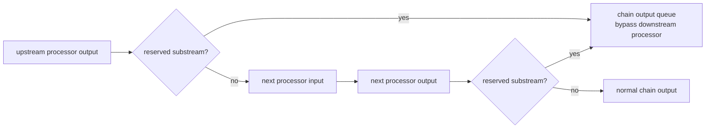
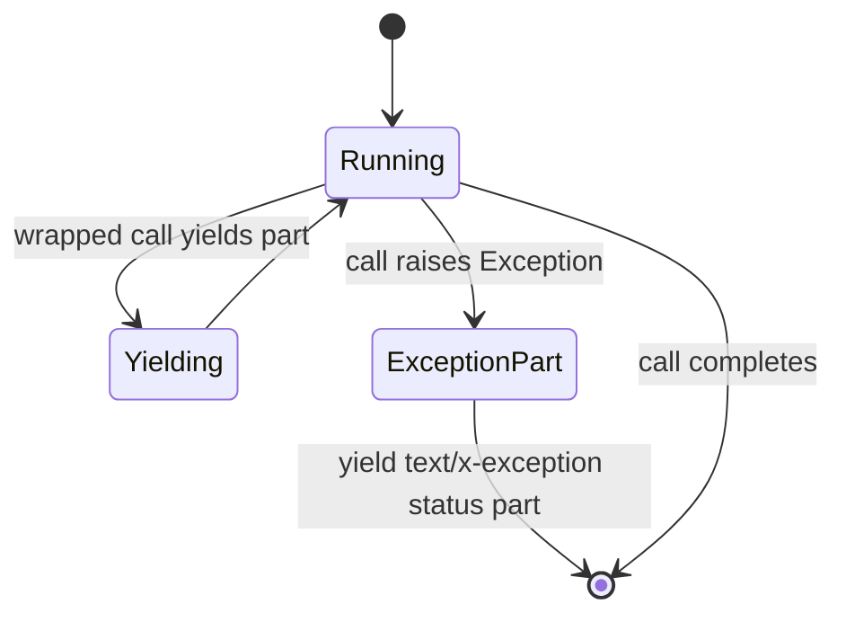
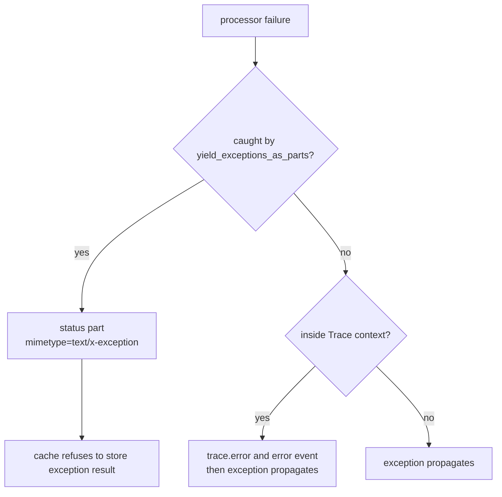

# Errors And Status Parts

Errors, status, debug, and UI messages are represented as ordinary
`ProcessorPart`s with reserved substream names or exception MIME types. This
lets pipelines carry operational state without sending those parts through
model prompts or downstream processors that should ignore them.

## Source References

- Reserved substream constants and context: `genai_processors/context.py:25-158`
- Status/debug helpers and reserved capture:
  `genai_processors/processor.py:510-515`,
  `genai_processors/processor.py:973-1089`
- Exception-to-part wrapper: `genai_processors/processor.py:1453-1521`
- Exception MIME and end-of-turn helpers:
  `genai_processors/mime_types.py:1-120`,
  `genai_processors/mime_types.py:247-250`,
  `genai_processors/content_api.py:583-654`,
  `genai_processors/content_api.py:987-1044`
- Function-calling error handling:
  `genai_processors/core/function_calling.py:402-620`,
  `genai_processors/core/function_calling.py:656-829`
- MCP tool errors: `genai_processors/mcp.py:48-132`
- Trace error recording: `genai_processors/dev/trace.py:36-267`

## Semantic Model

Operational parts use the same `ProcessorPart` envelope as user/model content,
but they carry different routing semantics:

- reserved substream part: bypasses the next processor in a chain and is yielded
  directly to the chain output.
- exception MIME part: encodes a caught Python exception as user-visible status
  data.
- function error response: encodes a tool failure inside the model tool
  protocol with `is_error=True`.
- end-of-turn part: empty user text with `metadata["turn_complete"] = True`.
- trace error event: records an uncaught exception outside the data stream.

These mechanisms are complementary. A processor can emit a status part for a
recoverable issue, return a function error to a model for a tool failure, and
still let tracing record an uncaught exception if the processor itself fails.

## Reserved Substreams

Default reserved substreams are:

- `debug`: debug information embedded in the conversation timeline.
- `status`: one-line task progress or recoverable failure messages.
- `ui`: parts intended to bypass model processing and go directly to the user.

Any substream whose name starts with a reserved prefix is also reserved.
`context.context(reserved_substreams=...)` can replace the reserved set for the
current async context.

Reserved check:

```text
is_reserved_substream(name) =
  any(name.startswith(prefix) for prefix in get_reserved_substreams())
```

This is prefix-based. A substream named `status/pdf` is reserved when `status`
is in the reserved set.

## Capture Contract

When processors are chained, reserved substream parts are captured and yielded
immediately instead of being passed to the next processor. This applies to both
processor chains and part-processor chains.



Use:

- `processor.debug(content, **kwargs)` to create a debug part.
- `processor.status(content, **kwargs)` to create a status part.
- reserved substreams for out-of-band progress, logs, UI events, and partial
  failures that should not affect model context unless explicitly reintroduced.

## Exception Parts

Decorate processor or part-processor `call` methods with
`processor.yield_exceptions_as_parts` to convert thrown exceptions into status
parts instead of failing the pipeline.

The generated part has:

- `mimetype="text/x-exception"`.
- `substream_name="status"`.
- text formatted as an unexpected-error message.
- metadata `original_exception` and `exception_type`.

Use `mime_types.is_exception(part.mimetype)` to detect exception parts instead
of relying on exact text formatting.



The decorator catches broad `Exception`. Cancellation and base exceptions are
not normal recoverable status events.

## Runtime Dispatch Matrix

| Incoming Condition | Runtime Branch | Emitted Representation | Downstream Effect |
| --- | --- | --- | --- |
| `substream_name` starts with reserved prefix | chain capture | original part | Bypasses the next processor and is yielded directly. |
| `processor.status(...)` | helper constructor | text part on `status` | Captured by chains by default. |
| `processor.debug(...)` | helper constructor | text part on `debug` | Captured by chains by default. |
| Decorated processor raises `Exception` | `yield_exceptions_as_parts` | `text/x-exception` on `status` | Recoverable status output, not an uncaught failure. |
| Input contains exception part | cache hash | key becomes `None` | Cache lookup/write is skipped. |
| Output contains exception part | cache wrapper | skip store | Failure output does not poison future hits. |
| Unknown function name | `FunctionCalling` | function response with `is_error=True` | Model receives tool-protocol error. |
| Tool raises exception | `FunctionCalling` | function response with `is_error=True` | Loop can continue or stop by scheduling rules. |
| MCP result has `isError` | MCP adapter raises `McpToolError` | function response with `is_error=True` | MCP text content is summarized in the error. |
| End-of-turn signal | `content_api.is_end_of_turn` | empty user part, `turn_complete=True` | Realtime/function loops may schedule a model turn. |
| Uncaught traced exception | `Trace.__aexit__` | trace error event | Exception still propagates. |

## Function-Calling Errors

Function-calling failures are encoded as function responses with
`is_error=True`. This stores the failure under the function response's `error`
field.

Common cases:

- Unknown tool name: emits an error response listing available tools.
- Tool exception: emits an error response containing the failed invocation.
- MCP `isError` result: raises `McpToolError`, which the function-calling loop
  converts into an error function response.
- `cancel_fc` can emit an error response when requested IDs are missing.

Function error response shape:

```text
ProcessorPart.from_function_response(
  name=call.name,
  function_call_id=call.id,
  response=error_text_or_object,
  is_error=True,
  role="user",
  substream_name=function_call_substream,
)
```

The model sees this as tool-protocol data, not as a reserved `status` part,
unless the response is explicitly put on a reserved substream.

## End Of Turn And Completion Status

End-of-turn is an empty user `ProcessorPart` with metadata
`{"turn_complete": True}`. `content_api.is_end_of_turn(part)` detects it.

- `ProcessorPart.end_of_turn()` creates the user signal.
- Realtime wrappers and function-calling loops use it to schedule or delimit
  model turns.
- `realtime.LiveProcessor` emits an empty model part with
  `metadata={"turn_complete": True}` after each generated turn.
- OpenRouter emits an empty model part with `finish_reason` and
  `turn_complete=True` at stream finish.
- Gemini Live sends `turn_complete` as provider metadata when the server
  reports that event.

End-of-turn is a control signal. If a wrapper passes it into a model prompt, it
should remove or interpret the `turn_complete` metadata first when the provider
does not understand it.

## Trace Errors

Tracing records uncaught exceptions separately from status exception parts.
When a traced processor raises, the trace stores a formatted traceback in
`trace.error` and adds an error event. Cancellation is recorded as
`cancelled=True`, not as a normal error.



## Invariants

- Reserved substream capture is based on prefixes, not exact names.
- Reserved parts are still ordinary `ProcessorPart`s and can be logged or
  displayed downstream.
- Exception status parts must use `text/x-exception` so cache and callers can
  detect them structurally.
- Cache hashing must return `None` for inputs containing exception parts.
- Cache wrappers must not store outputs containing exception parts.
- Function errors should stay in function-response form so the model can repair
  tool use.
- Trace errors record uncaught failures and do not replace status parts.
- End-of-turn is metadata-driven; the text value is intentionally empty.

## Failure Modes And Gotchas

- Accidentally putting user prompt text on `status`, `debug`, or `ui` will make
  it bypass downstream processors.
- Prefix matching can reserve more than intended. For example, `ui_state` is
  reserved when `ui` is a reserved prefix.
- Exception text formatting is not a stable API. Use
  `mime_types.is_exception(...)`.
- A status exception part is data, not a raised exception. Consumers that need
  hard failures must inspect for it.
- A traced uncaught exception still propagates; tracing is observational.
- Function-calling error responses are model-visible and can affect subsequent
  generations.
- Hiding function-call errors on reserved substreams can prevent the model from
  correcting the call.
- End-of-turn parts can trigger new model turns in realtime wrappers. Do not
  emit them as harmless empty text.

## Replication Pattern

For new operational channels:

- Use a reserved substream when the part should bypass normal model processing.
- Use a structural MIME type when downstream code must recognize the condition.
- Use function responses for model-facing tool results and tool errors.
- Use trace errors for uncaught runtime failures.
- Keep user-visible progress and model-visible content in separate substreams.
