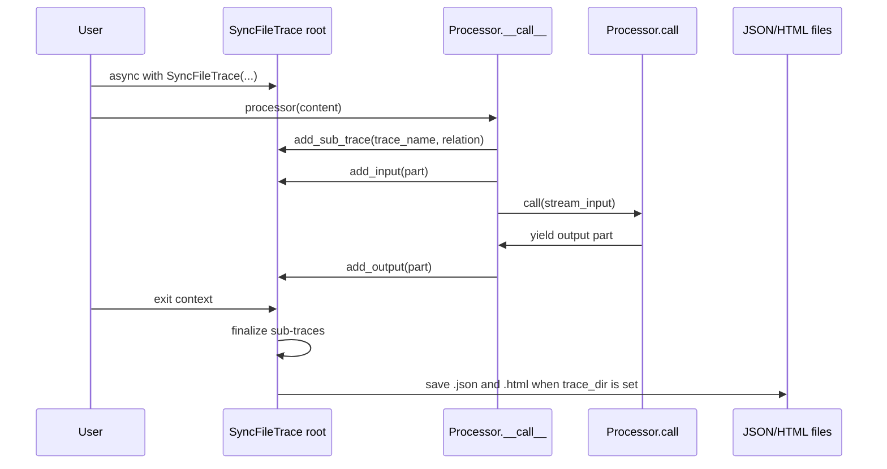
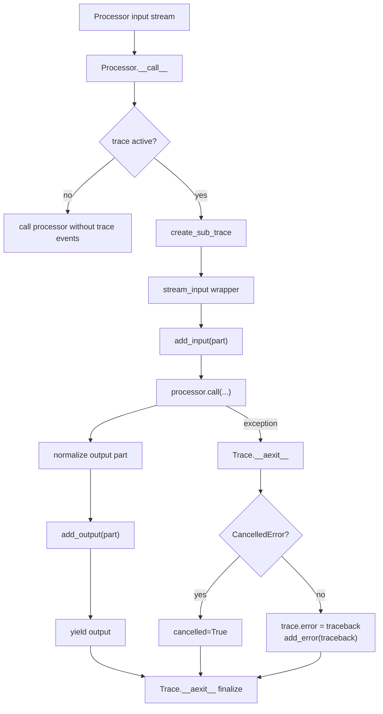
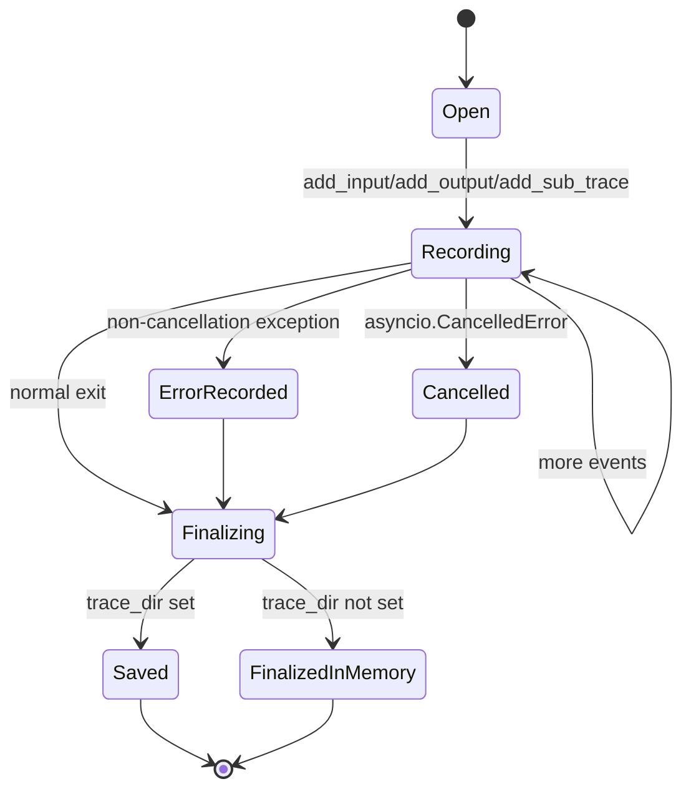

# Tracing

Tracing records processor execution as a hierarchy of timestamped events:
inputs, outputs, sub-processor calls, errors, cancellations, and multimodal
parts. The trace format is incubating and not guaranteed stable.

## Source References

- Trace interface and excluded modules: `genai_processors/dev/trace.py:36-267`
- File trace event model and backend:
  `genai_processors/dev/trace_file.py:94-415`
- Processor trace integration: `genai_processors/processor.py:149-283`
- Chain trace names and reserved-substream capture:
  `genai_processors/processor.py:898-1089`
- Part serialization contract: `genai_processors/content_api.py:39-676`
- Trace tests: `genai_processors/tests/trace_file_test.py:117-260`
- Published tracing guide: `documentation/docs/development/tracing.md:1-150`

## Semantic Model

A trace is a processor-call timeline. It tracks three layers:

- root trace: the outer explicit `Trace` context opened by user code.
- sub-trace: a nested processor invocation created automatically by
  `Processor.__call__`.
- event: an input part, output part, nested sub-trace reference, or error
  message.

The file backend stores part payloads separately from events. Events point to a
part hash, while the root trace owns a shared `parts_store` for all nested
traces.

```text
SyncFileTrace
  parts_store: {part_hash -> serialized ProcessorPart}
  trace:
    events:
      - input/output event with part_hash
      - sub_trace event with relation
      - error event with error_message
```

## Activation

Run a pipeline inside an async `Trace` context, usually
`trace_file.SyncFileTrace(trace_dir=..., name=...)`. `Processor.__call__` and
`PartProcessor` wrappers create sub-traces automatically when a trace is active.
Ordinary processor implementations do not need trace-specific code.



## Trace Interface

Subclass `genai_processors.dev.trace.Trace` to implement another backend.
Required operations:

- `add_input(part)`: record an input part.
- `add_output(part)`: record an output part.
- `add_sub_trace(name, relation)`: create and attach a nested trace.
- `add_error(error_message)`: record processor failure.
- `cancel()`: mark cancellation and optionally trim incomplete events.
- `_finalize()`: flush/store the trace when the context exits.

`Trace` stores `name`, optional `processor_description`, `trace_id`,
`start_time`, `end_time`, `error`, `cancelled`, and `is_sub_trace`.

## Part Hash Formula

The file backend deduplicates part payloads through a content hash:

```text
stored_part = maybe_resize_image(part)
part_dict = stored_part.to_dict(mode="python")
del part_dict["metadata"]["capture_time"] if present
part_hash = xxh128(json.dumps(part_dict, sort_keys=True, default=str)).hexdigest()
```

Images are resized before hashing when `image_size` is set and the part does
not already carry that target size. Because resizing happens before hashing,
the trace part store deduplicates the stored representation, not necessarily
the original image bytes.

## Trace Event Lifecycle



## Parent And Sub-Trace Rules

- `create_sub_trace(processor_name, parent_trace)` uses an explicit parent from
  the input stream when present; otherwise it uses the current trace context.
- Relation is `chain` when the input stream already carries a trace, otherwise
  `call`.
- Sub-traces are marked `is_sub_trace=True`.
- Modules in `EXCLUDED_TRACE_MODULES` do not create their own traces, but their
  children can still be traced. Defaults include `genai_processors.debug` and
  `genai_processors.map_processor`.
- `_ChainProcessor.trace_name` combines non-excluded child trace names and is
  itself excluded when the chain has only one visible processor.

## Runtime Dispatch Matrix

| Runtime Event | Guard | Trace Action | Output Behavior |
| --- | --- | --- | --- |
| Processor called outside a trace | no current trace and no stream trace | no trace object | Processor output is unchanged. |
| Processor module is excluded | `is_module_excluded(module)` | no trace for that processor | Children can still create traces under the current trace context. |
| Processor called under root trace | current trace exists | sub-trace relation `call` | Inputs and outputs are recorded. |
| Processor called on a traced stream | stream carries `trace` | sub-trace relation `chain` | Nested event records preserve chain relationship. |
| Input part consumed | active current trace | `add_input(part)` | Part is yielded to `call(...)`. |
| Output part emitted | active current trace | `add_output(part)` | Part is yielded downstream. |
| Non-cancellation exception | `Trace.__aexit__` sees exception | formatted traceback stored and error event appended | Exception still propagates. |
| `asyncio.CancelledError` | cancellation path | `cancelled=True` | Cancellation is not stored as a normal error. |
| Sub-trace cancelled before output | sub-trace and task cancelled | cancel and skip finalize | Incomplete empty sub-trace can disappear. |
| Finalization under cancellation | context exit | `_finalize()` is shielded | Trace has a chance to be saved. |

## File Trace Backend

`trace_file.SyncFileTrace` collects events in memory and writes JSON and HTML
files on finalize when `trace_dir` is set.

- Output filenames are `{name}_{trace_id}.json` and `.html`.
- `TraceEvent` may hold an input/output part hash, a nested sub-trace relation,
  or an error message.
- Root traces keep a deduplicated `parts_store`; sub-traces share the root
  store and set their own `parts_store` to `None`.
- Part dictionaries are serialized with bytes base64-encoded for JSON/HTML.
- `metadata["capture_time"]` is dropped before hashing.
- Images are resized to `image_size` by default `(200, 200)`; set `None` to
  keep original image bytes.
- `max_size_bytes` causes later part content to be omitted after the size limit
  is exceeded while retaining metadata and envelope fields.
- `SyncFileTrace.load(path)` loads a saved JSON trace.

Size limiting is monotonic for a root trace:

```text
if max_size_bytes is None:
  store full part
elif size_limit_exceeded:
  delete part_dict["part"] and store envelope only
elif current_size_bytes + len(json(part_dict)) > max_size_bytes:
  size_limit_exceeded = True
  delete part_dict["part"]
else:
  current_size_bytes += len(json(part_dict))
```

## Error And Cancellation Recording



- On non-cancellation exceptions, `Trace.__aexit__` stores the formatted
  traceback in `trace.error` and adds an error event before finalization.
- On `asyncio.CancelledError`, traces are marked `cancelled`.
- File traces cancel their worker task; if no output was produced, they clear
  incomplete events.
- Finalization is shielded from cancellation so traces can still be saved.

## Trace Names

Processors expose `trace_name`, usually the class name or wrapper name.
Composed chains and parallel part processors build combined names while
excluding modules registered as trace-noise. Override `trace_name` for shorter
human-readable labels in trace viewers.

The cache key prefix and trace name are intentionally separate:

- `key_prefix` should identify behavior for cache correctness.
- `trace_name` should identify runtime execution for humans.

## Invariants

- Tracing must not change the parts yielded by a processor.
- Input and output events are recorded in stream order as observed by the
  wrapper.
- `capture_time` does not affect trace part deduplication.
- Root traces own `parts_store`; sub-traces reference it.
- Sub-trace finalization happens before the root trace is saved.
- Errors are recorded before `_finalize()` so the timeline includes the failure.
- Cancellation is represented separately from ordinary errors.
- File trace JSON must be serializable after bytes encoding; metadata should be
  JSON-compatible.

## Failure Modes And Gotchas

- The trace schema is incubating; do not treat saved JSON as a stable external
  contract.
- Very large audio, video, or image streams can make traces huge. Use
  `image_size` and `max_size_bytes` when tracing media-heavy pipelines.
- Non-JSON-serializable metadata can make `to_json_str()` fail.
- Excluded modules can make a trace tree look like it skipped a processor; this
  is intentional noise reduction.
- Sub-traces that are cancelled before producing output may be removed from the
  final event tree.
- Because tracing wraps async streams, generator cancellation and task-group
  behavior can affect how much of a partially consumed stream is visible.

## Replication Pattern

For another trace backend, preserve these contracts:

- Record input and output parts at the processor boundary.
- Represent nested processor calls explicitly.
- Store cancellation separately from errors.
- Shield finalization from task cancellation.
- Keep large payload handling backend-specific so core processor semantics stay
  unchanged.
