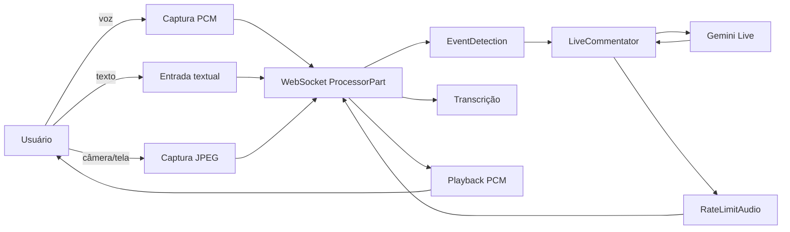
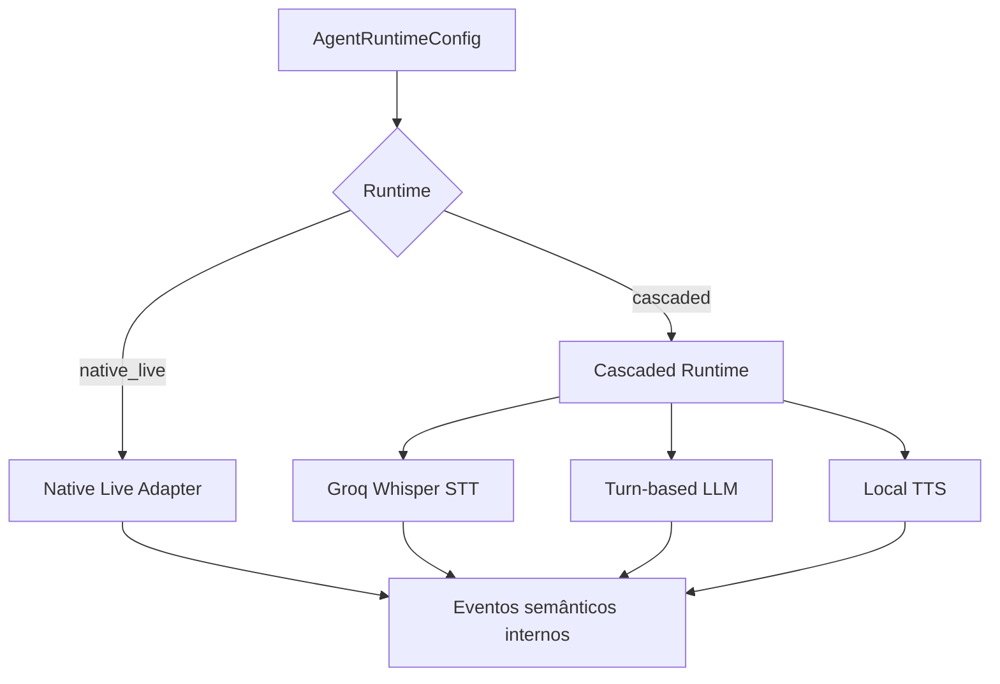

# Live Commentator — Especificação Canônica

## 1. Status e autoridade

Este documento é a fonte de verdade funcional e arquitetural do exemplo
`examples/live_commentator`. Ele descreve o comportamento existente que deve ser
preservado e a fronteira standalone da WebUI que substitui a dependência do AI
Studio.

Ordem de precedência:

1. Decisões explícitas registradas neste documento.
2. Contratos públicos de `genai_processors`.
3. `WORKFLOW.md` para fluxos e máquinas de estado.
4. `UI_SPECS.md` para comportamento da interface.
5. Testes automatizados.
6. Implementação atual.

Quando código e especificação divergirem, a divergência deve ser tratada como
bug ou como mudança de contrato deliberada. Não atualizar a especificação
retroativamente apenas para justificar comportamento acidental.

## 2. Objetivo do produto

O Live Commentator é um agente multimodal de baixa latência que:

- observa câmera ou tela compartilhada;
- escuta o microfone;
- produz fala em tempo real;
- inicia comentários de maneira proativa;
- responde ao usuário quando interrompido;
- reage a mudanças visuais relevantes;
- pode aguardar o usuário executar uma ação;
- permite controlar a frequência de comentários;
- funciona localmente em um navegador comum, sem AI Studio.

Nesta versão, o backend de conversação continua sendo Gemini Live. O suporte
alternativo Groq Whisper + LLM turn-based + TTS local é uma evolução planejada,
não parte desta implementação.

Diarização, Parakeet e XTTS são extensões locais planejadas. Elas devem ser
instaláveis como capacidades opcionais, com seleção explícita de dispositivo,
fallback CPU, limites de VRAM e matriz PyTorch/CUDA documentada. O pipeline
Gemini atual e o pacote base não podem depender de CUDA.

## 3. Escopo

### 3.1 Incluído

- WebUI Vite + TypeScript standalone.
- Captura de microfone com PCM mono.
- Captura de câmera ou tela em frames JPEG limitados.
- Reprodução de PCM retornado pelo backend.
- Interrupção imediata do buffer de áudio.
- Entrada de texto.
- Transcrição de saída.
- Controle de `chattiness`.
- Seleção explícita entre os dois modelos Gemini Live suportados.
- Reset de sessão.
- Estados de conexão, captura e agente.
- Servidor HTTP local para o build Vite.
- Servidor WebSocket existente para `ProcessorPart`.
- Documentação dos contratos, máquinas de estado e fluxos.

### 3.2 Não incluído

- Groq Whisper, LLMs alternativas ou TTS local.
- Persistência de conversas.
- Autenticação multiusuário.
- Exposição pública do servidor.
- Gravação de áudio, vídeo, tela ou transcrições.
- Deploy em produção.
- Compatibilidade com o runtime de Applets do AI Studio.

## 4. Maturidade e compatibilidade

`genai-processors` é uma biblioteca publicada e externamente consumida. A
extensão de `LiveProcessor` é aditiva: o transporte padrão continua sendo
`send_client_content`. `Processor`, `ProcessorPart` e mensagens existentes do
protocolo WebSocket permanecem compatíveis.

O antigo frontend específico de AI Studio é substituído. O backend
`commentator_ais.py` permanece como entrada WebSocket compatível enquanto o novo
launcher standalone é a entrada recomendada.

## 5. Modelo mental do sistema



O contrato interno está em `ProcessorPart`. A UI não conhece objetos do SDK
Gemini e o backend não conhece APIs DOM.

## 6. Componentes e ownership

### 6.1 `content_api`

Responsável por:

- conteúdo multimodal;
- `role`, `mimetype`, `substream_name` e `metadata`;
- serialização usada no WebSocket.

Não é responsável por:

- política de conversa;
- captura ou reprodução no navegador;
- seleção de provedor.

### 6.2 `core.event_detection.EventDetection`

Responsável por:

- passar todo input adiante;
- guardar uma janela limitada de imagens;
- chamar um modelo turn-based enquanto coleta novos frames;
- converter transições visuais em partes de controle;
- aplicar sensibilidade a transições.

No Live Commentator, emite:

- `start commentating`;
- `stop commentating`;
- `interrupt_request`.

### 6.3 `core.live_model.LiveProcessor`

Responsável por traduzir:

- substream `realtime` para `send_realtime_input`;
- substream padrão para o transporte configurado pelo chamador;
- function responses para `send_tool_response`;
- mensagens Gemini Live para `ProcessorPart`.

`DefaultInputTransport.CLIENT_CONTENT` é o padrão público. O modo
`REALTIME_INPUT` envia texto e mídia inline do substream padrão por
`send_realtime_input`, sem condicional baseada no nome do modelo.

### 6.4 `LiveCommentator`

Responsável por:

- estado conversacional específico do comentarista;
- comentário proativo;
- coordenação de interrupções;
- agendamento do próximo comentário;
- política `wait_for_user`;
- medição e previsão de tempo até o primeiro áudio;
- bloqueio textual opcional de saída insegura.

### 6.5 `RateLimitAudio`

Responsável por:

- limitar áudio gerado mais rápido que tempo real;
- manter o playback alinhado com o que já foi ouvido;
- permitir que `interrupted` descarte áudio futuro.

### 6.6 `dev.live_server`

Responsável por:

- uma instância de pipeline por conexão;
- JSON/base64 sobre WebSocket;
- reset/configuração de sessão;
- tradução de mídia recebida para `realtime`;
- tradução de estados de saída para `application/x-state`;
- limite atual de mensagem de 2 MiB.

### 6.7 WebUI Vite

Responsável por:

- permissões e dispositivos;
- captura e codificação;
- conexão/reconexão;
- playback e descarte de áudio;
- controles, estados e erros;
- nunca armazenar nem receber chaves de API.

### 6.8 Launcher standalone

Responsável por:

- validar `GOOGLE_API_KEY`;
- validar a existência do build Vite;
- servir arquivos estáticos locais;
- iniciar o WebSocket do comentarista;
- encerrar o servidor HTTP ao finalizar.

## 7. Composição atual

```python
EventDetection(
    backend=Gemini turn-based vision model,
) + LiveCommentator(
    live_api_processor=Gemini Live,
) + RateLimitAudio(sample_rate=24000)
```

Modelos atuais:

- Live padrão: `gemini-2.5-flash-native-audio-preview-12-2025`.
- Live opcional: `gemini-3.1-flash-live-preview`.
- Detecção: `gemini-2.5-flash-lite`.

Somente os dois IDs Live exatos são aceitos. Não existe entrada arbitrária,
persistência no navegador nem fallback silencioso.

| Capacidade | Gemini 2.5 | Gemini 3.1 |
|---|---|---|
| Transporte do substream padrão | `send_client_content` | `send_realtime_input` |
| Campo de áudio realtime | `media` legado | `audio` |
| Campo de frame realtime | `media` legado | `video` |
| Ferramentas | `NON_BLOCKING` assíncronas | síncronas |
| Próximo comentário | response `WHEN_IDLE` | texto realtime |
| Interrupção visual | response `INTERRUPT` | texto realtime + evento `interrupted` |
| Espera | response `SILENT` | response síncrona + timer local |
| Parada | cancelamento da call persistente | tool `stop_commentating` |

O perfil 2.5 preserva prompt, tools e scheduling anteriores. O perfil 3.1
reimplementa os mesmos efeitos de produto por orquestração local porque não
oferece scheduling assíncrono. Ele também não aceita `media_chunks`: PCM deve
ser enviado pelo campo `audio` e JPEG/PNG pelo campo `video`.

## 8. Contrato WebSocket

### 8.1 Transporte

- URL padrão: `ws://127.0.0.1:8765`.
- Mensagens: objetos JSON completos.
- Dados binários: base64 padrão.
- Máximo atual por mensagem: 2 MiB.
- Uma conexão representa uma sessão.

### 8.2 Texto do usuário

```json
{
  "part": {"text": "Explique o que está na tela"},
  "role": "user"
}
```

O servidor define `turn_complete=true`.

### 8.3 Áudio do usuário

```json
{
  "part": {
    "inline_data": {
      "data": "<base64>",
      "mime_type": "audio/pcm;rate=16000"
    }
  },
  "role": "user",
  "substream_name": "realtime"
}
```

Invariantes:

- PCM signed 16-bit little-endian;
- mono;
- blocos pequenos e ordenados;
- nunca enviar quando microfone estiver desligado.

### 8.4 Frame visual

```json
{
  "part": {
    "inline_data": {
      "data": "<base64>",
      "mime_type": "image/jpeg"
    }
  },
  "role": "user",
  "substream_name": "realtime"
}
```

Somente câmera ou tela pode estar ativa por vez.

### 8.5 Microfone desligado

```json
{
  "mimetype": "application/x-state",
  "metadata": {"mic": "off"}
}
```

O servidor converte para `audio_stream_end=true` no substream `realtime`.

### 8.6 Configuração

```json
{
  "mimetype": "application/x-config",
  "metadata": {
    "chattiness": 0.5,
    "live_model": "gemini-2.5-flash-native-audio-preview-12-2025"
  }
}
```

Configuração reinicializa o pipeline da conexão. O valor deve estar no intervalo
`[0, 1]` e `live_model` deve ser um dos dois IDs allowlisted. Se omitido por um
cliente antigo, o backend usa Gemini 2.5.

### 8.7 Reset

```json
{
  "mimetype": "application/x-command",
  "metadata": {"command": "reset"}
}
```

Reset cria uma nova instância do pipeline e descarta estado e áudio local.

### 8.8 Áudio do modelo

```json
{
  "part": {
    "inline_data": {
      "data": "<base64>",
      "mime_type": "audio/pcm;rate=24000"
    }
  },
  "role": "model",
  "mimetype": "audio/pcm;rate=24000"
}
```

A UI deve ler a taxa do MIME, converter Int16 para Float32 e agendar o playback
sem gaps artificiais.

### 8.9 Estados do servidor

```json
{
  "mimetype": "application/x-state",
  "metadata": {"interrupted": true}
}
```

Estados relevantes:

- `generation_complete`;
- `interrupted`;
- `health_check`.
- `error=pipeline_configuration_failed`.

Ao receber `interrupted`, a UI deve parar todas as fontes agendadas antes de
processar novo áudio.

O estado de erro é deliberadamente seguro: não contém mensagem do provider,
token ou traceback. A UI restaura a seleção aplicada anteriormente e orienta o
usuário a consultar `logs/`; o traceback completo permanece apenas no arquivo.

## 9. Requisitos funcionais

### RF-001 Inicialização

O launcher deve iniciar HTTP e WebSocket, imprimir URLs e falhar claramente
quando a chave ou o build estiver ausente.

### RF-002 Conexão

A UI deve conectar automaticamente e usar reconexão exponencial limitada após
falhas não intencionais.

### RF-003 Microfone

O usuário pode iniciar e parar o microfone. Permissão negada deve gerar erro
visível e recuperável.

### RF-004 Visão

O usuário pode escolher câmera ou tela. O preview deve indicar exatamente o
conteúdo capturado. Encerrar compartilhamento pelo navegador deve atualizar a
UI.

### RF-005 Texto

O usuário pode enviar uma mensagem textual sem ativar microfone ou visão.

### RF-006 Playback

Áudio deve tocar em ordem, usando a taxa informada pelo MIME. O primeiro gesto
do usuário deve desbloquear o `AudioContext`.

### RF-007 Interrupção

Interrupção deve zerar imediatamente a fila de playback e refletir estado na UI.

### RF-008 Transcrição

Transcrição incremental deve ser exibida sem misturar texto do usuário e do
modelo.

### RF-009 Chattiness

O usuário pode escolher entre 0 e 1. Aplicar o valor reinicia a sessão de forma
explícita.

### RF-010 Reset

Reset deve parar áudio, limpar transcrição e solicitar novo pipeline.

### RF-011 Privacidade

Nenhum dado capturado deve ser persistido localmente pelo aplicativo.

### RF-012 Seleção de modelo

O usuário pode selecionar Gemini 2.5 ou Gemini 3.1 e aplicar a configuração. A
troca deve parar playback, limpar a conversa visível e criar um novo pipeline,
sem desligar capturas ativas. Alterar somente `chattiness` preserva o histórico.
Gemini 2.5 é o padrão após reload; a seleção em memória permanece em reconnect.

## 10. Requisitos não funcionais

### RNF-001 Latência

- Blocos de microfone alvo: 20–100 ms.
- Frames visuais padrão: 1 FPS.
- Playback começa assim que o primeiro bloco de áudio é recebido.

### RNF-002 Limites

- Frames devem caber com folga no limite WebSocket de 2 MiB.
- Resolução visual máxima padrão: 1280×720.
- JPEG padrão: qualidade 0,75.
- Filas de áudio e timers devem ser canceláveis.

### RNF-003 Compatibilidade

- Chrome/Chromium atual é o navegador primário.
- `localhost`/`127.0.0.1` é contexto seguro para APIs de mídia.
- Python 3.11–3.13.
- Node.js 20 ou superior.

### RNF-004 Acessibilidade

- Todos os controles possuem nome acessível.
- Foco por teclado é visível.
- Estado não depende apenas de cor.
- Erros são anunciados por região `aria-live`.

### RNF-005 Segurança

- Chaves somente no processo Python.
- Sem chave em URL, HTML, bundle, local storage ou WebSocket.
- Servidor deve permanecer local nesta versão.

### RNF-006 Observabilidade

A UI mostra estado de conexão e mensagens úteis. Toda execução do launcher
standalone cria um arquivo diagnóstico rotativo em `logs/` com:

- timestamps com milissegundos;
- severidade, logger, PID e thread;
- modelos e runtime selecionados;
- lifecycle dos servidores HTTP e WebSocket;
- stack traces completos para exceções;
- eventos já emitidos pelos processors e pelo `live_server`.

Cada arquivo é limitado a 10 MiB e mantém cinco backups. `logs/` não pertence ao
controle de versão. API keys, tokens e payloads brutos de áudio/imagem não podem
ser registrados. O modo `--debug` aumenta a verbosidade sem remover essa
restrição.

## 11. Tratamento de falhas

| Falha | Comportamento obrigatório |
|---|---|
| Build Vite ausente | Launcher falha com comando de build |
| `GOOGLE_API_KEY` ausente | Launcher falha antes de abrir portas |
| WebSocket indisponível | UI entra em reconexão e preserva controles |
| Permissão negada | Captura volta a desligada e mostra erro |
| Track encerrada | Captura e timer são encerrados |
| Mensagem inválida | UI registra erro não sensível e continua |
| Áudio inválido | Bloco é descartado sem derrubar sessão |
| Reset/config | Áudio local é interrompido |
| Desconexão | Playback pendente é descartado |
| Modelo inválido/indisponível | Sem fallback silencioso; UI reverte seleção e aponta para logs |

## 12. Evolução para backends alternativos

A seleção futura deve ser orientada por capacidades, não por nome de modelo.



O runtime em cascata deve possuir explicitamente:

- endpointing;
- histórico;
- cancelamento;
- agendamento proativo;
- espera pelo usuário;
- política de frames;
- síntese e pacing.

As tool calls assíncronas do Gemini Live não são contrato portátil.

## 13. Critérios de aceite desta entrega

- Os documentos canônicos existem e não contradizem o código.
- A UI não importa recursos do AI Studio, ActionEngine, Lit ou CDNs.
- `npm run build` produz um diretório estático.
- O launcher serve esse diretório e inicia o WebSocket.
- Microfone envia PCM 16 kHz.
- Câmera e tela enviam JPEG em frequência limitada.
- Texto pode ser enviado.
- PCM 24 kHz é reproduzido.
- `interrupted` descarta playback pendente.
- Chattiness e reset funcionam pelo contrato existente.
- O seletor oferece somente os dois modelos allowlisted.
- Trocar modelo faz hard reset visual sem desligar mídia ativa.
- Gemini 2.5 mantém o fluxo assíncrono anterior.
- Gemini 3.1 mantém comentário proativo, interrupção, espera e parada por
  orquestração síncrona local.
- Testes Python e TypeScript relevantes passam.
- Um smoke real confirma áudio retornado pelo Live Commentator.

## 14. Evidência de implementação atual

- `examples/live_commentator/commentator.py`
- `examples/live_commentator/commentator_ais.py`
- `examples/live_commentator/README.md`
- `genai_processors/core/event_detection.py`
- `genai_processors/core/live_model.py`
- `genai_processors/core/rate_limit_audio.py`
- `genai_processors/dev/live_server.py`
- `genai_processors/core/realtime.py`
- `genai_processors/tests/live_model_test.py`
- `genai_processors/dev/live_server_test.py`
