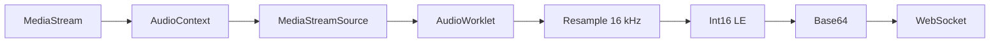
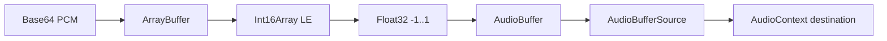

# Live Commentator — Especificação da WebUI Standalone

## 1. Objetivo

Fornecer uma interface Vite + TypeScript funcional, local e independente do AI
Studio para operar e diagnosticar o Live Commentator.

A interface deve parecer uma ferramenta de conversa multimodal, não uma demo de
componentes. O foco é clareza de estado, controle de privacidade, resposta
rápida e possibilidade de testar o pipeline atual.

## 2. Stack e restrições

- Vite.
- TypeScript estrito.
- HTML e CSS locais.
- Web Audio API.
- Media Capture and Streams API.
- Canvas API.
- WebSocket nativo.
- Sem framework obrigatório.
- Sem Lit, ActionEngine, Material Web ou imports por CDN.
- Sem chave de API ou SDK de modelo no navegador.
- Build estático em `webui/dist`.

## 3. Estrutura de arquivos

```text
examples/live_commentator/webui/
  index.html
  package.json
  package-lock.json
  tsconfig.json
  src/
    main.ts
    styles.css
    audio.ts
    protocol.ts
  public/
    pcm-capture-worklet.js
  tests/
    audio.test.ts
    protocol.test.ts
```

Responsabilidades:

- `main.ts`: estado, DOM, dispositivos, lifecycle e coordenação.
- `audio.ts`: base64, resampling, PCM e playback.
- `protocol.ts`: schemas estruturais e construção/parsing de mensagens.
- worklet: somente captura Float32; nenhuma regra de negócio.

## 4. Information architecture

```text
┌──────────────────────────────────────────────────────────────┐
│ Live Commentator       [status da conexão] [status do agente]│
├──────────────────────────────────┬───────────────────────────┤
│                                  │ Conversa                 │
│ Preview da câmera/tela           │ mensagens/transcrição    │
│                                  │                           │
│ estado vazio quando sem captura  │ [campo de texto] [enviar]│
├──────────────────────────────────┴───────────────────────────┤
│ [Microfone] [Câmera] [Tela]  Chattiness ─────  [Aplicar]     │
│ [Resetar sessão]                         privacidade/status  │
└──────────────────────────────────────────────────────────────┘
```

Desktop:

- header compacto;
- área principal em duas colunas;
- preview com maior peso visual;
- conversa lateral;
- controles persistentes abaixo.

Mobile:

- uma coluna;
- preview antes da conversa;
- controles quebram em múltiplas linhas;
- nenhum overflow horizontal.

## 5. Design visual

### 5.1 Direção

Visual escuro, calmo e operacional, inspirado em uma sala de controle de áudio,
sem aparência de painel corporativo genérico.

### 5.2 Tokens

```css
--bg: #08100f;
--surface: #101b19;
--surface-raised: #162421;
--border: #294039;
--text: #edf7f2;
--text-muted: #9db3aa;
--accent: #63e6be;
--accent-strong: #20c997;
--warning: #ffd166;
--danger: #ff6b6b;
--info: #74c0fc;
```

O contraste deve alcançar WCAG AA para texto normal.

### 5.3 Tipografia

- pilha de fontes de sistema;
- títulos com peso 650–750;
- texto comum 15–16 px;
- status e metadados 12–13 px;
- números técnicos podem usar monospace de sistema.

### 5.4 Movimento

- transições de 120–200 ms;
- pulso discreto quando ouvindo/falando;
- respeitar `prefers-reduced-motion`;
- nenhuma animação impede interação.

## 6. Componentes

### 6.1 Header

Contém:

- nome “Live Commentator”;
- descrição curta “Conversa multimodal local”;
- badge da conexão;
- badge do agente.

Estados de conexão:

- Conectando;
- Conectado;
- Reconectando;
- Desconectado.

Estados do agente:

- Pronto;
- Ouvindo;
- Observando;
- Pensando;
- Falando;
- Interrompido;
- Reiniciando;
- Erro.

### 6.2 Preview

Com captura ativa:

- elemento `<video autoplay muted playsinline>`;
- indicação “Câmera” ou “Tela”;
- botão de parar captura;
- informação 1 FPS / resolução limitada.

Sem captura:

- ícone/ilustração CSS simples;
- texto explicando que o agente ainda aceita voz e texto;
- ações para câmera/tela.

Não espelhar captura de tela. A câmera frontal pode ser espelhada apenas no
preview; o frame enviado deve manter orientação real.

### 6.3 Conversa

Exibe:

- mensagens de usuário enviadas por texto;
- transcrição incremental do modelo;
- eventos discretos de interrupção/reset;
- placeholder antes da primeira mensagem.

Regras:

- autoscroll somente quando usuário já está próximo ao final;
- texto parcial é atualizado no mesmo balão;
- `generation_complete` finaliza o balão;
- não renderizar HTML fornecido pelo modelo;
- limite visual de histórico para evitar crescimento sem fim.

### 6.4 Entrada textual

- `<textarea>` de uma a quatro linhas;
- Enter envia;
- Shift+Enter cria nova linha;
- desabilitada durante desconexão;
- envio vazio é rejeitado;
- mensagem aparece imediatamente como usuário.

### 6.5 Controles de captura

Botões independentes:

- Microfone;
- Câmera;
- Compartilhar tela.

Cada botão mostra:

- estado ligado/desligado;
- ícone local em SVG ou texto;
- `aria-pressed`;
- tooltip/title.

Câmera e tela são mutuamente exclusivas.

### 6.6 Chattiness

- slider de 0 a 1, step 0,1;
- valor numérico visível;
- botão “Aplicar”;
- aviso de que aplicar reinicia a sessão;
- valor inicial 0,5.

Mover o slider não deve reiniciar. Somente aplicar envia configuração.

### 6.7 Reset

Botão secundário com confirmação leve textual, sem modal bloqueante:

- primeiro clique muda para “Confirmar reset” por alguns segundos;
- segundo clique envia reset;
- após timeout volta ao normal.

### 6.8 Erros

Região `role=alert`/`aria-live=assertive`:

- descrição humana;
- ação sugerida;
- botão para dispensar;
- detalhes técnicos somente quando úteis e sem secrets.

## 7. Estado interno

```ts
type ConnectionState =
  | 'connecting'
  | 'connected'
  | 'reconnecting'
  | 'disconnected';

type AgentState =
  | 'ready'
  | 'listening'
  | 'observing'
  | 'thinking'
  | 'speaking'
  | 'interrupted'
  | 'resetting'
  | 'error';

type VisualSource = 'none' | 'camera' | 'screen';
```

Estado mínimo:

- conexão e tentativa de reconexão;
- agente;
- microfone;
- fonte visual;
- chattiness local/aplicado;
- mensagem parcial do modelo;
- histórico limitado;
- erro atual;
- fontes de áudio agendadas;
- tracks e timers ativos.

Estados impossíveis:

- câmera e tela ativas simultaneamente;
- microfone marcado ativo sem track viva;
- falando sem `AudioContext`;
- conectado sem objeto WebSocket aberto;

## 8. Conexão WebSocket

### 8.1 Resolução de URL

Prioridade:

1. query parameter `ws`;
2. query parameter `wsPort`;
3. host atual com porta 8765.

Regras:

- página HTTPS usa `wss`;
- página HTTP usa `ws`;
- URL explícita deve começar com `ws://` ou `wss://`;
- nunca incluir credenciais.

### 8.2 Reconexão

Backoff:

```text
500 ms, 1 s, 2 s, 4 s, 8 s, máximo 10 s
```

Adicionar jitter pequeno. Uma única tentativa/timer pode existir. Fechamento
intencional durante unload não reconecta.

### 8.3 Fila de envio

Mídia não deve ser armazenada enquanto desconectado. Texto do usuário pode ser
rejeitado com feedback em vez de ficar indefinidamente pendente.

## 9. Captura de áudio

### 9.1 Constraints

```ts
{
  audio: {
    channelCount: 1,
    echoCancellation: true,
    noiseSuppression: true,
    autoGainControl: true
  }
}
```

### 9.2 Pipeline



O worklet deve usar buffer suficiente para reduzir overhead sem ultrapassar
100 ms percebidos.

### 9.3 Reamostragem

- entrada: Float32, sample rate do `AudioContext`;
- saída: 16.000 Hz;
- saturar em `[-1, 1]`;
- converter para signed Int16;
- preservar estado/fracionamento necessário entre blocos para não criar gaps.

## 10. Playback

### 10.1 Pipeline



### 10.2 Scheduler

- manter `nextPlaybackTime`;
- novo bloco inicia em `max(currentTime + margem, nextPlaybackTime)`;
- guardar todas as fontes ainda ativas;
- remover fonte no evento `ended`;
- ao interromper, chamar `stop()` em todas, limpar conjunto e zerar relógio.

### 10.3 Autoplay

O primeiro gesto em qualquer controle deve executar `AudioContext.resume()`.
Antes disso, a UI pode receber áudio, mas deve indicar “clique para habilitar
áudio” sem acumular uma fila ilimitada.

## 11. Captura visual

### 11.1 Câmera

Preferências:

- ideal 1280×720;
- sem áudio;
- device padrão;
- preview `playsinline`.

### 11.2 Tela

- `getDisplayMedia({video: true, audio: false})`;
- respeitar escolha do navegador;
- evento `ended` desliga captura na UI.

### 11.3 Encoding

- canvas offscreen/local;
- manter proporção;
- limitar a 1280×720;
- JPEG 0,75;
- 1 FPS por padrão;
- não capturar se WebSocket não estiver aberto.

## 12. Protocol handling

O parser deve:

- validar que a mensagem é objeto;
- tratar ausência de `metadata`;
- reconhecer `audio/*`, `text/*` e `application/x-state`;
- ignorar campos desconhecidos;
- nunca confiar em HTML de texto;
- falhar por mensagem, não por sessão.

Mapeamento de estado:

| Entrada | UI |
|---|---|
| primeiro áudio | `speaking` |
| `generation_complete` | `ready` |
| `interrupted` | flush + `interrupted`, depois `ready` |
| `health_check` | conexão saudável |
| output transcription | atualiza mensagem parcial |
| socket close | `reconnecting` |

## 13. Privacidade e segurança

- Indicadores de captura sempre visíveis.
- Captura inicia somente por gesto explícito.
- Tracks param ao fechar/recarregar.
- Sem analytics.
- Sem local storage de conteúdo.
- Sem service worker nesta versão.
- Sem upload que não seja o WebSocket configurado.
- Bundle não contém tokens, endpoints de provider ou dados do usuário.

## 14. Acessibilidade

- Ordem de tabulação segue leitura visual.
- Skip link para conversa.
- `aria-live=polite` para status.
- `aria-live=assertive` para erros.
- `aria-pressed` em toggles.
- Labels associados a inputs.
- Área clicável mínima de 44×44 px.
- Contraste e foco visível.
- Funciona com zoom de 200%.
- `prefers-reduced-motion`.

## 15. Responsividade

Breakpoints conceituais:

- `>= 960 px`: duas colunas;
- `600–959 px`: duas colunas compactas ou uma conforme espaço;
- `< 600 px`: uma coluna.

O preview usa `aspect-ratio: 16 / 9` e nunca força viewport maior que a tela.

## 16. Testes

### 16.1 Unitários

- parsing de sample rate;
- base64/bytes;
- Float32 -> Int16;
- reamostragem;
- construção de mensagens;
- resolução segura de URL WebSocket;
- reconhecimento de estados.

### 16.2 Build

- TypeScript sem erros;
- Vite build;
- nenhuma referência a AI Studio/ActionEngine/Lit no bundle;
- worklet copiado para `dist`.

### 16.3 Integração local

- HTTP retorna `index.html`;
- assets retornam MIME correto;
- WebSocket conecta;
- config cria sessão;
- texto produz áudio/transcrição;
- reset mantém conexão;
- interrupção para áudio.

### 16.4 Manual

- permitir/negar microfone;
- permitir/negar câmera;
- iniciar/parar screen share pelo navegador;
- falar sobre o áudio;
- enviar texto;
- mudar chattiness;
- resetar;
- desligar backend e observar reconexão;
- testar layout estreito.

## 17. Critérios de aceite visual e funcional

- Página abre diretamente pelo launcher local.
- Não há tela vazia antes do JavaScript.
- Estado da conexão é compreensível sem abrir DevTools.
- Usuário consegue testar texto sem conceder mídia.
- Permissões só aparecem após ação explícita.
- Preview corresponde à fonte enviada.
- Áudio recebido é audível e pode ser interrompido.
- Erros não deixam botões em estado falso.
- Nenhum erro bloqueante aparece no console durante fluxo feliz.
- Interface permanece utilizável em 360 px de largura.
