# Live Commentator — Workflows, Fluxos e Máquinas de Estado

## 1. Finalidade

Este documento especifica como o Live Commentator executa em runtime, como cada
evento atravessa o sistema e como desenvolver mudanças sem quebrar os contratos.
Os requisitos funcionais vivem em `SPECS.md`; os detalhes visuais vivem em
`UI_SPECS.md`.

## 2. Inicialização standalone

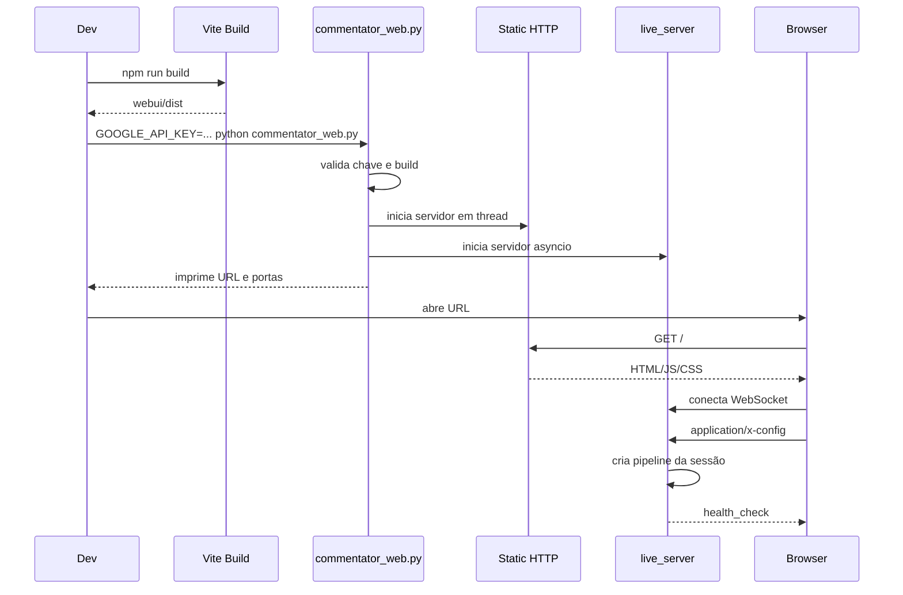

O servidor HTTP é apenas local e estático. O WebSocket continua sendo o
responsável pelo pipeline.

## 3. Data flow completo

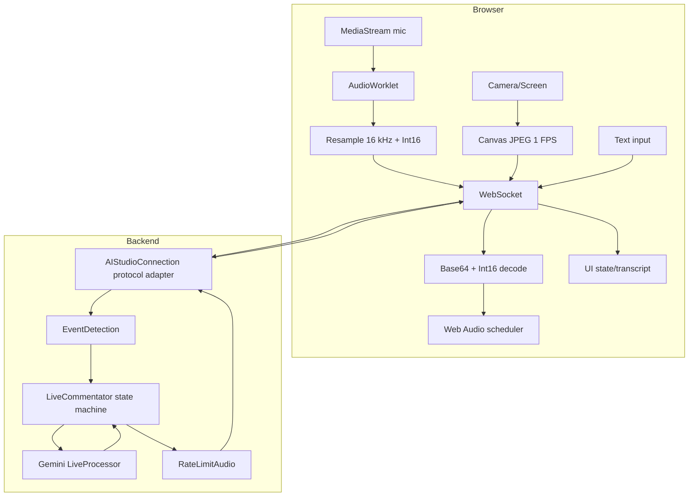

`AIStudioConnection` é um nome legado. Seu comportamento é um adaptador
WebSocket genérico e é usado pela WebUI standalone.

## 4. Fluxo de áudio do usuário

```mermaid
sequenceDiagram
  participant U as Usuário
  participant UI
  participant AW as AudioWorklet
  participant WS
  participant Live as Gemini Live

  U->>UI: ativa microfone
  UI->>U: solicita permissão
  U-->>UI: concede
  UI->>AW: conecta MediaStream
  loop blocos de áudio
    AW-->>UI: Float32 no sample rate do dispositivo
    UI->>UI: reamostra para 16 kHz e converte Int16 LE
    UI->>WS: audio/pcm;rate=16000, realtime
    WS->>Live: send_realtime_input(media)
  end
  U->>UI: desativa microfone
  UI->>WS: state mic=off
  WS->>Live: audio_stream_end=true
```

Invariantes:

- um único stream de microfone ativo;
- nenhuma gravação persistente;
- tracks e nós de áudio encerrados ao desligar;
- erro de permissão não deixa estado visual ativo.

## 5. Fluxo visual

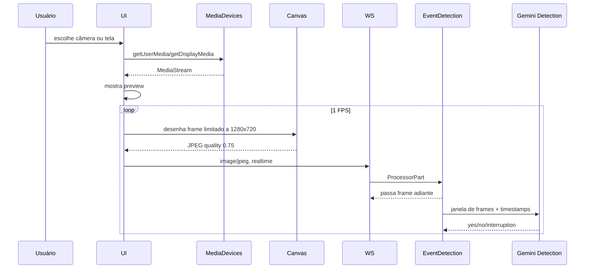

Somente uma fonte visual fica ativa. Trocar de fonte encerra tracks e timers da
fonte anterior.

## 6. Fluxo de detecção de eventos

Estados do detector:

- `""`: inicial;
- `yes`: pessoa/tela detectada;
- `no`: ausência de condição para comentário;
- `interruption`: mudança visual relevante.

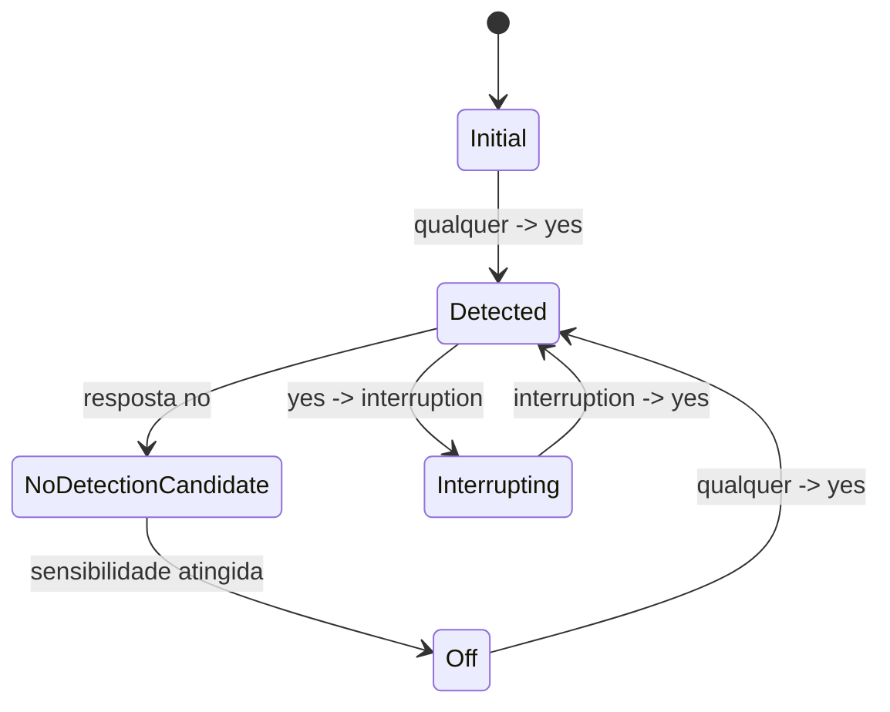

Mapeamento:

| Transição | Saída |
|---|---|
| `* -> yes` | texto realtime `start commentating` |
| `yes -> no` após sensibilidade | texto realtime `stop commentating` |
| `yes -> interruption` | metadata `interrupt_request=true` |
| `interruption -> yes` | nenhuma parte extra |

O detector passa inputs originais independentemente da classificação.

## 7. Máquina de estados do comentarista

### 7.1 Estados

| Estado | Significado |
|---|---|
| `OFF` | sem comentários proativos; usuário ainda pode falar |
| `TALKING` | comentário/resposta em curso ou estado estável ativo |
| `USER_IS_TALKING` | VAD indicou barge-in |
| `REQUESTING_INTERRUPTION` | evento pediu nova geração interruptiva |
| `REQUESTING_COMMENT` | comentário proativo solicitado |
| `REQUESTING_RESPONSE` | resposta textual do usuário solicitada |
| `INTERRUPTED_FROM_DETECTION` | interrupção confirmada; aguarda primeiro áudio |
| `WAITING_FOR_USER` | modelo pediu silêncio para ação/resposta |

### 7.2 Diagrama canônico

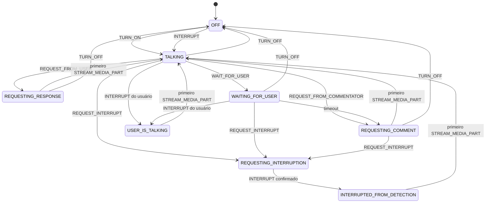

### 7.3 Tabela de transições

| Estado origem | Ação | Estado destino | Efeito |
|---|---|---|---|
| `OFF` | `TURN_ON(id)` | `TALKING` e depois `REQUESTING_COMMENT` | guarda function-call id |
| `OFF` | outra | `OFF` | ignora |
| qualquer ativo | `TURN_OFF` | `OFF` | limpa geração e id |
| talking/waiting/requesting comment | `REQUEST_INTERRUPT` | `REQUESTING_INTERRUPTION` | inicia métrica de geração |
| `REQUESTING_INTERRUPTION` | `INTERRUPT` | `INTERRUPTED_FROM_DETECTION` | aguarda áudio novo |
| demais ativos | `INTERRUPT` | `USER_IS_TALKING` | registra geração do usuário |
| qualquer ativo | `REQUEST_FROM_USER` | `REQUESTING_RESPONSE` | inicia geração |
| talking/waiting | `REQUEST_FROM_COMMENTATOR` | `REQUESTING_COMMENT` | inicia geração |
| qualquer ativo | `WAIT_FOR_USER` | `WAITING_FOR_USER` | agenda retomada |
| qualquer ativo | `STREAM_MEDIA_PART` | `TALKING`, exceto waiting | atualiza TTFT/duração |

## 8. Fluxo de início de comentário

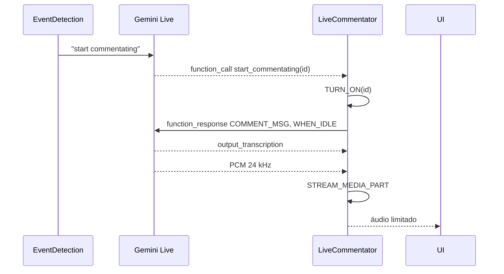

## 9. Fluxo de barge-in do usuário

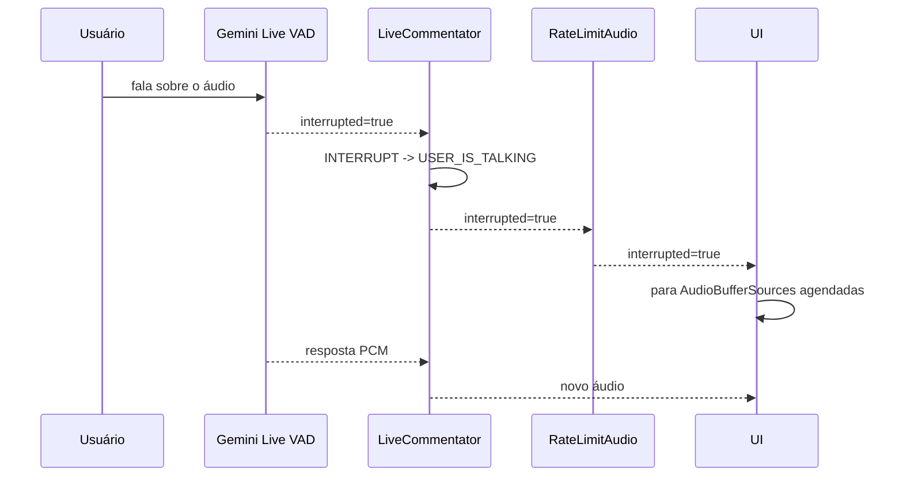

## 10. Fluxo de interrupção visual

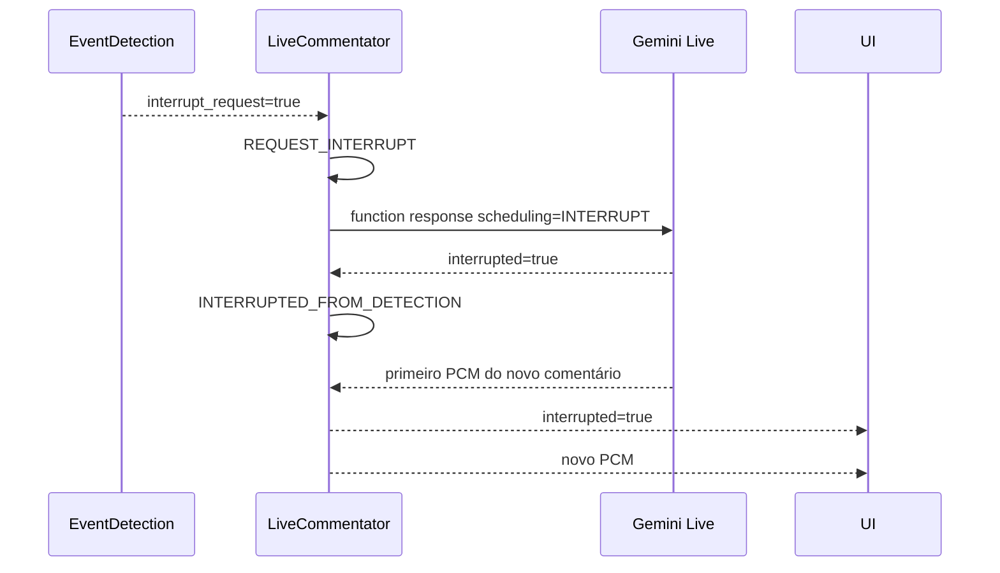

O áudio antigo só é interrompido quando o novo comentário começa, evitando
silêncio desnecessário.

## 11. Fluxo `wait_for_user`

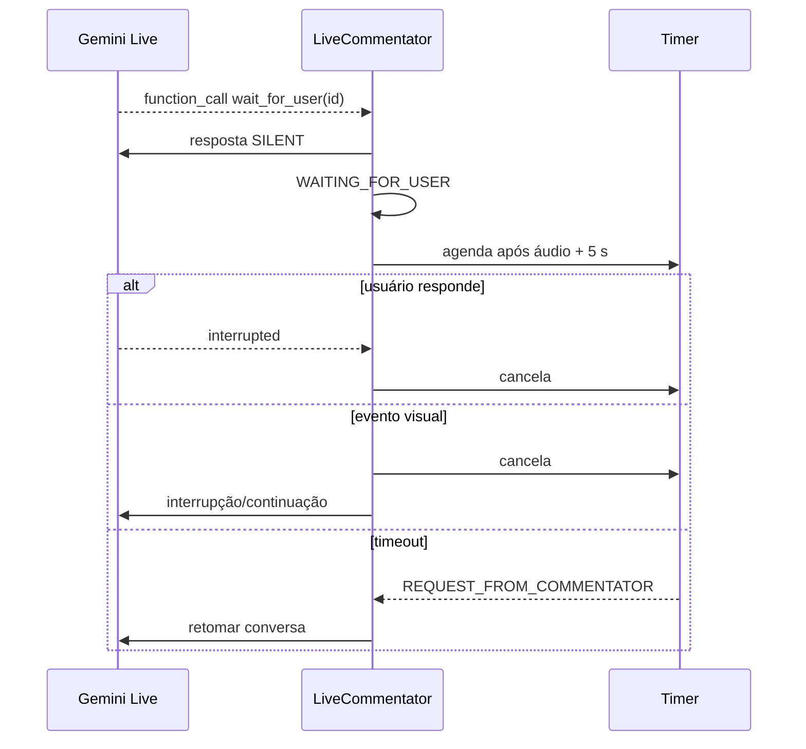

## 12. Agendamento e latência

Para cada geração, o comentarista guarda:

- início da solicitação;
- tipo da geração;
- instante do primeiro áudio;
- TTFT;
- duração acumulada do PCM.

Estimativa:

```text
next_ttft = max(0.4, média(ttft) - desvio_padrao(ttft))
trigger_at = audio_start + max(5.0, audio_duration) - next_ttft
```

O próximo comentário é solicitado próximo ao fim do áudio atual. `chattiness`
controla probabilisticamente se a solicitação ocorre; tentativas recusadas são
reavaliadas a cada 3 segundos.

## 13. Estado da WebUI

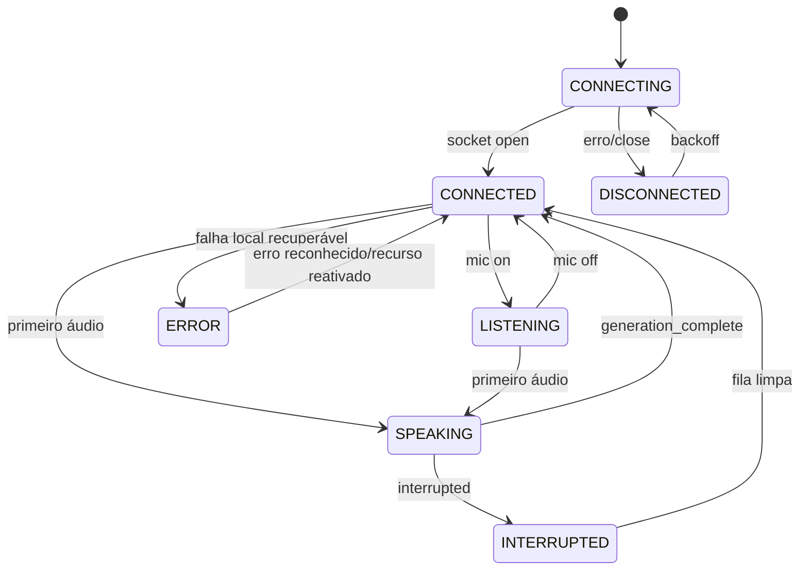

Captura visual é estado ortogonal: `NONE`, `CAMERA` ou `SCREEN`.

## 14. Reset e configuração

Configuração e reset encerram o stream de entrada atual no servidor. O loop
`live_server` cria uma nova instância de pipeline na mesma conexão e envia um
health check.

A UI deve:

1. parar playback;
2. limpar transcrição parcial;
3. enviar comando/configuração;
4. indicar reinicialização;
5. aceitar health check;
6. continuar capturas ativas somente após conexão saudável.

## 15. Encerramento

Ao receber `SIGINT`/`KeyboardInterrupt`:

- o WebSocket fecha;
- o servidor HTTP executa `shutdown`;
- a thread HTTP termina;
- sessões Live saem de seus context managers;
- o terminal retorna sem processos órfãos.

Ao fechar/recarregar a aba:

- tracks são paradas;
- timers são cancelados;
- `AudioContext` é fechado;
- WebSocket é fechado intencionalmente.

## 16. Workflow de desenvolvimento

Mudanças comportamentais seguem:

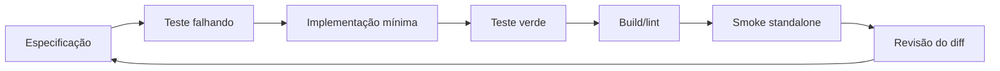

Checklist por mudança:

1. Ler `AGENTS.md`, estes documentos e os contratos tocados.
2. Identificar produtor e consumidores.
3. Escrever teste de comportamento/contrato.
4. Confirmar falha correta.
5. Implementar sem alterar contratos vizinhos.
6. Rodar teste alvo.
7. Rodar testes Python e WebUI relevantes.
8. Gerar build Vite.
9. Fazer smoke HTTP/WebSocket e, quando aplicável, API real.
10. Verificar secrets, artefatos gerados e estado Git.

## 17. Matriz de validação

| Área | Validação |
|---|---|
| Máquina do comentarista | testes unitários + smoke Live |
| Protocolo WebSocket | `live_server_test.py` |
| Launcher HTTP | teste com porta efêmera |
| Conversão PCM | testes TypeScript |
| URL WebSocket | testes TypeScript |
| Build UI | `npm run build` |
| Tipos | `npm run typecheck` |
| UI | smoke em navegador local |
| Segurança | scan de secrets e inspeção do bundle |
