# Leonidas — Workflows e máquinas de estado

## Componentes

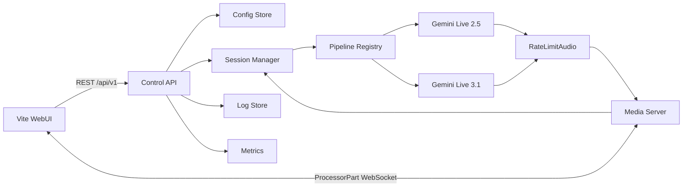

## Fluxo multimídia

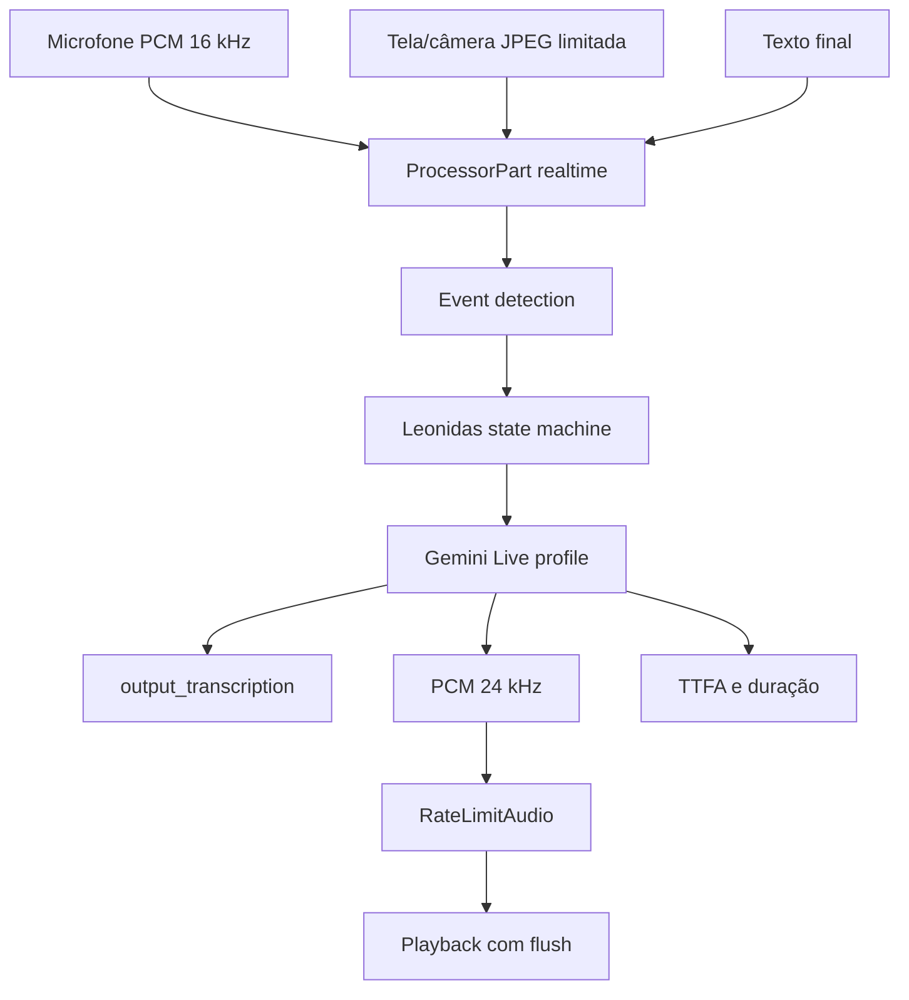

## Sessão

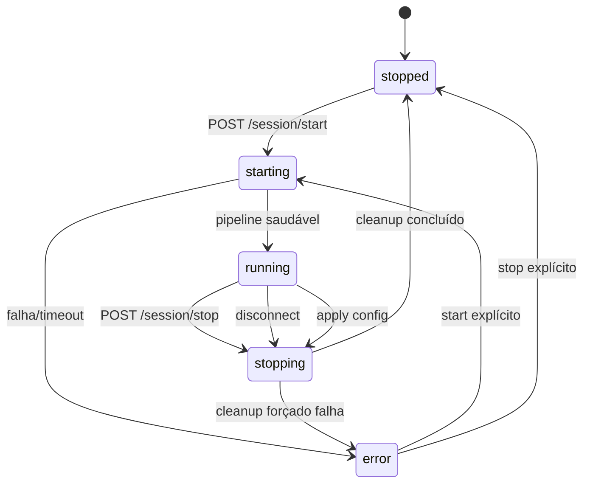

Invariantes:

- há no máximo uma task de pipeline e uma conexão de mídia proprietária;
- toda inicialização cria nova fila e novo stream;
- `stop` pode ser repetido sem erro;
- nenhuma transição automática sai de `error`.

## Aplicar configuração

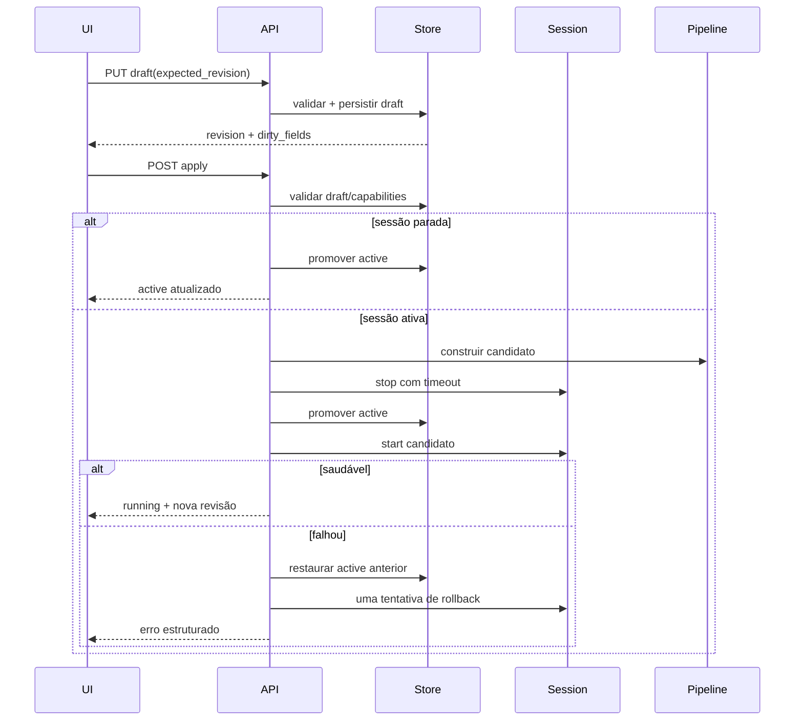

## Pipeline por modelo

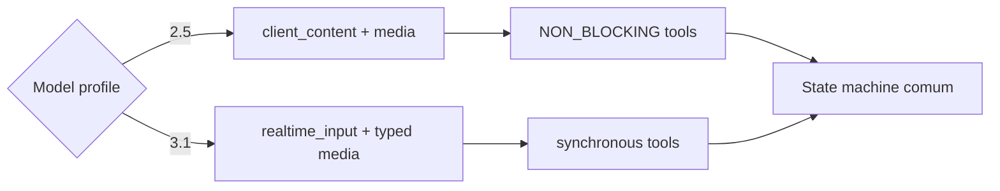

O profile decide transports, tools e campos do SDK. A máquina de estados não
contém condicionais baseadas em nomes de modelo.

## Start e Stop

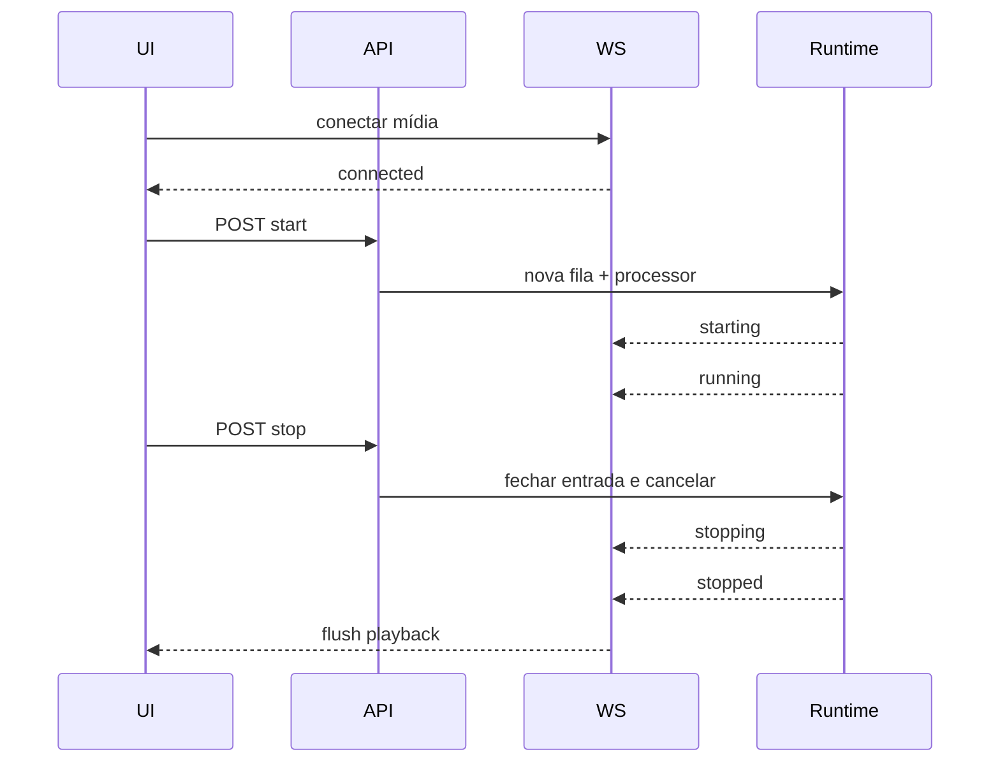

## Interrupção

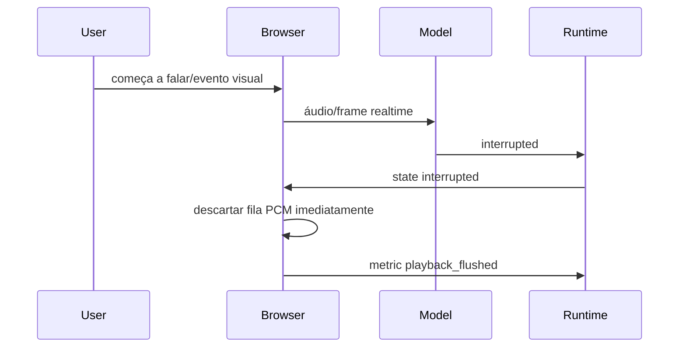

## Preview de voz

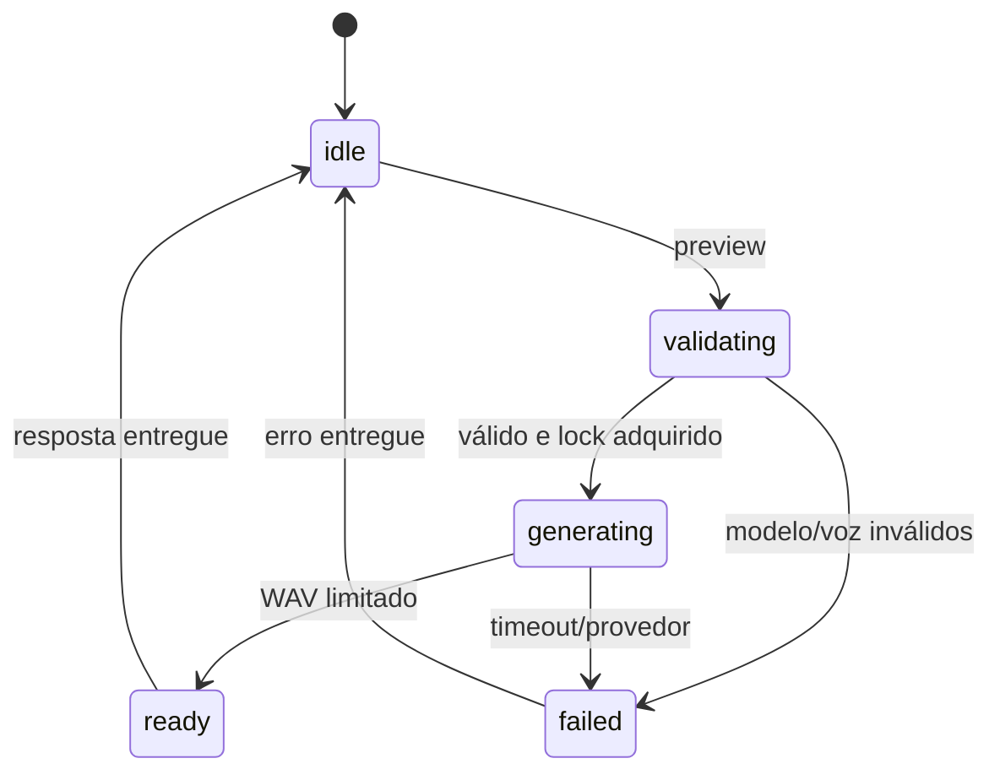

## Logs

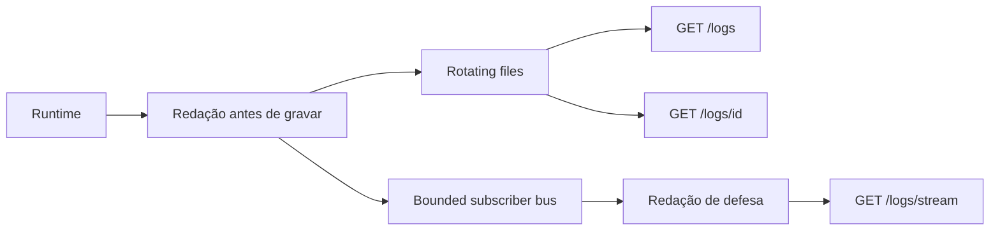

Clientes lentos perdem linhas antigas; nunca bloqueiam o runtime.

## Reconexão e falhas

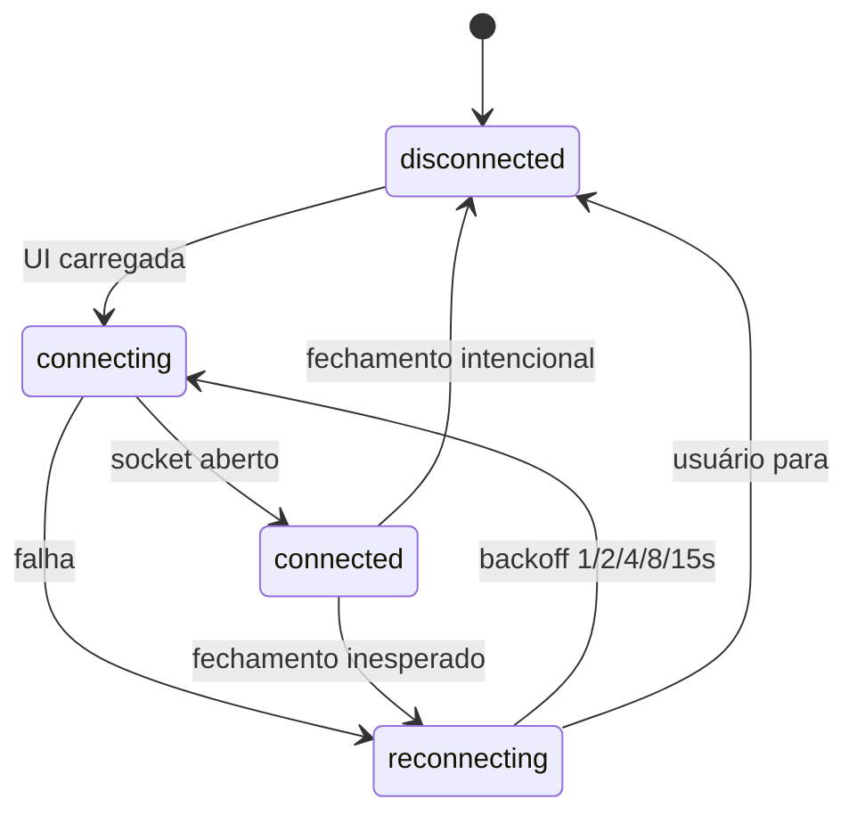

Perder o WebSocket para a sessão ativa dispara Stop no backend. Reconectar não
reinicia automaticamente a sessão: o usuário escolhe Start.

## E2E empírico

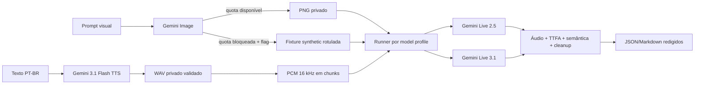
