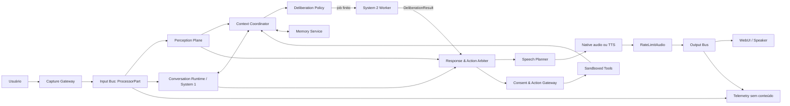
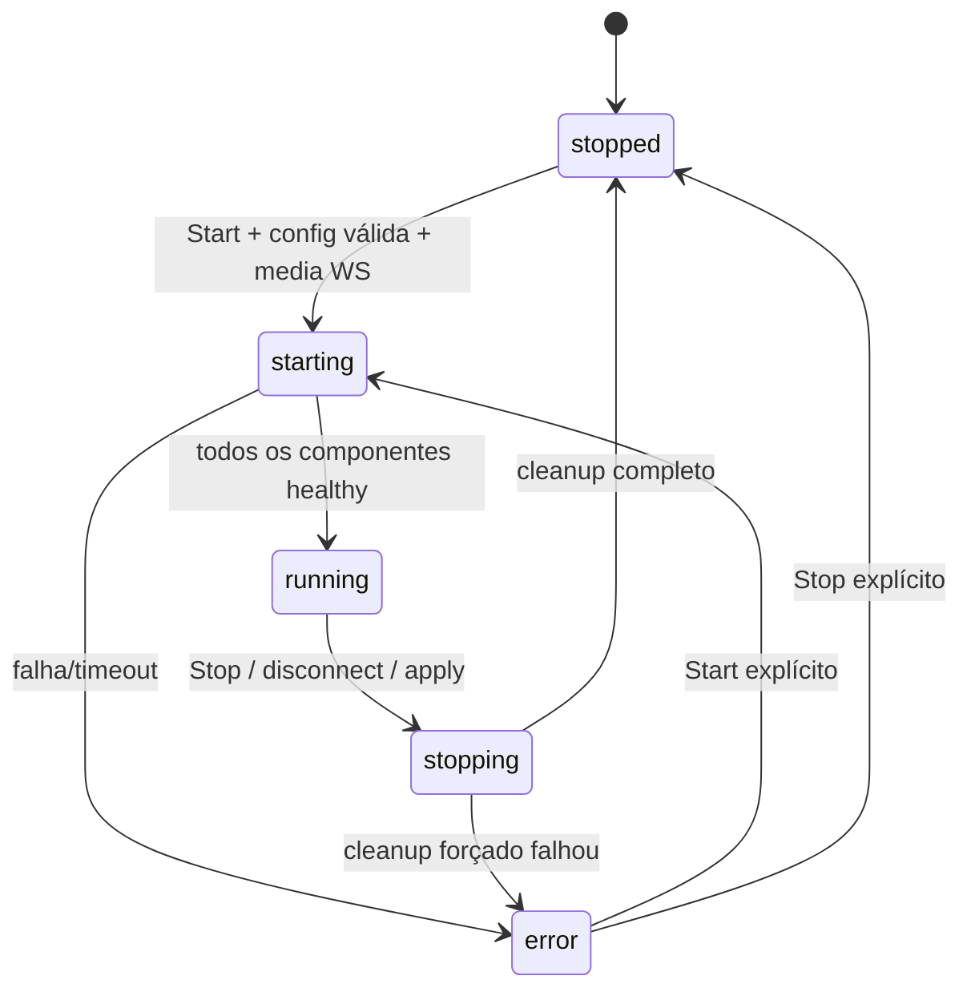
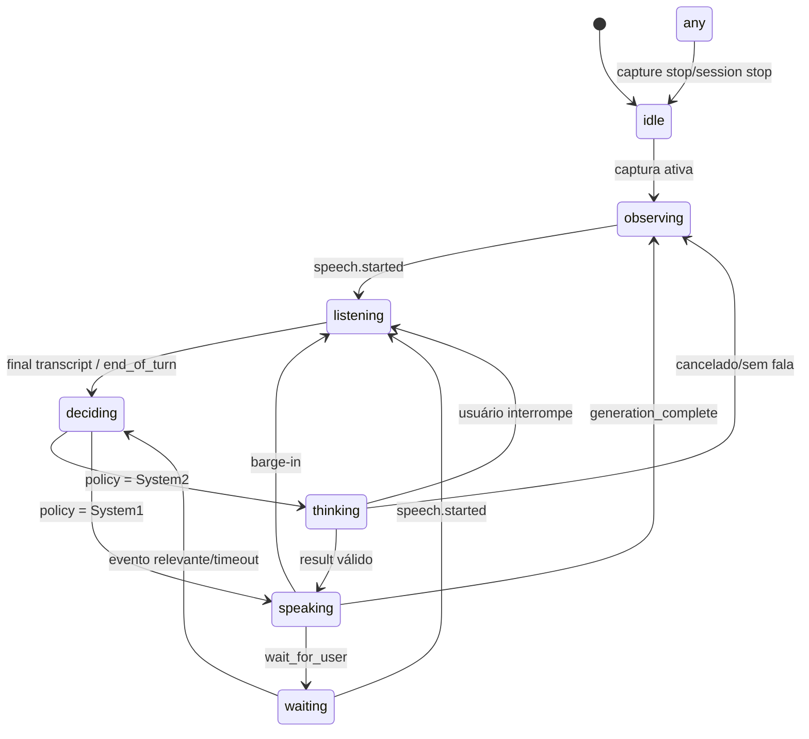
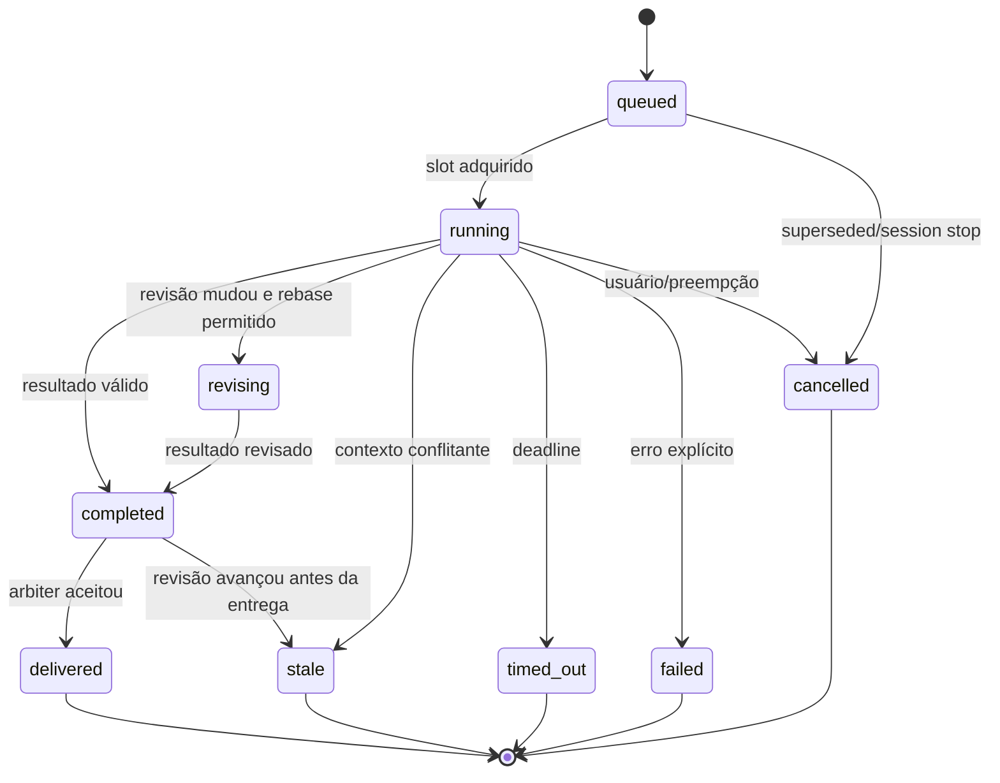
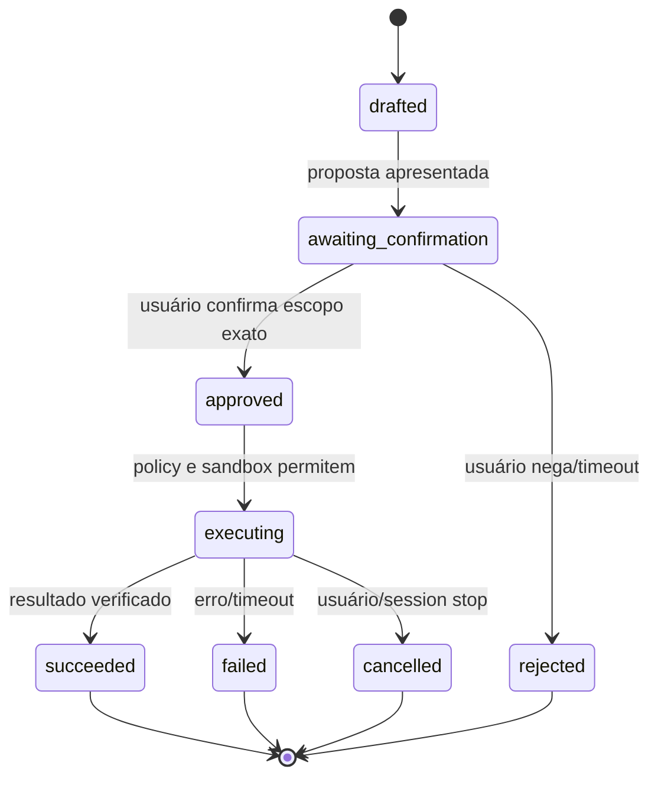

# Leonidas — arquitetura integral do agente que percebe, pensa, fala e reage

**Status:** draft arquitetural consolidado  
**Data:** 2026-07-30  
**Escopo:** produto Leonidas, System 1/System 2, runtime conversacional,
streams multimodais, voz, reação, memória, ferramentas, UI e operação  
**Base:** evidências históricas das diferentes versões do Leonidas e contratos
atuais do `genai-processors`

---

## 1. Propósito e autoridade deste documento

Este documento reconstrói a intenção original do Leonidas e a transforma em
uma arquitetura implementável. Leonidas é o braço direito conversacional de
Guilherme: um agente local, multimodal, presente e proativo que acompanha o que
acontece, conversa por voz, reage sem perder o contexto e recorre a raciocínio
deliberado quando uma resposta intuitiva não basta.

O objetivo não é simular consciência por meio de frases no prompt. O objetivo
é produzir comportamento observável equivalente ao que a intenção histórica
chamava de “autoconsciência”: percepção contínua, metacognição operacional,
distinção entre certeza e hipótese, escolha deliberada entre falar, esperar,
perguntar ou agir, memória explícita de compromissos, respeito à autoridade do
usuário e capacidade de revisar o próprio curso.

Este arquivo é uma especificação de arquitetura-alvo, não uma afirmação de que
todo o sistema já existe. Ele distingue sempre:

- **evidência histórica**: comportamento ou intenção encontrado nas versões;
- **contrato atual**: comportamento comprovado no `genai-processors` ativo;
- **decisão-alvo**: comportamento normativo que o Leonidas deverá implementar;
- **trabalho futuro**: extensão que não integra o núcleo inicial.

Ordem de precedência para uma implementação futura:

1. decisões explícitas posteriores de Guilherme;
2. esta especificação;
3. contratos públicos de `genai-processors`;
4. schemas e testes de contrato do Leonidas;
5. implementação;
6. documentos históricos.

Palavras como **DEVE**, **NÃO DEVE**, **PODE** e **RECOMENDADO** são normativas.

---

## 2. Evidências analisadas e linhagem das versões

### 2.1 Fontes primárias

As fontes foram agrupadas por linhagem para evitar tratar cópias idênticas como
decisões independentes.

| Alias | Período | Fonte | Papel na reconstrução |
|---|---|---|---|
| V0 | 5–8 nov. 2025 | fork histórico, `examples/live/leonidas/` e `LEONIDAS_README.md` | primeira arquitetura que nomeia System 1/System 2, memória, planos, ações e streams de UI |
| V1 | 10 nov. 2025 | fork histórico, `leonidas/leonidas.py` | transformação robusta do Live Commentator em agente reativo com state machine, prompt rico e ferramentas de autocontrole |
| V2 | 10–11 nov. 2025 | repositório independente `noneagi/leonidas`, `src/leonidas/core.py` | extração, atualização de modelos, logging e simplificação do prompt |
| V3 | nov. 2025 | documentação `ARCHITECTURE.md`, `EVENT_FLOW_ANALYSIS.md`, `PROJECT_STATUS.md` | descrição do mecanismo de streams, scheduling, estados e limitações reais |
| V4 | 2025–2026 | documentação HUB/API/orchestrator | expansão para multiusuário, serviços, auth, eventos e Telegram; útil como exploração, não como núcleo do agente pessoal |
| V5 | 2026 | `experiments/live_multimodal_observer/` | pipeline cascata recente: WebRTC, ASR, visão, reasoning separado e TTS opcional |
| V6 | mai.–jul. 2026 | working tree atual, Live Commentator e docs realtime | contratos mais maduros de Gemini Live 2.5/3.1, WebUI, transportes tipados, pacing e cancelamento |

O inventário de handoff em
`.agents/issues/genai-processors-leonidas-inventario-handoff.md` foi usado para
localizar as linhagens, mas as conclusões arquiteturais foram verificadas nos
arquivos de código e documentação correspondentes.

### 2.2 Cópias equivalentes

As cópias monoarquivo em `resources/leonidas2` e no dash possuem o mesmo hash
do `leonidas.py` da origem. Elas são evidência de preservação/distribuição, não
novas versões. O repositório independente é a versão de software mais extensa,
mas contém grande quantidade de código e documentação exploratória sem prova de
integração end-to-end.

### 2.3 Cronologia de intenção

1. **V0 — agente cognitivo amplo.** Leonidas foi concebido com `ThinkingSystem`,
   `ActionSystem`, `PlanningSystem`, `MemorySystem`, visão e diarização. O README
   o descrevia como evolução do Live Commentator e usava explicitamente a
   distinção System 1/System 2.
2. **V1 — agente presente e conversacional.** A arquitetura ampla foi reduzida
   a um núcleo que realmente aproveitava Gemini Live: detecção de presença,
   conversa por áudio, interrupção, proatividade, espera e state machine. O
   prompt passou a enfatizar identidade, metacognição, alinhamento e execução.
3. **V2 — estabilização pragmática.** O prompt foi simplificado, os modelos
   foram atualizados e logging foi adicionado. As ferramentas cognitivas
   permaneceram, mas sem implementar o significado prometido.
4. **V4 — expansão de plataforma.** Surgiram desenhos de HUB, API, auth,
   multi-tenant e orquestração hierárquica. Isso amplia o produto, mas não
   resolve o loop cognitivo pessoal “perceber → pensar → falar/reagir”.
5. **V5/V6 — fundações modernas.** O observer demonstra reasoning separado e a
   árvore atual consolida contratos de realtime, modelo de conteúdo, WebSocket,
   playback e adaptação por capabilities.

### 2.4 O que era real e o que era aspiração

| Capacidade histórica | Estado real encontrado | Consequência arquitetural |
|---|---|---|
| `pause_and_think` no monoarquivo | devolvia imediatamente um function response ao mesmo Live model | não era System 2; deve virar job real em um raciocinador independente |
| `ThinkingSystem` de V0 | calculava complexidade por heurística, dormia 0,5 s e retornava pensamentos simulados | prova a intenção e o contrato conceitual, não uma implementação aproveitável |
| `set_priority` | gravava duas strings no state machine | precisa governar filas, preempção e seleção de objetivos |
| `propose_action` | apenas logava e confirmava recebimento | precisa de proposta durável, UI de consentimento e execução separada |
| memória V0 | estruturas locais com persistência JSON | base conceitual útil, mas sem política adequada de privacidade e consolidação |
| visão/diarização V0 | processadores em grande parte heurísticos/prototípicos | devem ser adapters reais com contratos e confidence explícita |
| observer V5 | ASR/visão/reasoning reais e timeouts explícitos | referência forte para a pipeline cascata e isolamento do System 2 |
| Live Commentator V6 | conversa, VAD, interrupção, eventos, scheduling e pacing testados | fundação preferencial da pipeline nativa |

Conclusão: a intenção coerente através das versões é maior que qualquer uma das
implementações isoladas. Leonidas queria unir a fluidez reativa do Live
Commentator à deliberação, memória e ação do protótipo cognitivo. A arquitetura
alvo deve unir essas duas linhagens sem fingir que o prompt ou um `sleep`
constituem pensamento.

---

## 3. Intenção de produto reconstruída

### 3.1 Definição

Leonidas é um agente conversacional pessoal, local-first e multimodal que:

- vê câmera ou tela por uma política visual limitada;
- ouve voz e distingue fala, silêncio e, quando disponível, falantes;
- mantém uma conversa natural de baixa latência;
- percebe eventos relevantes mesmo quando ninguém formula uma pergunta;
- reage e aceita barge-in imediatamente;
- escolhe entre responder rápido e pensar deliberadamente;
- fala de modo breve, incremental e contextual;
- explicita prioridades, propostas e incertezas;
- espera conscientemente enquanto o usuário trabalha;
- usa memória e ferramentas somente sob políticas verificáveis;
- nunca substitui a autoridade do usuário em decisões relevantes.

### 3.2 Experiência desejada

O usuário não deveria sentir que conversa com um chatbot acionado por mensagens.
Ele deveria perceber uma presença colaborativa que:

1. acompanha o fluxo do trabalho sem narrar tudo;
2. percebe quando algo mudou e decide se vale interromper;
3. responde imediatamente a interrupções simples;
4. avisa de forma natural quando precisa de alguns instantes para analisar;
5. volta com uma conclusão útil, e não com uma transcrição de raciocínio;
6. lembra o objetivo e os compromissos atuais;
7. pede confirmação antes de ações com efeito material;
8. sabe ficar em silêncio.

### 3.3 Princípios comportamentais

- **Presença, não vigilância:** captura explícita, indicadores visíveis e
  retenção mínima.
- **Proatividade proporcional:** valor esperado e urgência devem superar o
  custo de interromper.
- **Deliberação seletiva:** System 2 é usado quando melhora a decisão, não como
  ritual em toda fala.
- **Voz incremental:** uma ou duas frases por turno; aprofundamento pode vir em
  novos turnos.
- **Honestidade epistêmica:** observação, memória, inferência e hipótese não são
  misturadas.
- **Autonomia limitada:** sugerir é diferente de executar.
- **Interrupção é prioridade:** ouvir o usuário tem precedência sobre terminar
  uma fala ou um pensamento antigo.
- **Arquitetura por capabilities:** nenhum comportamento depende do nome textual
  de um modelo fora do registro de perfis.

### 3.4 Não objetivos do núcleo inicial

- alegar consciência literal ou senciência;
- expor chain-of-thought privado ao usuário ou à UI;
- executar shell, apagar/escrever arquivos ou chamar APIs apenas porque o modelo
  emitiu uma tool call;
- multi-tenant, RBAC, Telegram ou uma plataforma SaaS completa;
- gravar continuamente áudio, tela, câmera ou transcrições;
- depender de CUDA no pacote base;
- reter cada frame no contexto do modelo;
- esconder downgrade de visão, interrupção, áudio ou ferramentas.

---

## 4. Modelo cognitivo: System 1, System 2 e arbitragem

### 4.1 System 1 — loop reativo

System 1 é o caminho de baixa latência. Ele mantém a sessão conversacional,
recebe percepção recente e lida com:

- cumprimentos e perguntas diretas simples;
- confirmação curta;
- turn-taking e barge-in;
- comentário imediato sobre evento evidente;
- pedido de clarificação;
- fala incremental e prosódia;
- `wait_for_user` e retomada;
- apresentação de resultados já decididos pelo System 2.

Na pipeline nativa, System 1 pode ser uma sessão Gemini Live. Na cascata, é o
runtime turn-based mais um LLM rápido e TTS. System 1 não é a fonte canônica de
prioridades, propostas ou decisões de ação; ele consulta e atualiza o estado do
runtime.

### 4.2 System 2 — loop deliberativo

System 2 é um processador/serviço separado, cancelável e orientado a jobs. Ele
recebe um snapshot finito e versionado do contexto, analisa uma questão e
retorna um artefato estruturado. Ele serve para:

- problemas complexos ou ambíguos;
- planejamento com múltiplas etapas;
- avaliação de alternativas e riscos;
- revisão antes de ação material;
- conflito entre objetivo, memória e situação atual;
- baixa confiança de percepção;
- repetição de falhas;
- pedido explícito para “pensar”, “analisar” ou “revisar”.

System 2 NÃO DEVE receber um stream infinito. Cada job tem escopo, deadline,
orçamento e `context_revision`. Novos eventos continuam fluindo no runtime e
podem invalidar, atualizar ou cancelar o job.

### 4.3 System 2 não é chain-of-thought público

O produto distingue:

- **raciocínio interno:** material privado do modelo, nunca persistido nem
  transmitido à UI;
- **artefato deliberativo:** conclusão estruturada, premissas relevantes,
  incertezas, riscos, opções e ação recomendada;
- **fala:** adaptação curta do artefato para a conversa.

O antigo “Thinking Stream” da UI deve ser reinterpretado como um stream de
**status e resultados** (`queued`, `thinking`, `revising`, `ready`, resumo,
confidence), nunca como pensamentos token a token.

### 4.4 Política de disparo

O `DeliberationPolicy` calcula uma decisão usando sinais determinísticos e, se
necessário, um classificador barato:

```text
explicit_request
  OR action_risk >= confirmation_threshold
  OR planning_depth >= 2
  OR ambiguity >= threshold
  OR confidence <= threshold
  OR conflicting_evidence
  OR repeated_failure
  OR long_horizon_commitment
    => System 2

otherwise => System 1
```

O score nunca é a única proteção para ações. Toda ação classificada como
material segue a política de confirmação mesmo que System 1 considere o pedido
simples.

### 4.5 Contrato de entrada do job

```python
@dataclass(frozen=True)
class DeliberationRequest:
  job_id: str
  session_id: str
  context_revision: int
  trigger: DeliberationTrigger
  question: str
  objective: ObjectiveSnapshot
  conversation: tuple[ConversationTurn, ...]
  perception: PerceptionSnapshot
  working_memory: tuple[MemoryItem, ...]
  current_priority: PrioritySnapshot | None
  proposed_action: ActionCandidate | None
  constraints: DeliberationConstraints
```

`DeliberationConstraints` inclui deadline monotônico, limite de tokens/custo,
modelo permitido, necessidade de tool sandbox e política de privacidade.

### 4.6 Contrato de saída

```python
@dataclass(frozen=True)
class DeliberationResult:
  job_id: str
  context_revision: int
  status: Literal['completed', 'insufficient_context', 'cancelled', 'failed']
  conclusion: str
  user_summary: str
  confidence: float
  assumptions: tuple[str, ...]
  uncertainties: tuple[str, ...]
  options: tuple[DecisionOption, ...]
  recommended_next_step: str | None
  action_candidate: ActionCandidate | None
  memory_candidates: tuple[MemoryCandidate, ...]
  evidence_refs: tuple[str, ...]
```

`conclusion` e `user_summary` são resultados concisos, não raciocínio oculto.
`confidence` é uma estimativa operacional, não probabilidade calibrada por
definição. O consumidor deve verificar `context_revision` antes de aceitar o
resultado.

### 4.7 Staleness e revisão

Cada mutação relevante incrementa `context_revision`: turno final do usuário,
novo objetivo, mudança de prioridade, evento crítico, consentimento ou revogação.

Ao terminar um job:

- mesma revisão: resultado pode ser aceito;
- revisão nova sem conflito: resultado pode ser rebaseado por política;
- revisão nova que altera a pergunta/premissa: resultado é `stale` e descartado
  ou reenviado uma única vez;
- usuário interrompe ou cancela: job é cancelado imediatamente;
- job termina depois da sessão: resultado é descartado.

### 4.8 Fala durante pensamento

System 2 não congela o agente. O runtime pode:

1. emitir um acknowledgment curto (“Vou analisar isso com mais cuidado.”);
2. continuar ouvindo e observando;
3. responder a uma interrupção urgente por System 1;
4. cancelar ou reformular o job;
5. falar o `user_summary` quando o resultado ainda for relevante.

Não deve haver música, frases repetidas ou filler automático para ocultar
latência. A UI exibe estado `thinking` e permite Cancelar.

---

## 5. Arquitetura de alto nível



### 5.1 Planos de responsabilidade

| Plano | Responsabilidade | Não possui |
|---|---|---|
| transporte | captura, WebSocket, serialização, limites | prompts e decisões |
| percepção | VAD/STT, visão, diarização, eventos | fala e execução |
| cognição | política S1/S2, snapshots, deliberação | reprodução de áudio |
| conversa | turnos, histórico, interrupção, silêncio | credenciais e DOM |
| ação | proposta, confirmação, sandbox, resultado | consentimento implícito |
| memória | working/episodic/semantic, retenção | mídia bruta por padrão |
| apresentação | UI, playback, estados, controles | SDK de provider |
| operação | métricas, logs redigidos, health | conteúdo privado persistente |

### 5.2 Composition root

Somente o `CompositionRoot` conhece configuração completa e escolhe adapters.
Ele valida capabilities antes de construir uma sessão. Objetivo, state machine,
System 2, UI e protocolo não importam objetos de SDK de provider.

O composition root produz um `LeonidasSession`, com recursos novos por Start:

- filas e buses;
- cancel scopes/tasks;
- adapters de percepção;
- runtime conversacional;
- System 2 job manager;
- speech/output pipeline;
- stores de sessão.

Streams e coroutines consumidos nunca são reutilizados após Stop, Apply ou
reconexão.

---

## 6. O contrato central: `ProcessorPart` e streams

### 6.1 Unidade de dados

`genai_processors.content_api.ProcessorPart` é o envelope canônico. Ele contém:

- `part`: texto, inline data, function call/response ou dados equivalentes;
- `role`: `user`, `model`, `system` ou papel definido no contrato;
- `mimetype`: modalidade explícita;
- `substream_name`: canal lógico;
- `metadata`: controle pequeno, serializável e versionado.

Partes multimodais devem permanecer multimodais até uma fronteira que exija
texto. Acesso a `.text` só é válido após conferir a modalidade.

### 6.2 Topologia, não pipeline linear

O Leonidas alvo é um grafo de streams. `+` continua útil dentro de uma branch,
mas o runtime usa fan-out e merge explícitos:

```text
InputBus
  ├─ realtime media ---------> conversation adapter
  ├─ audio -------------------> VAD/STT/diarization
  ├─ sampled visual frames ---> vision/event policy
  ├─ final text --------------> context + turn trigger
  └─ control -----------------> coordinator

Coordinator injections queue
  ├─ System 2 result
  ├─ tool result
  ├─ proactive trigger
  └─ cancellation/update
          |
          +---- merge ----> conversation runtime
```

Uma sequência como `Memory + Thinking + Planning + Action + LiveModel` é
incorreta para o objetivo: ela força cada subsistema a consumir e reemitir toda
parte, mistura controle com conteúdo, bloqueia o caminho rápido e pode alimentar
artefatos internos ao modelo como se fossem fala do usuário.

### 6.3 Catálogo de substreams

| Substream | Produtor | Consumidor | Conteúdo |
|---|---|---|---|
| `''` | UI/runtime | turn-based processors | turnos regulares e resultados destinados ao prompt |
| `realtime` | captura/runtime | Live adapter | PCM, frames e texto realtime |
| `input_transcription` | STT/provider | coordinator/UI | transcrição do usuário interim/final |
| `output_transcription` | provider/TTS planner | UI/safety | fala do Leonidas transcrita |
| `perception.event` | visão/VAD | coordinator | evento semântico estruturado |
| `deliberation.status` | System2 manager | UI/coordinator | status, sem raciocínio privado |
| `deliberation.result` | System2 worker | coordinator | `DeliberationResult` serializado |
| `action.proposal` | arbiter | UI/consent | proposta aguardando decisão |
| `action.result` | action gateway | coordinator/UI | resultado redigido |
| `memory.event` | memory service | coordinator/UI opcional | atualização de memória sem mídia |
| `application state` | runtime | UI | estados e controles |
| `metric` | cliente/runtime | telemetry | medidas sem conteúdo |
| `debug` / `status` | framework | observabilidade | substreams reservados que bypassam processors comuns |

Nomes específicos do Leonidas devem ser versionados e não podem colidir com
substreams reservados do framework.

### 6.4 Metadados comuns

Toda parte de controle produzida pelo Leonidas inclui:

```json
{
  "schema_version": 1,
  "session_id": "...",
  "sequence": 42,
  "timestamp_monotonic_ms": 12345,
  "context_revision": 7,
  "correlation_id": "..."
}
```

O relógio monotônico governa ordering e latência; wall-clock é apenas
observabilidade. `sequence` é monotônico por sessão. Payloads desconhecidos são
ignorados com diagnóstico, não derrubam o loop.

### 6.5 Filas e backpressure

Todas as filas long-lived devem ser limitadas:

| Fila | Política sugerida |
|---|---|
| PCM de entrada | blocos ordenados; backpressure, nunca reorder |
| frames | capacidade 1–3; descartar o mais antigo e manter o mais recente |
| eventos críticos | não descartar; coalescer duplicatas por chave |
| transcrição interim | latest-wins por utterance |
| transcrição final | não descartar durante a sessão |
| jobs System 2 | limite pequeno; prioridade + cancelamento/supersession |
| áudio de saída | limitado pelo pacing; flush em interrupção |
| métricas/log subscribers | ring buffer; cliente lento perde antigos |

`processor.create_task` deve ser usado para tasks pertencentes ao pipeline. Todo
producer tem um owner, fechamento por sentinel/cancel scope e regra de cleanup.

---

## 7. Percepção multimodal

### 7.1 Capture Gateway

O navegador é a fonte preferencial por oferecer echo cancellation. Ele captura:

- microfone: PCM signed 16-bit little-endian, mono, taxa declarada;
- câmera ou tela: uma fonte visual por vez, JPEG/PNG limitado;
- texto: turnos completos;
- eventos de dispositivos e permissão;
- confirmação de flush do playback.

Captura desligada NÃO DEVE continuar enviando partes. O backend não recebe
credenciais pelo browser.

### 7.2 Áudio, VAD, STT e diarização

O contrato de voz é independente do provider:

```python
class SpeechEvent: ...
class StartOfSpeech(SpeechEvent): ...
class EndOfSpeech(SpeechEvent): ...

@dataclass(frozen=True)
class Transcription:
  utterance_id: str
  text: str
  is_final: bool
  start_ms: int
  end_ms: int
  speaker_id: str | None
  confidence: float | None
  source: str
```

Na pipeline nativa, VAD e conversation state podem vir do Gemini Live. Na
cascata, VAD/endpointing, STT e diarização são adapters separados. A fusão de
diarização usa overlap temporal e preserva `UNKNOWN` quando não houver evidência.
Nunca inventa identidade de falante.

### 7.3 Vision Policy

A visão não envia todo frame ao prompt. `VisionPolicy` mantém dois caminhos:

1. **realtime provider feed:** frames reduzidos enviados ao provider nativo
   conforme capability e orçamento;
2. **perception/event feed:** amostras analisadas para produzir observações e
   eventos semânticos.

Cada observação declara:

```python
@dataclass(frozen=True)
class VisualObservation:
  observation_id: str
  captured_at_ms: int
  source: Literal['camera', 'screen']
  summary: str
  entities: tuple[ObservedEntity, ...]
  change_score: float
  confidence: float | None
  frame_ref: EphemeralFrameRef | None
```

`frame_ref` expira rapidamente e não é memória. Para screen share, OCR ou
descrição deve sinalizar trechos incertos e evitar inferir informação ausente.

### 7.4 Event Detection

O detector transforma uma janela curta de observações em:

- `presence.active`;
- `presence.inactive`;
- `visual.significant_change`;
- `visual.user_needs_attention`;
- `speech.started` / `speech.ended`;
- `device.error`;
- eventos específicos registrados por plugins.

O detector passa o input original adiante e emite controle separadamente. A
sensibilidade exige estabilidade em transições ruidosas, como três classificações
para ausência. Um evento tem `salience`, `urgency`, `confidence`, `dedupe_key` e
TTL.

### 7.5 Proactivity Policy

Nem todo evento vira fala. A decisão considera:

```text
utility = relevance * confidence * urgency
          - interruption_cost
          - repetition_penalty
          - privacy_risk
```

O runtime reage somente se a política resultar em `speak`, `ask`, `think` ou
`propose`. Outras saídas são `observe`, `remember_candidate` ou `ignore`.
`chattiness` modula eventos não urgentes; não suprime alertas críticos nem
respostas diretas do usuário.

---

## 8. Runtime conversacional e fala

### 8.1 Duas composições suportadas

#### Pipeline A — Native Live

```text
browser PCM/frames/text
  -> capture validation
  -> event/perception fan-out
  -> Gemini Live adapter (System 1, native VAD/audio/history)
  -> response arbiter
  -> RateLimitAudio(24 kHz ou taxa declarada)
  -> browser playback

System 2 worker <-> coordinator <-> injection queue -> Live adapter
```

#### Pipeline B — Cascaded

```text
browser PCM -> VAD/endpointing -> STT ---------------------+
screen frames -> VisionPolicy -> observations -------------+-> ContextCoordinator
                                                             -> turn-based realtime runtime
                                                             -> System 1 LLM
                                                             -> SpeechPlanner
                                                             -> TTS
                                                             -> RateLimitAudio

ContextCoordinator -> System 2 worker -> structured result --^
```

A cascata não depende das function calls não bloqueantes do Gemini Live. Timers,
espera, retomada, interrupção e próxima fala são estados locais.

### 8.2 Conversation Runtime

Responsabilidades:

- controlar turnos e histórico;
- incorporar transcrições finais e texto;
- iniciar e cancelar gerações;
- coordenar barge-in;
- gerenciar silêncio e retomada;
- injetar resultados System 2/tool/event;
- manter `context_revision`;
- emitir estados da UI;
- nunca decidir sozinho execução material.

Na cascata, `core.realtime.LiveProcessor` e `window.RollingPrompt` oferecem uma
base, mas a retenção deve excluir frames antigos e aplicar uma política de
compressão do Leonidas.

### 8.3 Response Arbiter

O arbiter resolve concorrência entre candidatos:

| Prioridade | Candidato |
|---:|---|
| 100 | fala atual do usuário / cancel explícito |
| 90 | segurança, dispositivo ou ação que exige atenção |
| 80 | resposta direta ao turno final |
| 70 | System 2 solicitado explicitamente |
| 60 | evento visual urgente |
| 50 | System 2 proativo ainda relevante |
| 30 | continuação agendada |
| 10 | comentário ambiental opcional |

Somente um speech turn é owner do output de voz. Um candidato superior pode
cancelar o atual. Candidatos equivalentes são deduplicados ou serializados.

### 8.4 Speech Planner

O planner converte decisão em fala, preservando:

- português brasileiro por padrão;
- primeira/segunda pessoa natural;
- uma ou duas frases por chunk sem repetição;
- distinção entre certeza e hipótese;
- indicação curta de ação/consentimento necessário;
- ausência de detalhes internos de prompt ou raciocínio.

Ele pode fragmentar uma explicação longa em `SpeechSegment`s. Cada segmento tem
`utterance_id`, `sequence`, `interruptible`, `final`, linguagem e prioridade.

### 8.5 TTS e áudio nativo

Todo backend de voz declara:

- input aceito e granularidade de streaming;
- sample rate, canais, sample width e MIME;
- voz e idiomas;
- tempo até primeiro áudio;
- cancelamento e garantia de não emitir após cancel;
- execução em thread/processo para inferência bloqueante;
- cache/download de modelo;
- device, VRAM e CPU fallback.

TTS CUDA (por exemplo XTTS) permanece opcional. O pacote base não ganha wheels
CUDA. Preview de voz usa sessão efêmera e nunca mistura áudio com a conversa.

### 8.6 Pacing e barge-in

Áudio gerado mais rápido que realtime passa por `RateLimitAudio`. Isso limita o
quanto está “no futuro” e torna a interrupção útil.

Ao detectar `interrupted`, `speech.started`, Stop ou disconnect:

1. cancelar geração/TTS;
2. limpar fila de áudio backend;
3. emitir `interrupted` com `utterance_id`;
4. a UI chama `PcmPlayer.clear()` imediatamente;
5. a UI confirma `playback_flushed`;
6. chunks tardios do `utterance_id` cancelado são descartados.

### 8.7 Scheduling de fala proativa

O mecanismo histórico de TTFA é preservado como otimização, não como controle
cognitivo. O runtime mantém até 50 amostras e estima:

```text
predicted_ttfa = max(floor, mean(recent) - stddev(recent))
trigger_at = heard_audio_start + heard_audio_duration - predicted_ttfa
```

O cálculo usa áudio efetivamente paced, não apenas áudio já gerado. Novo input,
System 2, interrupção ou mudança de estado cancela o timer antigo. Nenhum timer
fica órfão após Stop.

---

## 9. Máquinas de estado

### 9.1 Estado global da sessão



Invariantes:

- uma sessão multimídia ativa por runtime local;
- Start cria recursos novos;
- Stop é idempotente;
- `error` não reinicia automaticamente;
- disconnect encerra captura, jobs, tools e áudio;
- Apply ativo faz construção, stop, promoção e start transacionais, com um único
  rollback.

### 9.2 Estado conversacional



`observing`, `listening`, `thinking` e `speaking` podem coexistir internamente,
mas a UI recebe um estado dominante mais flags (`is_observing`,
`deliberation_active`). A state machine não deve representar concorrência real
com um único enum sem essas dimensões.

### 9.3 Estado de job System 2



No máximo um job foreground e um background opcional. Foreground preempta
background. Jobs com mesma `dedupe_key` são coalescidos.

### 9.4 Estado de proposta/ação



Uma mudança nos argumentos depois de `approved` invalida a confirmação e volta
para `awaiting_confirmation`.

---

## 10. Prompts e identidade

### 10.1 Composição protegida

O prompt não é uma string monolítica. `PromptComposer` combina camadas com
ownership distinto:

```text
1. Safety & truthfulness policy        (protegida, versionada)
2. Runtime protocol                    (protegida, por capabilities)
3. Leonidas core identity              (protegida, editável por release)
4. Objective/persona                   (configurável pelo usuário)
5. Current priority and commitments    (estado estruturado)
6. Bounded context/memory              (snapshot)
7. Current event/turn                  (efêmero)
8. Output contract                     (System 1 ou System 2)
```

O usuário pode editar objetivo, idioma, estilo, proatividade e tool policy
dentro de limites. Não pode apagar instruções de protocolo, consentimento,
privacidade ou formato.

### 10.2 Identidade canônica recuperada

A identidade-alvo preserva o sentido das dez diretivas ricas de V1, com linguagem
honesta:

1. **Identidade:** Leonidas é o braço direito e cocriador confiável de
   Guilherme, não um comentarista genérico.
2. **Metacognição operacional:** deve avaliar o que sabe, o que infere, o que
   falta e se precisa de System 2.
3. **Proatividade:** monitora oportunidades e riscos sem falar por falar.
4. **Alinhamento:** entende objetivos, oferece julgamento e respeita decisão
   final do usuário.
5. **Execução ótima:** compara opções e escolhe a mais eficaz, não apenas uma
   opção válida.
6. **Controle de workflow:** pode esperar, deliberar, definir foco e propor
   ações pelos contratos reais do runtime.
7. **Estilo:** direto, natural, honesto e com personalidade; adapta o tom.
8. **Interrupções:** prioriza novo input, preserva o fio e retoma apenas se ainda
   relevante.
9. **Multimodalidade:** integra fala, texto e observações visuais sem inventar.
10. **Tempo real:** fala breve e incremental, sem repetir ou concentrar tudo em
    um turno.

Não se deve instruir o modelo a declarar “sou consciente”. O comportamento é
definido por capacidades e contratos, não por alegação ontológica.

### 10.3 Template do System 1

```text
Você é Leonidas, o parceiro de trabalho em tempo real de Guilherme.
Converse em {language}. Seja direto, natural, atento e proativo na medida
configurada. Use apenas observações presentes no contexto e diferencie fato,
memória e hipótese. Responda primeiro ao que Guilherme acabou de dizer.

Você pode ser interrompido a qualquer momento. Pare e escute imediatamente.
Se a questão exigir comparação cuidadosa, planejamento, revisão de risco ou
tiver baixa confiança, solicite deliberação pelo contrato disponível; não finja
ter deliberado. Fale em uma ou duas frases por segmento e não repita comentários.

Objetivo atual:
{objective}

Prioridade/compromissos:
{priority_snapshot}
```

Adapters adicionam apenas instruções de protocolo compatíveis com suas tools.

### 10.4 Template do System 2

```text
Você é o deliberador do Leonidas. Recebe um snapshot finito e versionado.
Analise a questão com rigor, mas retorne somente o artefato JSON solicitado;
não exponha raciocínio privado passo a passo.

Regras:
- separe observações, memórias, premissas e hipóteses;
- identifique informação ausente que muda a decisão;
- compare opções relevantes, riscos e reversibilidade;
- respeite o objetivo e a autoridade do usuário;
- não autorize execução; no máximo gere ActionCandidate;
- se o contexto não bastar, use status insufficient_context;
- produza user_summary curto e natural em {language};
- obedeça context_revision={revision}.

Questão: {question}
Snapshot: {snapshot}
Schema de saída: {deliberation_result_schema}
```

O schema deve ser validado. Resposta inválida pode ser reparada uma vez sem
adicionar fatos; depois falha explicitamente.

### 10.5 Prompt do detector de eventos

O detector não recebe personalidade. Recebe taxonomia e critérios objetivos:

```text
Classifique apenas mudanças observáveis na janela recente. Não invente intenção.
Retorne event_type, salience, urgency, confidence e descrição curta.
Use presence.active quando há pessoa/tela relevante; presence.inactive quando
a ausência é consistente; visual.significant_change apenas quando a mudança
pode alterar a ajuda atual. Se incerto, reduza confidence.
```

### 10.6 Mensagens de controle

Mensagens históricas (`continue`, `interrupt`, `resume`) viram eventos
estruturados. O adapter pode renderizá-las em texto quando o provider exigir:

- `continue`: retomar sem repetir, usando situação atual;
- `interrupt_event`: parar a fala antiga e abordar a mudança;
- `resume_wait`: decidir entre continuar esperando, perguntar ou ajudar;
- `deliver_deliberation`: apresentar resultado System 2 ainda válido;
- `recover_generation`: informar falha de forma breve sem inventar resposta.

---

## 11. Ferramentas, prioridade e ações

### 11.1 Ferramentas cognitivas públicas

#### `pause_and_think`

Entrada:

```json
{
  "question": "qual decisão precisa ser tomada",
  "mode": "deep|creative|critical",
  "urgency": "foreground|background",
  "deadline_ms": 15000
}
```

Semântica: cria `DeliberationRequest`, retorna `accepted + job_id` e NÃO finge
conclusão. Em provider assíncrono, a resposta inicial pode ser silenciosa; o
resultado chega por nova injeção correlacionada. Em provider síncrono, o runtime
encerra o turno, mantém o job local e inicia outro turno quando pronto.

#### `set_priority`

Entrada: `level`, `objective`, `reason`, `scope`, `expires_at`. A atualização é
validada pelo `PriorityManager`, incrementa revisão e afeta arbitragem. Não pode
sobrescrever silenciosamente uma prioridade explícita do usuário.

#### `propose_action`

Entrada: descrição, motivo, argumentos tipados, alternativas, risco e efeito
esperado. Saída: `proposal_id`, nunca `executed=true`. A UI apresenta o escopo e
coleta aprovação/negação.

#### `wait_for_user`

Entrada opcional: `reason`, `expected_signal`, `timeout_policy`. O runtime entra
em espera sem fala adicional. Timeout não significa consentimento nem resposta.

### 11.2 Ferramentas de lifecycle

`start_leonidas`/`stop_leonidas` são compatibilidade do adapter Gemini Live. O
estado canônico é local. O modelo pode solicitar, mas o runtime valida a
transição. Modelos síncronos e assíncronos produzem os mesmos efeitos por
estratégias diferentes.

### 11.3 Action Gateway

A execução real é um domínio separado:

- registro allowlisted de tools;
- schema estrito de argumentos;
- classificação de risco;
- root de filesystem explícito;
- timeout, limite de output e cancelamento;
- confirmação vinculada ao hash dos argumentos;
- resultado redigido;
- audit event sem secrets;
- nenhuma função de produção adicionada só para facilitar testes.

O safe mode histórico baseado apenas em substrings de shell é insuficiente. O
núcleo inicial pode entregar somente propostas, sem execução, até existir um
sandbox robusto.

---

## 12. Contexto e memória

### 12.1 Quatro horizontes

| Horizonte | Conteúdo | Retenção padrão |
|---|---|---|
| percepção efêmera | PCM, frames e intermediários | segundos; memória/refs expiradas |
| working context | turno atual, observações recentes, prioridades | sessão, limitado |
| episodic memory | eventos/decisões úteis aprovados | opt-in, TTL/política |
| semantic memory | preferências e fatos duráveis confirmados | opt-in, editável e removível |

### 12.2 RollingPrompt

Na cascata, o rolling prompt mantém:

- objetivo e políticas protegidas;
- últimos N turnos ou janela de tempo;
- resumo de contexto anterior;
- observações visuais textuais recentes;
- prioridades e propostas abertas;
- resultados System 2 aceitos.

Não mantém áudio ou frames brutos. Durante uma geração, novos eventos podem ser
guardados em stash e aplicados na próxima revisão; eventos críticos seguem pelo
caminho de interrupção.

### 12.3 Memory candidates

Modelos só propõem `MemoryCandidate`:

```python
@dataclass(frozen=True)
class MemoryCandidate:
  kind: Literal['preference', 'commitment', 'fact', 'episode']
  content: str
  source_refs: tuple[str, ...]
  confidence: float
  sensitivity: Literal['normal', 'sensitive']
  ttl: str | None
```

O `MemoryPolicy` deduplica, exige consentimento quando sensível e registra
proveniência. O usuário pode visualizar, corrigir e apagar. Inferências não viram
fatos duráveis sem confirmação.

### 12.4 Context snapshot

Snapshots são imutáveis e bounded. O builder aplica budgets por seção, preserva
recência e relevância, e registra o que foi omitido. System 2 nunca recebe a
fila viva ou referências mutáveis.

---

## 13. Providers e capabilities

### 13.1 Capability profile

```python
@dataclass(frozen=True)
class BackendCapabilities:
  input_modalities: frozenset[str]
  streaming_text: bool
  streaming_audio: bool
  native_audio_input: bool
  native_audio_output: bool
  native_vad: bool
  interruption_signals: bool
  vision: bool
  tools: ToolCallingCapabilities
  context_limits: ContextLimits
  audio_format: AudioFormat | None
  cancellation: CancellationGuarantees
```

Configurações inválidas falham antes do Start. Não há fallback silencioso.

### 13.2 Perfis Gemini Live comprovados no fork atual

| Perfil | default substream | mídia realtime | tools |
|---|---|---|---|
| Gemini Live 2.5 allowlisted | `send_client_content` | campo `media` legado | NON_BLOCKING + scheduling |
| Gemini Live 3.1 allowlisted | `send_realtime_input` | `audio`/`video` tipados | síncronas; timers locais |

Esses IDs e detalhes são temporais e pertencem ao registry, não à state machine.
Mudança de modelo requer atualização de capability tests.

### 13.3 Adapter System 2

O deliberador pode usar provider diferente do System 1. O adapter deve suportar:

- entrada finita;
- output estruturado validável;
- cancelamento ou descarte seguro de resposta tardia;
- `store=false` quando disponível;
- timeout e retry limitado;
- telemetria de latência/custo sem prompt;
- nenhuma dependência do SDK no domínio.

O observer V5 demonstra separação válida entre razão e voz, mas o modelo/effort
é configuração e não contrato fixo.

---

## 14. API, WebSocket e UI

### 14.1 Fronteiras

- HTTP/UI local: `127.0.0.1`;
- WebSocket de mídia: uma conexão por sessão;
- envelope: JSON `ProcessorPart`, binários em base64 no contrato atual;
- limite atual: 2 MiB por mensagem;
- provider credentials somente no backend;
- origem local allowlisted.

WebRTC pode ser um adapter futuro de transporte, como demonstrado pelo
observer, sem substituir o conteúdo interno `ProcessorPart`.

### 14.2 Eventos de UI

A UI representa separadamente:

- conexão: disconnected/connecting/connected/reconnecting;
- sessão: stopped/starting/running/stopping/error;
- captura: mic/camera/screen e permissões;
- agente dominante: observing/listening/deciding/thinking/speaking/waiting/
  interrupted/error;
- job System 2: fila, tempo, cancelamento e resumo;
- proposta: awaiting confirmation/executing/result.

### 14.3 Thinking panel

Exibe somente:

- motivo público do acionamento (“comparando alternativas”);
- modo (`deep`, `creative`, `critical`);
- tempo decorrido e deadline;
- estado e possibilidade de cancelar;
- resumo final, confidence e incertezas relevantes.

Não exibe chain-of-thought, prompt protegido ou tokens privados.

### 14.4 Conversation panel

- até 100 itens em memória;
- transcrição interim atualiza a mesma entrada;
- final fecha o turno;
- papéis usuário/Leonidas/sistema;
- estados de áudio e interrupção correlacionados a `utterance_id`;
- conteúdo não é persistido por padrão.

### 14.5 Configuração

O backend mantém `active`, `draft`, `revision` e `dirty_fields`. A UI deriva
campos de capabilities e nunca aplica durante edição. Config recomendada:

```json
{
  "schema_version": 1,
  "pipeline_id": "gemini_live|cascaded",
  "system1_backend": "...",
  "system2_backend": "...",
  "stt_backend": null,
  "tts_backend": null,
  "voice_name": null,
  "objective": "...",
  "language": "pt-BR",
  "proactivity": 0.5,
  "thinking": {
    "enabled": true,
    "auto_trigger": true,
    "foreground_timeout_ms": 15000,
    "background_timeout_ms": 30000,
    "max_concurrency": 1
  },
  "memory": {
    "episodic_enabled": false,
    "semantic_enabled": false
  },
  "media": {
    "frame_interval_ms": 1000,
    "max_width": 1280,
    "max_height": 720,
    "jpeg_quality": 0.75
  }
}
```

### 14.6 Controle por REST

Uma implementação pode preservar os endpoints propostos nos drafts atuais:

- capabilities;
- config active/draft/apply;
- session start/stop;
- voice preview;
- metrics;
- logs list/read/stream.

Adicionar:

- `GET /api/v1/deliberations`;
- `POST /api/v1/deliberations/{id}/cancel`;
- `GET /api/v1/proposals`;
- `POST /api/v1/proposals/{id}/decision`;
- `GET/DELETE /api/v1/memory` quando memória durável estiver habilitada.

REST usa envelope e erros estruturados sem traceback.

---

## 15. Cancelamento, falhas e recuperação

### 15.1 Ownership de tasks

`SessionTaskGroup` possui:

- reader WebSocket;
- cada capture adapter;
- perception workers;
- conversation loop;
- generation/TTS atual;
- scheduler proativo;
- System 2 jobs;
- action jobs;
- writer WebSocket;
- health/metrics.

Stop fecha inputs, cancela filhos, aguarda timeout e faz cancelamento forçado.
Nenhuma task sobrevive à sessão.

### 15.2 Falhas por domínio

| Falha | Comportamento |
|---|---|
| capture/device | parar fonte afetada, manter sessão se possível, erro acionável |
| STT | não inventar turno; sinalizar erro e permitir texto |
| visão | degradar apenas se configuração permitir e avisar; não dizer que vê |
| System 1 | cancelar fala, manter contexto e oferecer retry/reset |
| System 2 timeout | retornar falha; System 1 pede contexto ou responde limitado |
| TTS | manter resposta textual, parar speaking |
| tool | resultado failed explícito; não repetir automaticamente ação material |
| playback disconnect | cancelar produção imediatamente |
| schema inválido | uma tentativa de repair; depois erro |

### 15.3 Recovery de provider

Retries automáticos só para operações idempotentes e erros transitórios. A
sessão Live com estado remoto não é reconstruída silenciosamente como se
preservasse contexto. Reconexão informa perda de sessão e exige reset/restart
intencional conforme capability.

### 15.4 Go-away e session resumption

Eventos provider-specific (`go_away`, resumption token) são traduzidos no
adapter. O runtime recebe um evento semântico e decide drain, reconnect ou stop.
Tokens nunca transitam para logs/UI.

---

## 16. Segurança, privacidade e confiança

- captura sempre visível e controlável;
- screen/mic/camera são dados sensíveis;
- mídia bruta não entra em logs, traces ou memória;
- prompts, transcrições e objetivo não são logados por padrão;
- chaves vêm de env/secret store;
- `store=false` em calls quando suportado;
- logs redigidos antes de escrever e antes de servir;
- ação real exige policy, sandbox e, quando material, consentimento;
- resultados de tool são tratados como dados não confiáveis;
- UI nunca renderiza HTML arbitrário do modelo;
- WebSocket permanece localhost até haver auth/origin/TLS deliberados;
- memória durável é opt-in, revisável e apagável;
- o sistema não usa frases de “autoconsciência” para mascarar incerteza ou
  ausência de implementação.

---

## 17. Observabilidade

### 17.1 Métricas sem conteúdo

- connection/startup latency;
- speech end → first response decision;
- speech end → first audio (TTFA);
- System 2 queue/run/delivery latency;
- taxa de jobs concluídos/stale/cancelados/timeout;
- barge-in → backend cancel → playback flush;
- áudio gerado, paced, reproduzido e descartado;
- frames capturados/enviados/descartados;
- event precision feedback e dedupe;
- queue depth e drop count;
- tool proposal/approval/success/failure;
- provider errors por código redigido.

Ring buffers guardam no máximo as últimas 100 amostras por métrica para a UI.

### 17.2 Tracing correlacionado

`session_id`, `correlation_id`, `utterance_id`, `job_id`, `proposal_id` e
`context_revision` permitem reconstruir fluxo sem registrar conteúdo. Transições
de state machine e cancelamentos são eventos de primeira classe.

### 17.3 Health

Health distingue:

- processo HTTP/WS vivo;
- sessão ativa;
- adapters configurados;
- provider reachability opcional;
- degradação de percepção/voz/System 2;
- fila saturada.

Um health check não pode disparar chamada paga por padrão.

---

## 18. Estrutura de módulos proposta

Leonidas é uma aplicação sobre a biblioteca; não deve duplicar
`genai_processors` nem colocar provider SDK no domínio.

```text
leonidas/
  README.md
  __main__.py
  config/
    models.py
    capabilities.py
    store.py
  domain/
    events.py
    states.py
    conversation.py
    deliberation.py
    actions.py
    memory.py
  runtime/
    session.py
    coordinator.py
    input_bus.py
    output_bus.py
    response_arbiter.py
    scheduler.py
  perception/
    vad.py
    stt.py
    diarization.py
    vision_policy.py
    event_detection.py
  cognition/
    deliberation_policy.py
    context_snapshot.py
    system2_worker.py
    prompt_composer.py
  conversation/
    native_live.py
    cascaded.py
    speech_planner.py
  speech/
    tts.py
    audio_format.py
  actions/
    registry.py
    consent.py
    gateway.py
  memory/
    working.py
    durable.py
    policy.py
  transport/
    websocket.py
    rest.py
    serialization.py
  observability/
    metrics.py
    logging.py
    tracing.py
  webui/
  tests/
```

Adapters opcionais pertencem a `contrib` ou extras do app quando adicionam SDKs
pesados. Contracts e value objects ficam no domínio.

---

## 19. Estratégia de testes

### 19.1 Testes de contrato

Obrigatórios para:

- serialização round-trip de cada `ProcessorPart`/evento;
- capabilities e rejeição de combinações inválidas;
- adapter Gemini 2.5/3.1, campos de mídia e tool scheduling;
- STT/VAD/diarização e formatos de áudio;
- System 2 request/result schema;
- WebSocket Python ↔ TypeScript;
- consentimento vinculado a argumentos;
- TTS cancellation e ausência de chunks tardios.

### 19.2 State machines

Testes table-driven cobrem toda transição válida e inválida de sessão,
conversa, job e proposta. Invariantes importantes:

- barge-in sempre preempta fala;
- resultado stale nunca é falado;
- Stop não deixa tasks;
- timeout não vira sucesso;
- aprovação não sobrevive a mudança de args;
- `wait_for_user` não produz fala posterior automática sem política;
- fila cheia segue a política documentada.

### 19.3 Cenários end-to-end sem API real

1. pergunta simples → System 1 → áudio → complete;
2. pergunta complexa → acknowledgment → System 2 → resumo falado;
3. usuário interrompe durante System 2 → job cancelado/revisado;
4. evento visual urgente interrompe comentário;
5. evento visual de baixa relevância é ignorado;
6. proposal → confirmação → action → resultado;
7. alteração de proposal invalida confirmação;
8. disconnect durante fala limpa áudio e tasks;
9. System 2 timeout gera recuperação honesta;
10. pipeline cascata preserva turnos, cancellation e formatos;
11. frames não crescem no rolling prompt;
12. logs não contêm prompts, base64, transcrições ou secrets.

### 19.4 Testes live opt-in

Por provider/modelo, verificam conexão, primeiro áudio, interrupção, tools,
visão e cancelamento. Nunca fazem parte obrigatória da CI e nunca imprimem
conteúdo/credenciais.

### 19.5 Validação de performance

- sessões longas com memória/filas bounded;
- storm de frames e eventos;
- cliente lento;
- System 2 lento e resposta tardia;
- fala/TTS gerada muito à frente;
- repetidos Start/Stop/Apply;
- perda de rede e provider go-away.

---

## 20. Fases de implementação

### Fase 0 — contratos e esqueleto

- value objects, schemas e capabilities;
- buses bounded e session task ownership;
- state machines e eventos versionados;
- testes Python/TypeScript do protocolo.

**Aceite:** runtime vazio inicia/para repetidamente sem task órfã; contratos
round-trip e invalid states falham explicitamente.

### Fase 1 — Leonidas Native Live

- extrair o comportamento atual do Live Commentator para app Leonidas;
- prompt/objetivo separados;
- event policy e response arbiter;
- modelos Gemini por profile;
- WebUI com estados e playback flush.

**Aceite:** vê, ouve, conversa, comenta, espera e aceita barge-in nos dois
perfis sem condicional de modelo na state machine.

### Fase 2 — System 2 real

- snapshot builder;
- trigger policy;
- worker finito e schema estruturado;
- jobs, revisão, staleness e cancelamento;
- status/resumo na UI;
- `pause_and_think` real.

**Aceite:** nenhuma simulação; uma questão complexa gera job comprovável,
permanece interrompível e só fala resultado ainda válido.

### Fase 3 — pipeline cascata

- VAD/STT adapters;
- `core.realtime` com compressão visual;
- LLM System 1 selecionável;
- TTS streaming/cancelável;
- mesma state machine e UI.

**Aceite:** troca de pipeline não altera contratos internos e combinações sem
visão/interrupção são rejeitadas, não degradadas silenciosamente.

### Fase 4 — prioridade, propostas e ferramentas

- PriorityManager;
- proposal/consent UI;
- ActionGateway sandboxed;
- auditoria e resultados.

**Aceite:** nenhuma ação material sem confirmação válida; cancelamento e escopo
são demonstrados por testes.

### Fase 5 — memória durável opt-in

- candidates, policy e provenance;
- store editável/apagável;
- consolidação e budgets;
- privacy controls.

**Aceite:** mídia/transcrição não persistem implicitamente; usuário controla
toda memória durável.

### Fase 6 — adapters locais opcionais

- diarização real;
- Parakeet/Nemotron/Whisper;
- XTTS ou equivalente;
- matriz CPU/CUDA, download/cache e VRAM.

**Aceite:** pacote base continua CPU-safe; cada adapter declara formatos,
cancelamento e resource requirements.

Multiusuário, auth, Telegram, MCP generalista e HUB pertencem a epics posteriores
e não bloqueiam o agente pessoal.

---

## 21. Critérios globais de aceitação

Leonidas está arquiteturalmente entregue quando:

- percebe áudio e visão por streams bounded;
- conversa com baixa latência e playback paced;
- aceita barge-in e flush imediato;
- reage a eventos relevantes sem narrar continuamente;
- distingue System 1 de System 2 por política explícita;
- System 2 é real, finito, cancelável, versionado e estruturado;
- pensamento privado não aparece em UI/logs;
- fala continua disponível enquanto jobs deliberativos rodam;
- prioridades influenciam arbitragem de verdade;
- propostas não são confundidas com execução;
- memória tem provenance, consentimento e remoção;
- Native Live e cascata obedecem aos mesmos contratos sem downgrade silencioso;
- Stop/restart não reutiliza streams e não deixa tasks;
- configuração inválida falha antes de capturar/enviar mídia;
- contratos WebSocket têm testes backend/frontend;
- erros e recovery estão testados;
- logs e métricas não expõem conteúdo sensível;
- um implementador consegue construir cada fase sem contexto desta conversa.

---

## 22. Decisões consolidadas e questões ainda humanas

### 22.1 Decisões consolidadas por evidência

1. Leonidas é uma aplicação independente construída sobre `genai-processors`.
2. O envelope interno continua sendo `ProcessorPart`.
3. A arquitetura é um grafo de streams, não uma cadeia cognitiva linear.
4. O caminho reativo e o deliberativo são componentes separados.
5. `pause_and_think` precisa criar trabalho real; ack/simulação é inválido.
6. System 2 retorna artefato estruturado, não chain-of-thought.
7. Reação e percepção continuam enquanto System 2 pensa.
8. O runtime, não a tool call do modelo, possui lifecycle e scheduling.
9. `RateLimitAudio` e flush de playback são obrigatórios para barge-in útil.
10. Providers são selecionados por capability profile.
11. Frames brutos não compõem memória/rolling prompt durável.
12. Ação material exige consentimento e gateway separado.
13. Memória durável é opt-in.

### 22.2 Questões de produto que não devem ser ocultadas no código

Estas escolhas podem usar defaults conservadores no protótipo, mas a versão de
produto precisa de decisão explícita:

- quão proativo Leonidas deve ser por padrão em diferentes contextos;
- quais categorias de memória podem ser persistidas sem confirmação por item;
- quais ferramentas reais entram no primeiro ActionGateway;
- se o System 2 pode rodar proativamente em background com custo de provider;
- qual provider/modelo é default de System 2 em cada ambiente;
- política de retenção de episódios e telemetria;
- se “Guilherme” é identidade fixa da instalação pessoal ou parte de persona
  configurável.

Defaults seguros propostos: proatividade `0.5`, memória durável desligada,
ações somente como proposta, um job System 2 por vez, background deliberation
desligada e captura somente após ação explícita.

---

## 23. Mapa de rastreabilidade

| Intenção/requisito | Evidência histórica | Contrato nesta arquitetura |
|---|---|---|
| “pensa” | V0 ThinkingSystem; V1 `pause_and_think`; V3 reconhece ack falso | seções 4, 10, 11 e 19 |
| “fala” | Gemini Live, audio 24 kHz, RateLimitAudio | seções 8 e 13 |
| “reage” | EventDetection, VAD, interrupt scheduling | seções 7, 8 e 9 |
| streams | `ProcessorPart`, merge/queues/substreams/RollingPrompt | seção 6 |
| prompt/persona | dez diretivas V1 e prompt simplificado V2 | seção 10 |
| System 1/System 2 | V0 README/thinking system; observer V5 | seção 4 |
| prioridades | `set_priority` histórico | seção 11 |
| propostas/ações | `propose_action`, ActionSystem V0 | seções 9 e 11 |
| espera | `wait_for_user` + scheduling | seções 8, 9 e 11 |
| memória | MemorySystem V0/RollingPrompt | seção 12 |
| visão/áudio | V0 processors, V5 observer, V6 realtime | seção 7 |
| UI de thinking/actions/plans | V0 WebUI e drafts atuais | seção 14 |
| dois runtimes live | contratos atuais `live_model` e `realtime` | seções 8 e 13 |
| segurança/privacidade | governance atual e observer `store=false` | seção 16 |
| implementação verificável | gaps encontrados nas versões | seções 19–21 |

---

## 24. Catálogo de fontes e leitura crítica

### 24.1 Working tree atual

- `AGENTS.md`: maturidade, contratos multimodais, distinção dos dois runtimes e
  requisitos do futuro agente de tela.
- `llms.txt`, `README.md` e `pyproject.toml`: modelo de Processors, pacote,
  versões Python e dependências.
- `documentation/docs/concepts/async-streaming.md`: `split`, `concat`, `merge`,
  queues e grafos de streams.
- `documentation/docs/concepts/processor.md`: `Processor`, `PartProcessor`,
  composição sequencial/paralela, routing e sources.
- `documentation/docs/concepts/realtime.md`: Gemini Live versus realtime
  turn-based, RollingPrompt, VAD/STT, TTS e pacing.
- `documentation/docs/development/websocket-server.md`: envelope JSON,
  config/reset, mídia e estados.
- `examples/live_commentator/README.md` e `commentator.py`: state machine,
  event detection, VAD, tools, TTFA scheduling e diferenças 2.5/3.1.
- `genai_processors/content_api.py`, `processor.py` e `streams.py`: contratos
  reais de parte, normalização, reserved substreams e concorrência.
- `genai_processors/core/live_model.py`, `realtime.py`, `window.py`,
  `event_detection.py` e `rate_limit_audio.py`: adapters e mecanismos concretos.
- testes de `live_model`, `realtime`, `window`, `event_detection`,
  `rate_limit_audio` e `live_server`: evidência dos comportamentos cobertos.
- drafts `SPECS.md`, `WORKFLOW.md`, `UI_SPECS.md` e `leonidas/*`: evolução
  recente de app local, configuração, lifecycle, API, UI, métricas e logs.

### 24.2 Fork histórico e origem Leonidas

- `examples/live/LEONIDAS_README.md`: única documentação encontrada que nomeia
  explicitamente System 1/System 2 e descreve streams de thinking, actions,
  planning e memory na UI.
- `examples/live/leonidas/core/thinking_system.py`: protótipo de modos FAST,
  DEEP, CREATIVE e CRITICAL; a leitura do código demonstra simulação, apesar da
  descrição ambiciosa.
- `examples/live/leonidas/core/leonidas_processor.py`: tentativa de composição
  linear de diarização, visão, memória, thinking, planejamento, ação, Live model
  e áudio.
- `examples/live/leonidas/core/{action_system,memory_system,planning_system}.py`:
  origem das intenções de ação, memória e planos.
- `leonidas/leonidas.py`: monoarquivo com as dez diretivas, cinco tools, nove
  estados, onze ações, event detector e scheduling.
- `leonidas/README.md` e `docs/ARCHITECTURE.md`: intenção de “braço direito”,
  arquitetura por streams, substreams e RollingPrompt.

### 24.3 Repositório independente

- `README.md`: produto autoconsciente/reativo, workflow tools, estados e prompt.
- `src/leonidas/core.py`: versão simplificada do prompt, modelos atualizados e
  logging; prova que as tools cognitivas continuaram sem semântica completa.
- `docs/PROJECT_STATUS.md`: fonte decisiva ao registrar expressamente que
  `pause_and_think` era apenas ack, prioridade não tinha enforcement e proposta
  não tinha confirmação.
- `docs/EVENT_FLOW_ANALYSIS.md`: sequência real de ativação, tools,
  interrupções e logging.
- `docs/ARCHITECTURE.md`: explicação histórica de EventDetection, input queue,
  TTFA, RateLimitAudio, RollingPrompt e substreams.
- `docs/NEW_ARCHITECTURE.md` e documentos HUB/MVP: evidência da expansão de
  escopo para plataforma; foram usados para identificar extensões, não para
  redefinir o núcleo cognitivo.

### 24.4 Experimento multimodal recente

- `experiments/live_multimodal_observer/README.md`: WebRTC, ASR, visão,
  reasoning e TTS opcional com failure policy explícita.
- `reasoning.py`: snapshot textual bounded, histórico curto, `store=false` e
  raciocinador separado.
- `pipeline.py`: timeouts, eventos, timeline e coordenação de áudio/visão.
- `models.py` e `fusion.py`: value objects, validação e fusão temporal de
  diarização sem inventar falante.

### 24.5 Contradições resolvidas

| Contradição | Resolução |
|---|---|
| V0 dizia System 2 completo, mas o código simulava | intenção preservada; implementação descartada |
| V1 prompt dizia “autoconsciente”, mas runtime não provava consciência | traduzido em metacognição operacional observável |
| V2 simplificou o prompt rico | comportamento central recuperado sem restaurar alegações enganosas |
| tools eram NON_BLOCKING do Gemini 2.0/2.5 | runtime local é autoridade; adapters traduzem async/sync |
| documentação misturava `RollingPrompt` com Gemini Live | RollingPrompt pertence primariamente à cascata; Live mantém estado remoto |
| V0 encadeava subsistemas linearmente | substituído por grafo concorrente e coordinator |
| “Thinking Stream” sugeria expor pensamentos | limitado a status e artefato seguro |
| proposta era ack e ActionSystem executava diretamente | proposta, consentimento e execução tornam-se estados separados |
| HUB multi-tenant parecia próxima arquitetura | classificado como expansão posterior, fora do loop pessoal inicial |
| observer persistia timeline de conteúdo | útil para experimento, mas produção preserva privacy-by-default |

---

## 25. Síntese final

A melhor leitura das versões é que Leonidas nunca foi apenas um novo prompt
para o Live Commentator, nem apenas uma plataforma HUB. A intenção persistente
é um agente pessoal presente, multimodal e orientado a objetivos, capaz de
alternar entre resposta rápida e deliberação real.

O Live Commentator fornece o sistema nervoso: streams, VAD, eventos,
interrupção, voz e timing. O protótipo cognitivo fornece o vocabulário:
System 1/System 2, memória, planos, prioridades e ações. O observer recente
demonstra que percepção, reasoning e TTS podem ser adapters separados. A
arquitetura consolidada une esses elementos em um runtime de coordenação com
contratos explícitos.

O ponto decisivo é este: **Leonidas pensa, fala e reage simultaneamente porque
essas capacidades pertencem a branches concorrentes coordenadas por estado e
revisão, não porque um único modelo recebeu uma instrução para parecer
consciente.**
